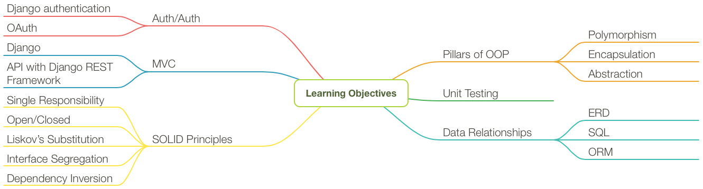

# Bangazon LLC

## The Personal E-Commerce Platform

Bangazon LLC welcomes you to the team. You've been selected from a deep pool of candidates to help build the next, disruptive online platform. Our goal is to become the most personalized, and most powerful commericial platform for individuals all around the globe.

You are needed to make that happen.

In order to become a profitable, and sustainable organization, we need you to build all of the technology and tooling for the company.

## Orientation

Your first two weeks on the job will be you orientation to the technical languages, tools, and frameworks that you'll be using. You will also be introduced to the processes and procedures that you will need to follow to ensure high communication and high productivity for your team.

1. Installation of required tools.
1. Introduction to the language.
1. Concepts of sustainable, scalable, object-oriented software development.
1. Test driven development
1. Overview of server-side development ecosystem
1. How the Internet works
1. Inheritance, composition, and aggregation
1. Entity relationships
1. Structured Query Language (SQL)
1. Django [database abstraction API](https://docs.djangoproject.com/en/1.10/topics/db/queries/)

At the end of your orientation, your management team will determine which Development Team you will be assigned to for the next three months.

## Bangazon API

Once you have been assigned to your team, the entire team will build the initial version of the Bangazon Application Programming Interface. This API will be used by much of the rest of the platform, and by our customers to buy & sell products. You will use all of the Magical Abstractions and conventions that the development ecosystem provides to build the API.

As you build subsequent projects, you will learn much of the foundational technologies, tools and concepts that the Magical Abstrations do for you.

## Platform Development

Once all teams have built the initial version of the API, you will receive your next project.

Your management team will ensure that you have the proper training in the skills, concepts, and tools needed to complete the project, and then you will fulfill the requirements for the project until you are done, as defined in the [Bangazon Definition of Done](https://github.com/nashville-software-school/bangazon-llc/blob/master/EMPLOYEE_HANDBOOK.md#definition-of-done).

# Learning Objectives

While you are building out the Bangazon Platform, your leadership team will ensure that the following foundational skills are developed by each team, and by each individual on the team.

