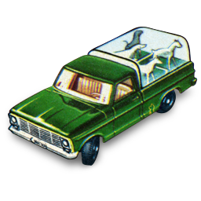

# Book 1 - Python Kennels Data

## Chapters

| # | 🐕 🐩   Python Kennels (_Guided Tour_) | 📔 ✒️   Daily Journal  (_Data Server_) | 🏏 🍺   Tavern API Challenge (_Data Server_)
|--|--|---|---|
| 💻 | [Installations](./chapters/INSTALLATIONS.md) | | |
| 🐞 | [Debugging Python in Visual Studio Code](./chapters/DEBUGGING_PYTHON.md) | | |
| 1 | [Request and Response](./chapters/PK_INTRO_SETUP.md)   #overview #pipenv #watchgod | | |
| 2 | [Animals Package and Data](./chapters/PK_PACKAGES_INTRO.md)   #packages #modules #lists #dictionaries | | |
| 3 |  [Animal Response](./chapters/PK_ANIMAL_RESOURCE.md)   #HTTP_GET #functions #for_loop #if |  | |
| 4 | [Adding Animals](./chapters/PK_CREATE_ANIMAL.md)   #HTTP_POST |  | |
| 5 | [Discharging Animals](./chapters/PK_DELETE_ANIMAL.md)   #for_loop #enumerate #pop() |  | |
| 6 | [Animal Status](./chapters/PK_UPDATE_ANIMAL.md)   #HTTP_PUT #for_loop #enumerate |  |  |
| 7 | [Animal Class](./chapters/PK_CLASSES.md)   #classes |  |  |
| Interlude: SQL | [SQL Bolt: Beginner SQL Tutorial](https://sqlbolt.com/) |  |  |
| 8 | [Kennel Database](./chapters/PK_DATABASE_INTRO.md)   #database #sql #CREATE #INSERT | [Daily Journal Database](./chapters/DJ_DATABASE_CREATION.md) |  |
| 9 | [Animal Queries](./chapters/PK_SQL_SELECT.md)   #sql #SELECT #WHERE #HTTP_GET | [Get All Journal Entries](./chapters/DJ_QUERY_ALL.md) |  |
| 10 | [Customers by Email](./chapters/PK_WHERE_QUERY_STRING_PARAMS.md)   #sql #WHERE #query_string_parameters | [Get Single Journal Entry](./chapters/DJ_QUERY_SINGLE.md) |  |
| 11 | [Deleting Animal Records](./chapters/PK_SQL_DELETE.md)   #sql #DELETE #HTTP_DELETE | [Deleting Journal Entries](./chapters/DJ_DELETE.md) |  |
| 12 | [Using React Kennels Client Again](./chapters/PK_REACT_CLIENT.md)   #react |  [Searching for Journal Entries](./chapters/DJ_ADD_SEARCH_QUERY.md)|  |
| 13 | [Updating Animal Records](./chapters/PK_SQL_UPDATE.md)   #sql #UPDATE #HTTP_PUT |  | [Truncheons &amp; Flagons API](./chapters/TF_SETUP.md) |
| 14 | [Animals with Location Report](./chapters/PK_SQL_JOINS.md)   #sql #JOIN #HTTP_GET | [Including Mood with Entry](./chapters/DJ_JOIN_MOOD.md) |  |
| 15 | [Admitting Animals](./chapters/PK_POST_INSERT.md)   #sql #INSERT | [Recording New Entries](./chapters/DJ_INSERT.md) |  |
| Interlude: SQL | [SQL Murder Mystery](https://mystery.knightlab.com/) |  |  |
| 16 |  | [Editing Journal Entries](./chapters/DJ_UPDATE.md) |  |
| 17 |  | [Add Entry Tags](./chapters/DJ_JOIN_TAGS.md) |  |  |
| 18 |  | [Add Entry Tags in Client](./chapters/DJ_CLIENT_TAGS.md) |  |  |
| 👨‍👩‍👧‍👧 | [Group Project: Rare](./chapters/RARE.md) | | | |

## Supplementary Chapters

These chapters will let you explore more fundamental concepts about object oriented programming in Python.

| # | 🐑 🦆   Critters and Croquettes  (_Fundamentals &amp;   Inheritance_) |  |
|--|--|--|
| 1 | [Meeting Bobby Kawlins](./chapters/CC_PROJECT_SETUP.md)    |  |
| 2 | [Critter Creation](./chapters/CC_CLASSES.md)   #classes |  |
| 3 | [Condensed Critter Creation](./chapters/CC_CONSTRUCTORS.md)   #classes |  |
| 4 | [Packaging Animals for Transport](./chapters/CC_PACKAGES.md)   #packages |  |
| 5 | [Piling On Properties](./chapters/CC_CLASS_PROPERTIES.md)   #properties |  |
| 6 | [Food Function Fun](./chapters/CC_METHODS.md)   #methods |  |
| 7 | [Composing Coming Attractions](./chapters/CC_COMPOSITION.md)   #object-relationships |  |
| 8 | [Controlling the Animals](./chapters/CC_GETTER_SETTER.md)   #properties #get #set |  |
| 9 | [Eliminating Class Waste](./chapters/CC_INHERITANCE.md)   #inheritance |  |
| 10 | [Complex, Clean Critter Classes](./chapters/CC_MULTIPLE_INHERITANCE.md)   #inheritance #multiple |  |
| 11 | [If it Honks Like a Goose](./chapters/CC_DUCK_TYPING.md)   #typing |  |

