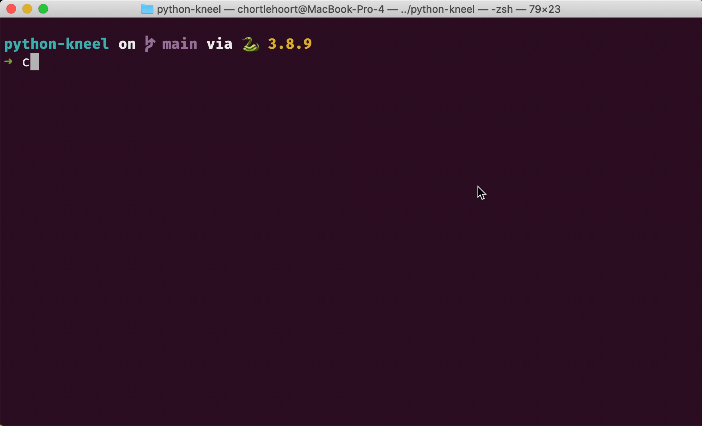

# Placing Jewelry Orders

In this chapter, you will write code to support the POST method of HTTP. Using your favorite API client - again, for most of you, this will be Postman - you will send a new object from the client to the server. The server will then parse that JSON into a Python dictionary and add it to the list.

1. Define a `create_order` or `place_order` function in the appropriate module.
1. Add that function to the `views` package.
1. Import the function from `views` into the `request_handler` module.
1. Copy pasta the `do_POST` function from Kennels into Kneel Diamonds.
1. Make sure you update the code to see if the URL resource is **`orders`** instead of **`animals`**.

Then perform a POST operation from your API client and verify that the response contains your newly created order.

