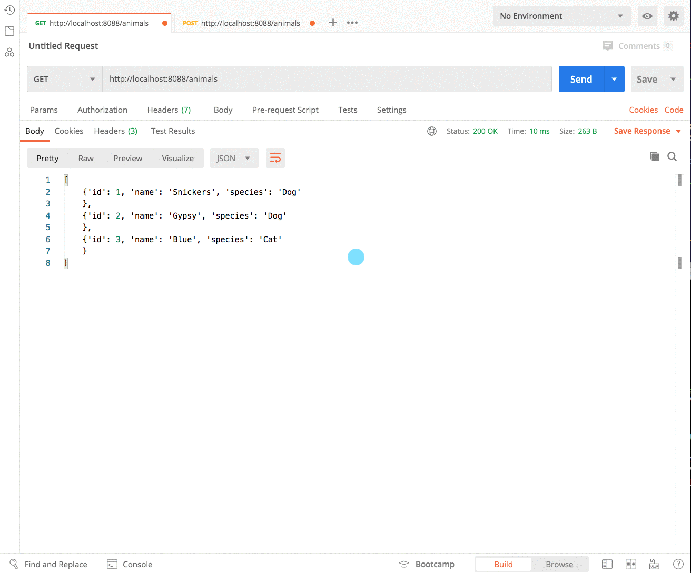

# Creating Animals

In this chapter, you will write code to support the POST method of HTTP. From Postman, you will POST a new object to your Python server. That object will be converted from a string into a Python dictionary, and then added to the `ANIMALS` list in the `animals/request.py` module.

## Using the Built-in JSON package

First, import the `json` package in the Python Standard Libary (_stlib_) at the top of the main module.

```py
import json
```

Back in JavaScript, you could use `JSON.stringify(object)` to convert an object to a string, and `JSON.parse(string)` to convert a JSON string into a JavaScript object.

In Python, you convert a string to a dictionary with `json.loads()`.

Replace the existing `do_POST` method in the main module with the following code.

```py
    def do_POST(self):
        '''Reads post request body'''
        self._set_headers()
        content_len = int(self.headers.get('content-length', 0))
        post_body = self.rfile.read(content_len)

        # Convert JSON string to a Python dictionary
        post_body = json.loads(post_body)

        # Parse the URL
        (resource, id) = self.parse_url(self.path)

        # Initialize new animal
        new_animal = None

        # Add a new animal to the list. Don't worry about
        # the orange squiggle, you'll define the create_animal
        # function next.
        if resource == "animals":
            new_animal = create_animal(post_body)

        # Encode the new animal and send in response
        self.wfile.write(f"{new_animal}".encode())
```

## Appending the Animals List

Next, in the `animals/request.py` module, put the following function in to take the new dictionary representation sent my the client and append it to the `ANIMALS` list.

```py
def create_animal(animal):
    # Get the id value of the last animal in the list
    max_id = ANIMALS[-1]["id"]

    # Add 1 to whatever that number is
    new_id = max_id + 1

    # Add an `id` property to the animal dictionary
    animal["id"] = new_id

    # Add the animal dictionary to the list
    ANIMALS.append(animal)

    # Return the dictionary with `id` property added
    return animal
```

## Import the New Method

Make the new function importable into the main module.

1. In `animals/__init__.py`, import the create function.
1. In the main module, add `create_animal` to the list of functions being imported from the `animals` package.

## Create a New Animal

Now open Postman and follow these steps to create a new animal.

1. Open a new request tab.
1. Make the URL `http://localhost:8088/animals`
1. Make the request type `POST`.
1. Click on the Body section beneath the URL
1. Click on the `raw` radio button that appears.
1. Paste in the following JSON in the text area beneath the radio button.
    ```json
    {
        "name": "Snickers",
        "species": "Dog",
        "location": 1
    }
    ```
1. Click the Send button.

If your code was set up correctly, the status of the request should be 200 and you should see an animal object - with a new `id` property on it - in the response section at the bottom of Postman.



If this isn't working for you, please see an instructor as soon as possible.

## Practice: Creating Locations

1. Update the `do_POST` method in the main module to handle requests to the `/locations` path.
1. Write a `create_location` function in the `locations/request.py` module that appends a new location dictionary to the list.

Then perform a POST request from Postman to create a new location.

## Practice: Creating Employees

1. Update the `do_POST` method in the main module to handle requests to the `/employees` path.
1. Write a `create_employee` function in the `employees/request.py` module that appends a new employee dictionary to the list.

Then perform a POST request from Postman to create a new employee. Make sure that your employee JSON assigns the employee to a location with a foreign key.

```json
{
    "name": "Emma Beaton",
    "address": "54 Sycamore Avenue",
    "locationId": 2
}
```


