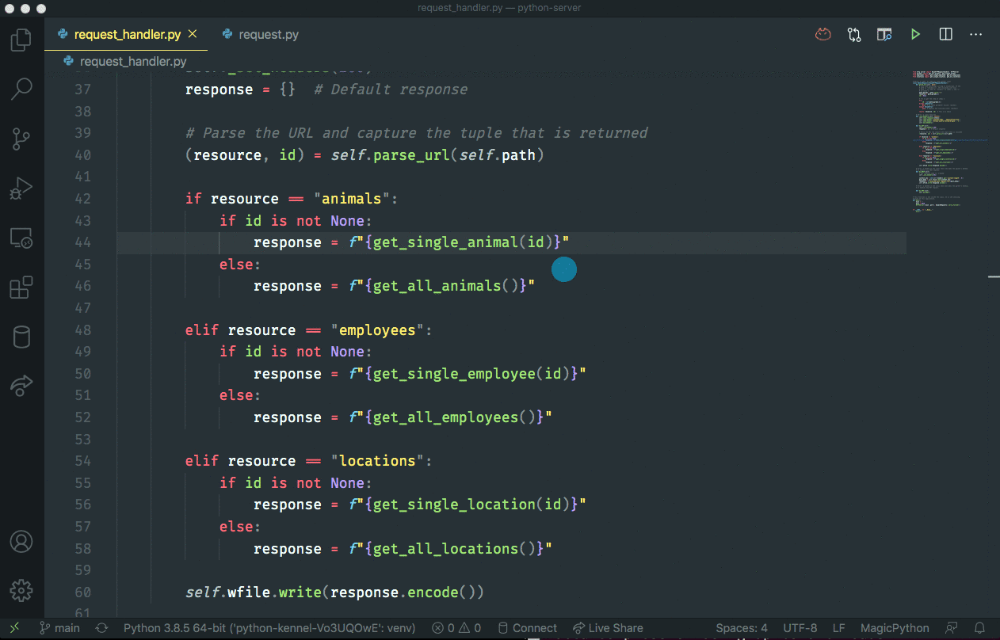
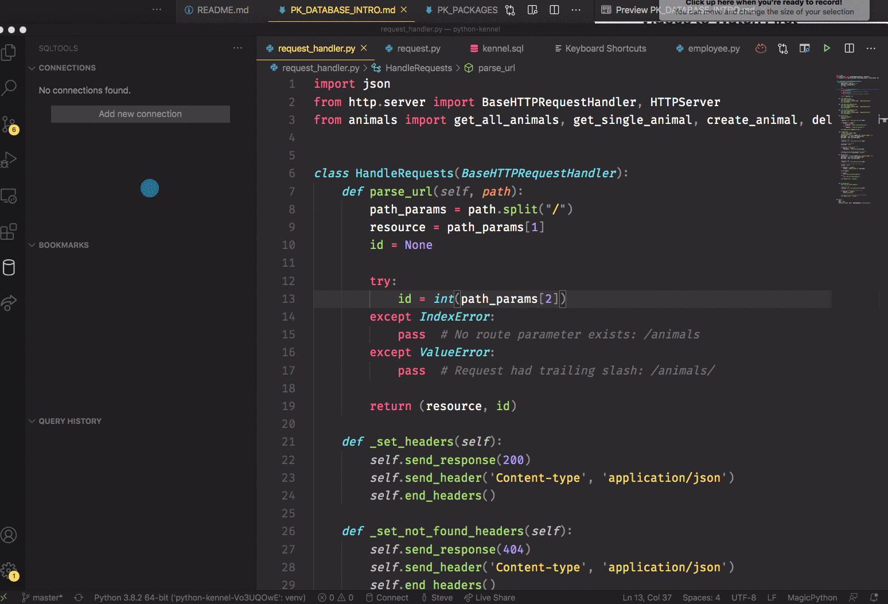
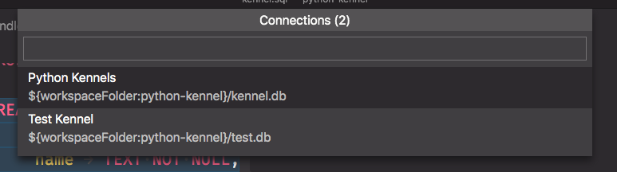

# Ch.8 Kennel Database

## Creating Database Tables for Nashville Kennels

In this chapter you will learn about using SQL to create database tables, defining relationships between them, and inserting some seed data.

## Learning Objectives

- You should be able to connect to a SQLite database file in Visual Studio Code.
- You should be able to use the `CREATE TABLE` statement in SQL to define database tables.
- You should be able to use the `INSERT INTO` statement in SQL to generate data for a table.
- You should be able to use the `FOREIGN KEY` statements in SQL to designate columns that are foreign keys, which establish a relationships between tables.
- You should be able to demonstrate that you can execute SQL statements in Visual Studio Code with a keyboard shortcut.

## Videos to Watch First

- [What is SQL? [in 4 minutes for beginners]](https://www.youtube.com/watch?v=27axs9dO7AE)
- [Creating Tables - SQL - Tutorial 6](https://youtu.be/SPPTQwx4FfE?t=300)
- [Inserting Data - SQL - Tutorial 7](https://www.youtube.com/watch?v=3Qq93zqO3GE)
- [Constraints - SQL - Tutorial 8](https://www.youtube.com/watch?v=9WP35xwZ3tk)

## Binding Keyboard Shortcut

Before you start using SQL in VS Code, you need to set up a keyboard shortcut so that you can run a query without needing to use your mouse to click on an icon every time. It wastes too much time to click with a mouse when you are working with SQL.

1. Cmd+Shift+P if you are on Mac.
1. Ctrl+Shift+P if you are on Windows.
1. Type in "shortcut" in the search bar.
1. Choose **Keyboard Shortcuts** from the results.
1. In the search bar for shortcuts, type in "sqltoolrun".
1. Double click the **SQLTools Connection: Run Current Query** option.
1. Hold down the Command key and tap R twice if you are on Mac
1. Hold down the Control key and tap R twice if you are on Windows
1. Then press enter to save the shortcut.



## Creating Database and SQL Files

In your project directory, create two files:

1. `kennel.db` : This is your database to store all of the data.
1. `kennel.sql` : This is a text file to hold the SQL commands to interact with the database.

## Creating Connection to Database File

1. Click on the SQLTools icon at the very left of VS Code. It looks like a soup can 🥫.
1. Click on "Add New Connection"
1. Choose SQLite in the window that appears.
1. Enter in "Python Kennels" for the name of the connection.
1. Enter `kennel.db` in the Database file input field. ( don't click Select File )
1. Click the "Test Connection" button to verify that it works. ( _Error? See note below_ )
1. Click the "Save Connection" button.

> NOTE - When testing the connection you may get an error along the lines of "cannot convert undefined or null to an object". Ignore the message and create the connection anyway. You will get a few prompts about enabling some extensions. Accept those (as well as the prompt about reloading vs code) and you should be good to go!

You should then see a new connection in the "Connections" panel in the upper-left part of your screen.



## Creating Tables

Now open the `kennel.sql` file in VS Code.

The `CREATE TABLE` SQL statement creates a table in a database to store a particular resource. Columns, or fields, are defined for each table to store the individual properties of that resource.

Time to create a table for each of the four resources in this application.

- Locations
- Customers
- Animals
- Employees

1. Copy the `CREATE TABLE` SQL commands below and paste it into the `kennel.sql` file.
1. Highlight all of the text.
1. Press `Cmd+R+R` if you are on Mac, and `Ctrl+R+R` if you are on Windows. You will then be prompted to choose a connection.
   
1. Choose "Python Kennels".
1. A new tab will open in VS Code and you should see this message in it - **Query returned 0 rows**. That means it worked.
   

If any step of this didn't work, contact a member of your instruction team immediately to get it fixed.

```sql
CREATE TABLE `Location` (
	`id`	INTEGER NOT NULL PRIMARY KEY AUTOINCREMENT,
	`name`	TEXT NOT NULL,
	`address`	TEXT NOT NULL
);

CREATE TABLE `Customer` (
    `id`    INTEGER NOT NULL PRIMARY KEY AUTOINCREMENT,
    `name`    TEXT NOT NULL,
    `address`    TEXT NOT NULL,
    `email`    TEXT NOT NULL,
    `password`    TEXT NOT NULL
);

CREATE TABLE `Animal` (
	`id`  INTEGER NOT NULL PRIMARY KEY AUTOINCREMENT,
	`name`  TEXT NOT NULL,
	`status` TEXT NOT NULL,
	`breed` TEXT NOT NULL,
	`customer_id` INTEGER NOT NULL,
	`location_id` INTEGER,
	FOREIGN KEY(`customer_id`) REFERENCES `Customer`(`id`),
	FOREIGN KEY(`location_id`) REFERENCES `Location`(`id`)
);


CREATE TABLE `Employee` (
	`id`	INTEGER NOT NULL PRIMARY KEY AUTOINCREMENT,
	`name`	TEXT NOT NULL,
	`address`	TEXT NOT NULL,
	`location_id` INTEGER NOT NULL,
	FOREIGN KEY(`location_id`) REFERENCES `Location`(`id`)

);
```

## Inserting Starter Data

The `INSERT INTO` SQL statement allows you to enter in the actual data about individual resources that will be stored in a table. The values have to match the order in which the columns were defined in the `CREATE TABLE` statements above, so yes, order matters.

1. Once the tables are created from the step above, copy the `INSERT INTO` statements below into your `kennel.sql` file.
1. Highlight only the `INSERT INTO` statements. Make sure none of the `CREATE TABLE` statements get highlighted.
1. Press `Cmd+R+R` if you are on Mac, and `Ctrl+R+R` if you are on Windows.
1. A new tab will open in VS Code and you should see this message in it - **Query returned 0 rows**. That means it worked.

```sql
INSERT INTO `Location` VALUES (null, 'Nashville North', "64 Washington Heights");
INSERT INTO `Location` VALUES (null, 'Nashville South', "101 Penn Ave");


INSERT INTO `Employee` VALUES (null, "Madi Peper", "35498 Madison Ave", 1);
INSERT INTO `Employee` VALUES (null, "Kristen Norris", "100 Main St", 1);
INSERT INTO `Employee` VALUES (null, "Meg Ducharme", "404 Unknown Ct", 2);
INSERT INTO `Employee` VALUES (null, "Hannah Hall", "204 Empty Ave", 1);
INSERT INTO `Employee` VALUES (null, "Leah Hoefling", "200 Success Way", 2);


INSERT INTO `Customer` VALUES (null, "Mo Silvera", "201 Created St", "mo@silvera.com", "password");
INSERT INTO `Customer` VALUES (null, "Bryan Nilsen", "500 Internal Error Blvd", "bryan@nilsen.com", "password");
INSERT INTO `Customer` VALUES (null, "Jenna Solis", "301 Redirect Ave", "jenna@solis.com", "password");
INSERT INTO `Customer` VALUES (null, "Emily Lemmon", "454 Mulberry Way", "emily@lemmon.com", "password");


INSERT INTO `Animal` VALUES (null, "Snickers", "Recreation", "Dalmation", 4, 1);
INSERT INTO `Animal` VALUES (null, "Jax", "Treatment", "Beagle", 1, 1);
INSERT INTO `Animal` VALUES (null, "Falafel", "Treatment", "Siamese", 4, 2);
INSERT INTO `Animal` VALUES (null, "Doodles", "Kennel", "Poodle", 3, 1);
INSERT INTO `Animal` VALUES (null, "Daps", "Kennel", "Boxer", 2, 2);
```

## What's Next

After you got all the above steps to work, it's time to move to the next chapter and write your first queries to get information from the database.
