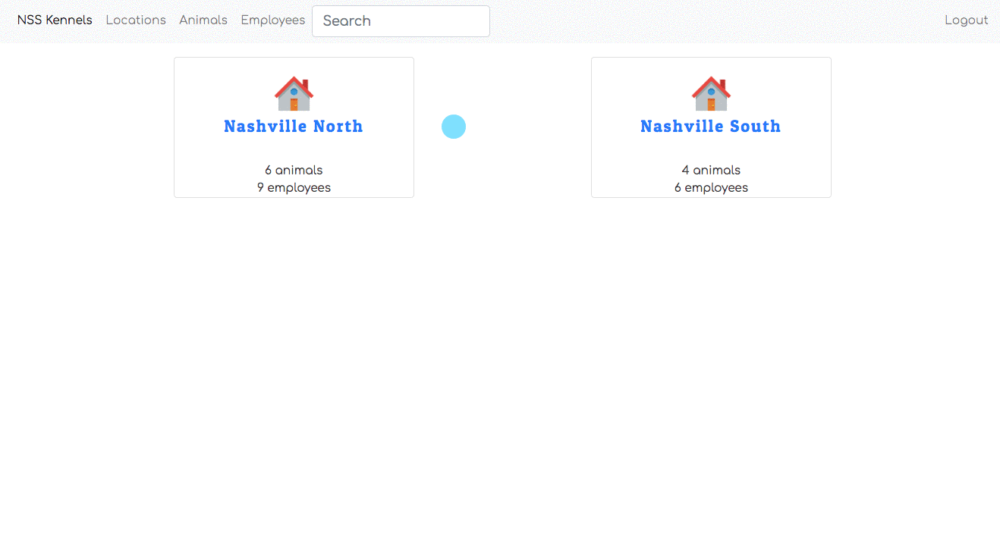

# Ch.12 Using React Kennles Client Again

## Switching Clients

Up to this point, you've been using Postman as the client to make requests to your Python server. Well, if you have completed all of the previous chapters, and their associated practice exercises, you should now be able to fire up your Nashville Kennels React client from 4-5 weeks ago.

Forget how to do it?

`cd` to your workspace and then find the directory where you built Nashville Kennels. The chapter suggested `~/workspace/kennels`, but you may have placed it elsewhere.

Then run the `npm start` command and wait for your application to render in the browser.

If/When you are prompted with the login screen, enter in the credentials for one of the people that you created in your database. To see the emails and passwords, look in the `kennel.db` file in your Python server project.

Once authenticated, you should now be able to use your application just as you did when `json-server` was running and storing your data.

> **Note**: Some of the client views will work, but some won't. You're not done building all the relationships in your Python server.

