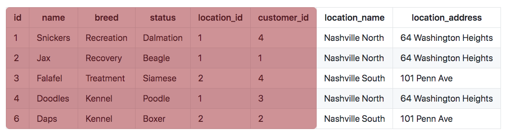
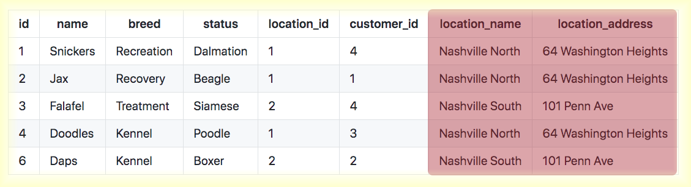
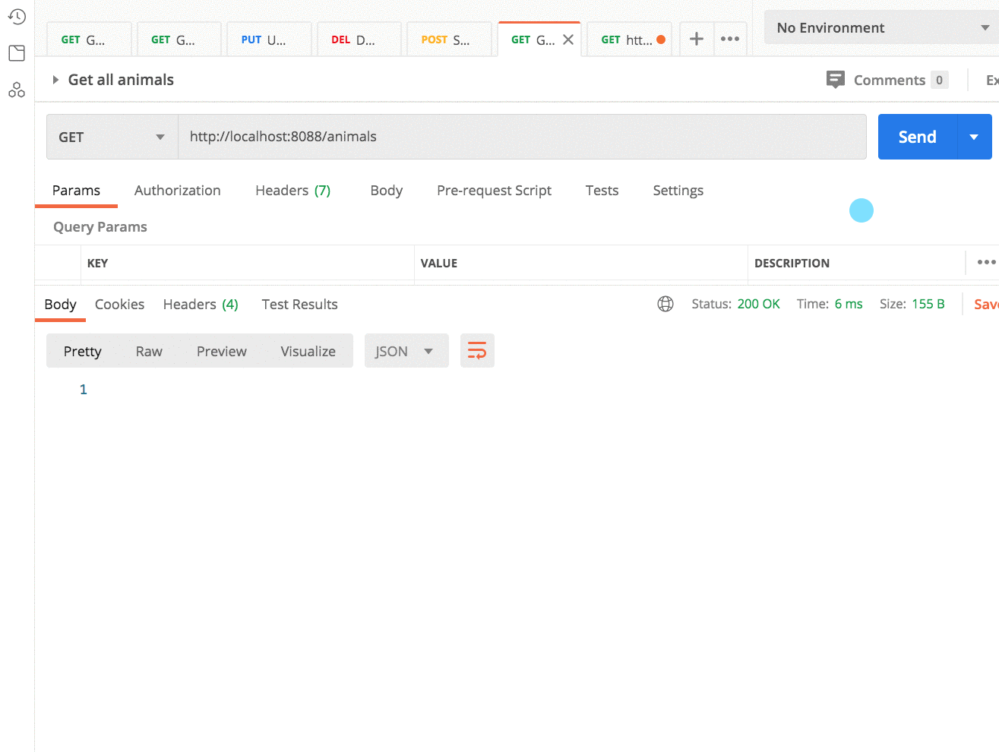

# Getting Animals With Embedded Locations

## Videos to Watch First

* [SQL Joins Explained](https://www.youtube.com/watch?v=9yeOJ0ZMUYw)
* [SQL Joins Examples](https://www.youtube.com/watch?v=Jh_pvk48jHA)
* [SQL Joins Tutorial for Beginners](https://www.youtube.com/watch?v=2HVMiPPuPIM)

## Joining Data for Python Kennel

Right now in your React client, you get all locations, and get all animals from the API and then use JavaScript to "join" them together.

```js
const animals = useAnimals()
const locations = useLocations()

const findLocation = (locationId) => {
    return locations.find(location => location.id === locationId)
}

const animalsWithEmbeddedLocation = animals.map(animal => {
    animal.location = findLocation(animal.locationId)
})
```

This process requires two `fetch()` calls to the API and plenty of iterations to get the information together to generate the final HTML representations you want.

What if you could let the server do the joining of the data? That way, you only need one call to the API and reduce the processing needs of the client.

#### Goal: Animal with Embedded Location

You want the server to add the location data to each animal JSON representation that it returns. It would look like this.

```json
 {
    "id": 6,
    "name": "Daps",
    "species": "Kennel",
    "status": "Boxer",
    "location_id": 2,
    "customer_id": 2,
    "location": {
        "name": "Nashville South",
        "address": "101 Penn Ave"
    }
}
```

Since the JSON is generated by serializing an instance of the **`Animal`** class, that means you need to add a new property to your class. Add a new location property to **`Animal`**, but with an initial value of `None`.

```py
class Animal():

    def __init__(self, name, species, status, location_id, customer_id):
        self.name = name
        self.species = species
        self.status = status
        self.location_id = location_id
        self.customer_id = customer_id
        self.location = None
```

## Joining Tables in SQL

The video showed you how to join 2 tables to ensure that only information that had a match between the primary key in one table, and a foreign key in the other table, were returned.

It showed `INNER JOIN`.

In most dialects of SQL, you can discard the `INNER` and it will be assumed. You will use the shortened syntax in this application.

In the query below, you start with selecting the `Animal` table and specify which fields you want. One field is `location_id`, but that's not enough. Remember, the goal is to have the location name and address embedded in the response.

Now you can join the `Location` table into the query so that the name and address fields are in the results. Put the following SQL in your `kennel.sql` file and run it. You should see the results displayed below.

#### SQL

```sql
SELECT
    a.id,
    a.name,
    a.breed,
    a.status,
    a.location_id,
    a.customer_id,
    l.name location_name,
    l.address location_address
FROM Animal a
JOIN Location l
    ON l.id = a.location_id
```

#### Results

|id|name|breed|status|location_id|customer_id|location_name|location_address|
|--|--|--|--|--|--|--|--|
1|	Snickers|	Recreation|	Dalmation|	1|	4|	Nashville North|	64 Washington Heights	|
2|	Jax|	Recovery|	Beagle|	1|	1|	Nashville North|	64 Washington Heights	|
3|	Falafel|	Treatment|	Siamese|	2|	4|	Nashville South|	101 Penn Ave	|
4|	Doodles|	Kennel|	Poodle|	1|	3|	Nashville North|	64 Washington Heights	|
6|	Daps|	Kennel|	Boxer|	2|	2|	Nashville South|	101 Penn Ave|

Take the SQL statement from above and replace the existing SQL in the `get_all_animals()` function.

## Columns Used to Make an Animal

### Animal Fields

Each row contains 8 fields. The information in the first 6 will be used to create an **`Animal`** instance in your Python code.




### Location Fields

The final two columns will be used to create a **`Location`** instance in your Python code.



## Creating Location Instances

Since you have two columns in each row from the locations table in your database, that means that you can create a new instance of the **`Location`** class, in addition to the instance of **`Animal`** class that you are already making, from each row in the results.

Now replace your `for` loop with the following code.

```py
for row in dataset:

    # Create an animal instance from the current row
    animal = Animal(row['id'], row['name'], row['breed'], row['status'],
                    row['location_id'], row['customer_id'])

    # Create a Location instance from the current row
    location = Location(row['location_name'], row['location_address'])

    # Add the dictionary representation of the location to the animal
    animal.location = location.__dict__

    # Add the dictionary representation of the animal to the list
    animals.append(animal.__dict__)
```

## Requesting from Postman Client

Request all animals from the Postman client and verify that there is an embedded `location` property on each one.



## Practice: Animals with Embedded Customer

Add an embedded customer object to the JSON response.

1. Add a `customer` property to the **`Animal`** table.
1. JOIN in the Customer table in your SQL query.
1. Select all of the columns that are needed for an instance of a **`Customer`**.
1. Create an instance of a **`Customer`** for each row in the results.
1. Add that instance of a customer

## Practice: Employee Locations

Add a `location` property to the response when the user requests http://localhost:8088/employees so that the client immediately knows the details of the employee's workplace.