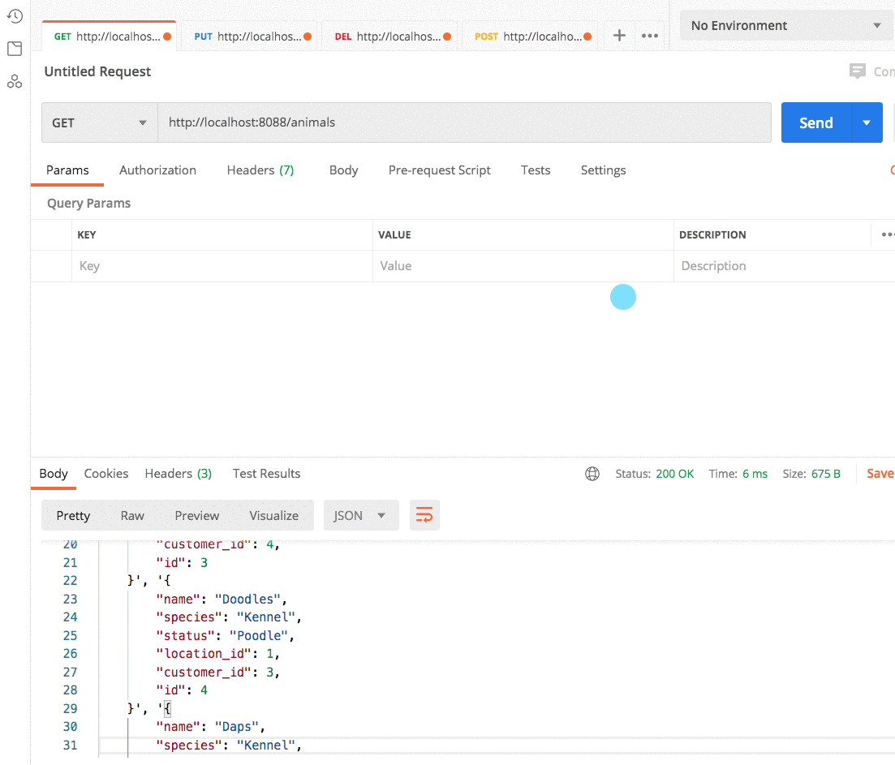

# Getting Animals from the Database

## Learning Objectives

* You should be able to explain the benefits of using classes in Python.
* You should be able to explain the purpose of the initializer method.
* You should be able to explain, and demonstrate, how to create a new instance of a custom type _(i.e. a class)_.
* You should be able to identify where the Python code creates a connection to the database so that it can be queried for data.
* You should be able to identify the method used to get the results of SQL query.
* You should be able to explain how the data in row of results is used to create an instance of a custom type.
* You should be able to explain the purpose of the SELECT, FROM, and WHERE keywords in SQL.
* You should be able to identify a SQL parameter.

## Videos to Watch First

* [SQL SELECT Tutorial |¦| SQL Tutorial |¦| SQL for Beginners](https://www.youtube.com/watch?v=YufocuHbYZo)
* [SQL SELECT Tutorial - Part 2 |¦| SQL Tutorial |¦| SQL for Beginners](https://www.youtube.com/watch?v=PkJKzR_sClM)

## Required Package from the Standard Library

The `sqlite3` package is built into Python and will allow you to query your database. The `json` package is also built into Python and allows you to serialize Python data structures to JSON format, and vice versa.

> ##### `animals/request.py`

```py
import sqlite3
import json
```

## Import the Database Model Class

Now import the **`Animal`** class so that you can create instances of it for each row of data that gets returned from the database.

> ##### `animals/request.py`

```py
from models import Animal
```

## Query for All Animals

Now you can copy the function below into your animal request module to query the database for all animals, convert each row into an **`Animal`** instance, convert the list to JSON, and respond to the client request.

> ##### `animals/request.py`

```py
def get_all_animals():
    # Open a connection to the database
    with sqlite3.connect("./kennel.db") as conn:

        # Just use these. It's a Black Box.
        conn.row_factory = sqlite3.Row
        db_cursor = conn.cursor()

        # Write the SQL query to get the information you want
        db_cursor.execute("""
        SELECT
            a.id,
            a.name,
            a.breed,
            a.status,
            a.location_id,
            a.customer_id
        FROM animal a
        """)

        # Initialize an empty list to hold all animal representations
        animals = []

        # Convert rows of data into a Python list
        dataset = db_cursor.fetchall()

        # Iterate list of data returned from database
        for row in dataset:

            # Create an animal instance from the current row.
            # Note that the database fields are specified in
            # exact order of the parameters defined in the
            # Animal class above.
            animal = Animal(row['id'], row['name'], row['breed'],
                            row['status'], row['location_id'],
                            row['customer_id'])

            animals.append(animal.__dict__)

    # Use `json` package to properly serialize list as JSON
    return json.dumps(animals)
```

### For the Curious

If you want to explore some black box concepts from the code in this chapter, here are some searches you can run.

* [row_factory](https://duckduckgo.com/?q=sqlite3+connection+row_factory)
* [Connection cursor](https://duckduckgo.com/?q=sqlite3+cursor)
* [Cursor's fetchAll() method](https://duckduckgo.com/?q=sqlite3+cursor+fetchall)

## Request all Animals from Postman

Open the Postman client and request all animals from http://localhost:8088/animals and verify that all five animals in the database get returned as JSON representations.


## Get Single Animal

The WHERE clause in SQL does the same job as `filter()` did for JavaScript arrays. It filters down all items in a table to one that pass a certain condition. For getting a single animal, the client passes the `id` of the animal as a route parameter.

You will use that value to filter down all rows in the Animal table to only those whose `id` field value is what the client specified. To do that, you use a SQL parameter, which you will notice is a question mark in the query below.

Then you need to add a second argument to the `execute()` method. That second argument is a tuple - `( id, )` - that contains the actual value to inject into the SQL statement where the question mark is.

Since you will only get one row returned, you will use the `fetchone()` method instead of `fetchall()`.

> ##### `animals/request.py`

```py
def get_single_animal(id):
    with sqlite3.connect("./kennel.db") as conn:
        conn.row_factory = sqlite3.Row
        db_cursor = conn.cursor()

        # Use a ? parameter to inject a variable's value
        # into the SQL statement.
        db_cursor.execute("""
        SELECT
            a.id,
            a.name,
            a.breed,
            a.status,
            a.location_id,
            a.customer_id
        FROM animal a
        WHERE a.id = ?
        """, ( id, ))

        # Load the single result into memory
        data = db_cursor.fetchone()

        # Create an animal instance from the current row
        animal = Animal(data['id'], data['name'], data['breed'],
                            data['status'], data['location_id'],
                            data['customer_id'])

        return json.dumps(animal.__dict__)
```

If the client requests http://localhost:8088/animals/3, then the `id` parameter to the function will be `3`. In this case, the generate SQL will look like this.

```sql
-- Get only the animal rows where the `id` field value is 3
SELECT
    a.id,
    a.name,
    a.breed,
    a.status,
    a.location_id,
    a.customer_id
FROM animal a
WHERE a.id = 3
```

1. Copy pasta that statement into your `kennel.sql` file an execute it. You will get a single animal back.
2. Change the id in the SQL from 3 to some other number to query a different animal.


## Request Animal from Postman

Now request a single animal from the Postman client. In the animation below the animal with an id of 2 is requested, then the animals with an id of 3.

http://localhost:8088/animals/2

http://localhost:8088/animals/3



## Practice: Locations, Customers, and Employees

Follow this same pattern for all other resources.

1. Import `json`, and `sqlite3`
1. Import the corresponding class for the resource
1. Write SQL statements to get all database rows for the `get_all_*` functions.
1. Write SQL statements with a WHERE clause to get a single database row for the `get_single_*` functions.
1. Request all resources with the Postman client and verify that all GET requests return the correct JSON representations.

