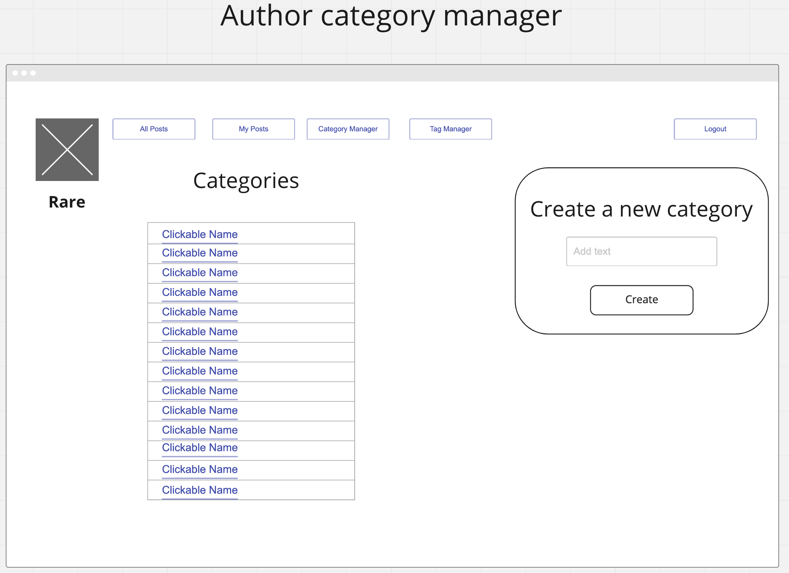

# Rare Publishing Platform Notes

## Setup

Just in case you haven't updated your computer to use the new default branch name of `main` for git repositories, **EVERYONE** should run this command in your terminal.

```sh
git config --global init.defaultBranch main
```

You are going to need a minimum of two terminal sessions open for this project at all times. Go ahead and open two now.

## Project Directory

1. In the first terminal, every teammate should make a directory on their system for the code for this group project. For example, `~/workspace/python/rare`.
1. `cd` to that directory.
1. Create two sub-directories.
    1. `client`
    1. `server`

## Client Setup

1. In the same terminal session, `cd` to the client directory.
1. `git clone {your repo URL} .` <-- note the single dot at the end.
1. `npm install` to get all required packages installed for the React client.
1. `npm start`

## Server Setup

You are not given any boilerplate code for your server, so **one teammate** should follow these steps and create a new repository in your cohort's organization. Make sure you follow the naming schema of your React client repo.

For example, if your initial repo is named `Rare-Goofy-Gophers`, your new repo should be named `Rare-Server-Goofy-Gophers`.

1. In the second terminal session, `cd` into the `rare/server` directory.
1. `pipenv shell`
1. `pipenv install watchgod autopep8`
1. `touch request_handler.py`
1. `mkdir models posts categories tags comments`
1. `touch models/__init__.py posts/__init__.py categories/__init__.py tags/__init__.py comments/__init__.py`
1. `curl https://www.toptal.com/developers/gitignore/api/python > .gitignore`
1. `echo 'rare.db' >> .gitignore`
1. `echo 'Pipfile*' >> .gitignore`
1. `echo '.vscode' >> .gitignore`
1. `git init`
1. `git remote add origin {server repo URL}`
1. `git push origin -u main`


## Constraints for Vanilla Python Rare

* You are not going to worry about admin users for this first sprint. Assume all users are authors.
* Since no admins, posts should be automatically published and not wait for approval.
* No image uploads for user profile or post

## ERD

The database development team has already taken a stab at the [ERD for this project](https://dbdiagram.io/d/5f885a013a78976d7b77cb74). You will use this to start building the project. Unfortunately, they built the ERD assuming that you were going to use Django to build the project. Therefore, you will see two user tables, but you only need one. As a team, decide what the consolidated user table should be structured.

## Create/Seed the Database

The database team also has a SQL script for you to run to build the database. There are a small handful of INSERT statements they provided. Your team should create as many INSERT statements as needed to seed the database to your satisfaction.

```sql
CREATE TABLE "Users" (
  "id" INTEGER PRIMARY KEY AUTOINCREMENT,
  "first_name" varchar,
  "last_name" varchar,
  "email" varchar,
  "bio" varchar,
  "username" varchar,
  "password" varchar,
  "profile_image_url" varchar,
  "created_on" date,
  "active" bit
);

CREATE TABLE "DemotionQueue" (
  "action" varchar,
  "admin_id" INTEGER,
  "approver_one_id" INTEGER,
  FOREIGN KEY(`admin_id`) REFERENCES `Users`(`id`),
  FOREIGN KEY(`approver_one_id`) REFERENCES `Users`(`id`),
  PRIMARY KEY (action, admin_id, approver_one_id)
);


CREATE TABLE "Subscriptions" (
  "id" INTEGER PRIMARY KEY AUTOINCREMENT,
  "follower_id" INTEGER,
  "author_id" INTEGER,
  "created_on" date,
  FOREIGN KEY(`follower_id`) REFERENCES `Users`(`id`),
  FOREIGN KEY(`author_id`) REFERENCES `Users`(`id`)
);

CREATE TABLE "Posts" (
  "id" INTEGER PRIMARY KEY AUTOINCREMENT,
  "user_id" INTEGER,
  "category_id" INTEGER,
  "title" varchar,
  "publication_date" date,
  "image_url" varchar,
  "content" varchar,
  "approved" bit
);

CREATE TABLE "Comments" (
  "id" INTEGER PRIMARY KEY AUTOINCREMENT,
  "post_id" INTEGER,
  "author_id" INTEGER,
  "content" varchar,
  FOREIGN KEY(`post_id`) REFERENCES `Posts`(`id`),
  FOREIGN KEY(`author_id`) REFERENCES `Users`(`id`)
);

CREATE TABLE "Reactions" (
  "id" INTEGER PRIMARY KEY AUTOINCREMENT,
  "label" varchar,
  "image_url" varchar
);

CREATE TABLE "PostReactions" (
  "id" INTEGER PRIMARY KEY AUTOINCREMENT,
  "user_id" INTEGER,
  "reaction_id" INTEGER,
  "post_id" INTEGER,
  FOREIGN KEY(`user_id`) REFERENCES `Users`(`id`),
  FOREIGN KEY(`reaction_id`) REFERENCES `Reactions`(`id`),
  FOREIGN KEY(`post_id`) REFERENCES `Posts`(`id`)
);

CREATE TABLE "Tags" (
  "id" INTEGER PRIMARY KEY AUTOINCREMENT,
  "label" varchar
);

CREATE TABLE "PostTags" (
  "id" INTEGER PRIMARY KEY AUTOINCREMENT,
  "post_id" INTEGER,
  "tag_id" INTEGER,
  FOREIGN KEY(`post_id`) REFERENCES `Posts`(`id`),
  FOREIGN KEY(`tag_id`) REFERENCES `Tags`(`id`)
);

CREATE TABLE "Categories" (
  "id" INTEGER PRIMARY KEY AUTOINCREMENT,
  "label" varchar
);

INSERT INTO Categories ('label') VALUES ('News');
INSERT INTO Tags ('label') VALUES ('JavaScript');
INSERT INTO Reactions ('label', 'image_url') VALUES ('happy', 'https://pngtree.com/so/happy');
```

<!--
## Wireframes




-->