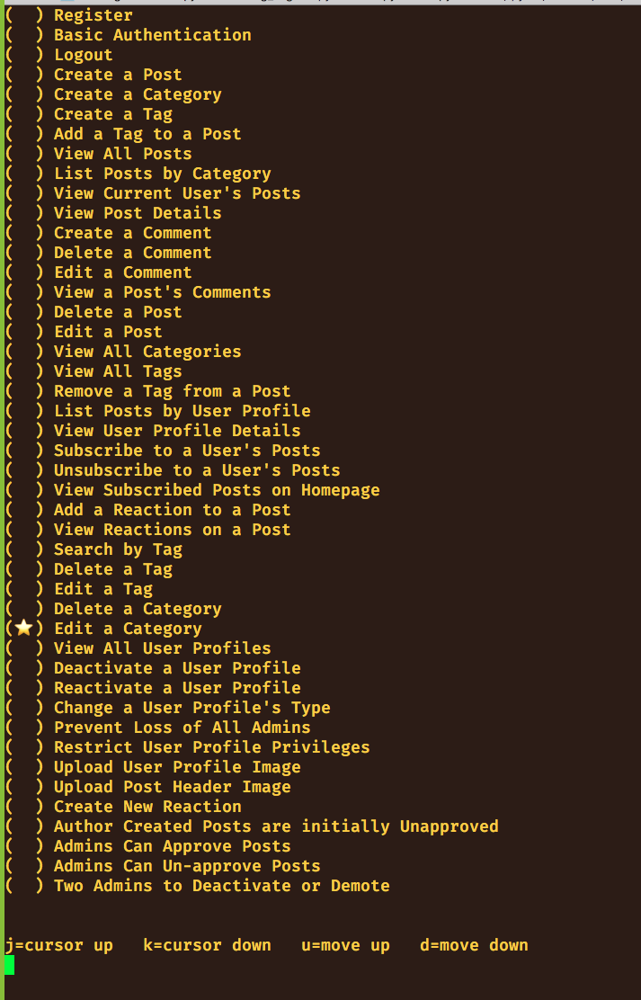

# Rare Database

## ERD

https://dbdiagram.io/d/5f885a013a78976d7b77cb74

## SQL Script

```sql
CREATE TABLE `AccountTypes` (
  `id` int PRIMARY KEY,
  `label` varchar
);

CREATE TABLE `Users` (
  `id` int PRIMARY KEY,
  `first_name` varchar,
  `last_name` varchar,
  `email` varchar,
  `bio` varchar,
  `username` varchar,
  `profile_image_url` varchar,
  `created_on` date,
  `active` bit,
  `account_type_id` int,
  FOREIGN KEY(`account_type_id`) REFERENCES `AccountTypes`(`id`)
);

CREATE TABLE "DemotionQueue" (
  "action" varchar,
  "admin_id" int,
  "approver_one_id" int,
  FOREIGN KEY(`admin_id`) REFERENCES `Users`(`id`),
  FOREIGN KEY(`approver_one_id`) REFERENCES `Users`(`id`),
  PRIMARY KEY (action, admin_id, approver_one_id)
);


CREATE TABLE `Subscriptions` (
  `id` int PRIMARY KEY,
  `follower_id` int,
  `author_id` int,
  `created_on` date,
  FOREIGN KEY(`follower_id`) REFERENCES `Users`(`id`),
  FOREIGN KEY(`author_id`) REFERENCES `Users`(`id`)
);

CREATE TABLE `Posts` (
  `id` int PRIMARY KEY,
  `user_id` int,
  `category_id` int,
  `title` varchar,
  `publication_date` date,
  `image_url` varchar,
  `content` varchar,
  `approved` bit
);

CREATE TABLE `Comments` (
  `id` int PRIMARY KEY,
  `post_id` int,
  `author_id` int,
  `content` varchar,
  FOREIGN KEY(`post_id`) REFERENCES `Posts`(`id`),
  FOREIGN KEY(`author_id`) REFERENCES `Users`(`id`)
);

CREATE TABLE `Reactions` (
  `id` int PRIMARY KEY,
  `label` varchar,
  `image_url` varchar
);

CREATE TABLE `PostReactions` (
  `id` int PRIMARY KEY,
  `user_id` int,
  `reaction_id` int,
  `post_id` int,
  FOREIGN KEY(`user_id`) REFERENCES `Users`(`id`),
  FOREIGN KEY(`reaction_id`) REFERENCES `Reactions`(`id`),
  FOREIGN KEY(`post_id`) REFERENCES `Posts`(`id`)
);

CREATE TABLE `Tags` (
  `id` int PRIMARY KEY,
  `label` varchar
);

CREATE TABLE `PostTags` (
  `id` int PRIMARY KEY,
  `post_id` int,
  `tag_id` int,
  FOREIGN KEY(`post_id`) REFERENCES `Posts`(`id`),
  FOREIGN KEY(`tag_id`) REFERENCES `Tags`(`id`)
);

CREATE TABLE `Categories` (
  `id` int PRIMARY KEY,
  `label` varchar
);
```

## Ticket Order for Rare Project


