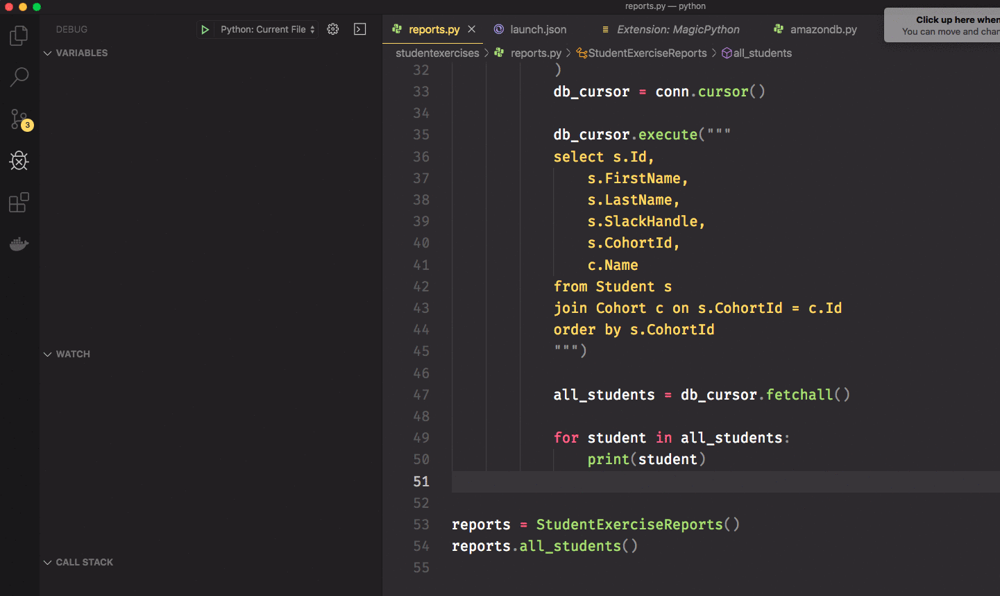

# Debugging Python in Visual Studio Code

Please read the "[Python debug configurations in Visual Studio Code](https://code.visualstudio.com/docs/python/debugging)" article and follow the steps so that you can start debugging individual Python files.

Here's a short animation showing you a breakpoint being set in the code, and then inspecting the value of the `all_students` variable in both the variables panel and in a pop-up window in the editor.

Your instruction team will show you how to use the debugger to step through a for loop of different data structures to get your started.