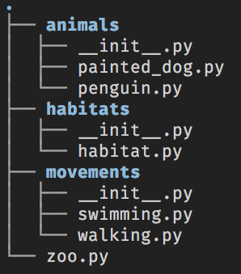

# Interface Based Programming

In Python, you can use classes to represent concrete things - Person, Building, Vehicle, Animal, Flower - but you also use them to define general types of things so that they can be grouped together in a more flexible way. The mechanism in Python is multiple inheritance. You can inherit from **more** than just one parent class!

## Why Are You Learning This?

You will use multiple inheritance to provide much more flexibility to your project to work with disparate types. It's one of the most powerful features of the Python language.

You will also likely be asked about interfaces during the interview process. Python does not have concrete interfaces, but you can use classes to implement an interface-based system. After working with interfaces during your time at Nashville Software School, you should be able to describe interfaces in the following ways.

1. Interfaces are a mechanism to introduce polymorphism into your system. They provide additional types to your classes.
1. They allow you to define common properties and behaviors among different classes in your system so that you can group them together into collections.

## Zoological Zaniness

Imagine a scenario in which you are writing an application in which you need to classify any animal species as ground-based, air-based, or water-based. Also consider that animals can be any combination of those classifications.

For example, a platypus is both ground and water. Most birds are both air and ground. Cats are ground only. Dolphins are water only. Seagulls are air, ground, and water (they can dive to amazing depths and are great swimmers). So many possible combinations of behavior in the animal kingdom!

🐯 🦅 🐎 🦈 🙎🏾‍♀️ 🦉

To make our code base as flexible as possible, we define the properties and behaviors of each classification (or description) into an separate class. You are going to start with classes for animals that can walk and those that can swim.

Note that the classes start with a capital I. This is to designate them as interfaces, instead of representations of a concrete thing. They will be used to compose behavior and properties **into** objects that represent real things.

## Setup

```sh
mkdir -p ~/workspace/python/exercises/zoo && cd $_
mkdir animals
touch animals/__init__.py animals/penguin.py
mkdir movements
touch movements/__init__.py movements/walking.py movements/swimming.py
mkdir habitats
touch habitats/__init__.py habitats/habitat.py
touch zoo.py
```

Your directory structure should look like this. The `__init__.py` file in each of those subdirectories makes the directories into packages. Your instruction team will discuss what a package is during class. Another word for package is `namespace`, which is used by other programming languages.



## Defining How Animals Move

The first step is to define the different ways an animal can move.

> #### `movements/walking.py`

```py
class IWalking:

    def __init__(self):
        self.walk_speed = 0
        self.legs = 0

    def run(self):
        print("The animal walks")
```

> #### `movements/swimming.py`

```py
class ISwimming:

    def __init__(self):
        self.swim_speed = 0
        self.maximum_depth = 0

    def swim(self):
        print("The animal swims")
```


Now you can define a class and implement the interface for a walking animal. You can start with a Penguin. Note that when a class inherits from two parents that you have to discard using the `super().__init__()` syntax and explicitly invoke the initialization method of both. You also need to pass `self` as an argument - something that is not needed when you use the `super()` abstraction.

> #### `animals/penguin.py`

```py
from movements import IWalking, ISwimming


class Penguin(IWalking, ISwimming):

    def __init__(self, name):
        ISwimming.__init__(self)
        IWalking.__init__(self)
        self.name = name

    def __str__(self):
        return f'{self.name} the Penguin'
```

The **`Penguin`** class is now composed of the methods and properties of two smaller, focused classes.

### Update the Package

> #### `animals/__init__.py`

```py
from .penguin import Penguin
```

### Create a Penguin

In your main zoo module, import the **`Penguin`** class, and create one. Then makes it walk and swim.

> #### `zoo.py`

```py
from animals import Penguin


bob = Penguin("Bob")
bob.run()
bob.swim()
```

This produces the following output.

```
The animal runs
The animal swims
```


### Overriding the Run Method

The run method's output is pretty boring and generic. I would rather state that a penguin waddles instead of walks.

> #### `animals/penguin.py`

```py
class Penguin(IWalking, ISwimming):

    def __init__(self, name):
        ISwimming.__init__(self)
        IWalking.__init__(self)
        self.name = name

    def run(self):
        print(f'{self} waddles')

    def __str__(self):
        return f'{self.name} the Penguin'
```

##### Output

```sh
Bob the Penguin waddles
The animal swims
```

Now each class can override and specialize inherited behavior, or simply choose to let the parent class' logic run, depending on the situation.


### Important Vocabulary: Method Overriding

[Method overriding](https://en.wikipedia.org/wiki/Method_overriding), in object-oriented programming, is a language feature that allows a subclass or child class to provide a specific implementation of a method that is already provided by one of its superclasses or parent classes.

Also read [Method Overriding in Python](https://www.studytonight.com/python/method-overriding-in-python).

## Habitats for Certain Types of Animals

Time to start putting animals in habitats. You need to create classes to hold certain kinds of animals. For example, the Aquarium habitat will hold swimming animals, and the Savannah habitat will hold walking animals.

Define a Habitat class in a new module.

> #### `habitats/habitat.py`

```py
class Habitat:

    def __init__(self, name):
        self.name = name
        self.animals = set()

    def add_animal(self, animal):
        self.animals.add(animal)

    def remove_animal(self, animal):
        self.animals.remove(animal)

    def __str__(self):
        return f'{self.name} ({len(self)} animals)'

    def __len__(self):
        return len(self.animals)
```

Next, import that module into the zoo module, create a new habitat, and add Bob to it.

> #### `zoo.py`

```py
from animals import Penguin
from habitat import Habitat


# Create a penguin
bob = Penguin("Bob")

# Create a habitat
seaworld = Habitat("Sea World")
seaworld.add_animal(bob)

for animal in seaworld.animals:
    print(animal)
```

When the set of animals is printed, you will see the following output.

```sh
Bob the Penguin
```

You now have one penguin in the habitat.

### Unrestrictive Lists

In Python, lists can contain any combination of object types. A single list could contain an integer, a boolean, and a string. This means that the `animals` attribute of your Sea World habitat can contain **any** kind of animal, regardless if it that animal can swim.

Time to see this in action, and see why you should write code to avoid this from happening in nearly every case.

### Painted Dogs Can't Swim

Create a class for an African Painted Dog in a new file. Dogs can only walk. They can't fly and are awful in the water.

> #### `animals/painted_dog.py`

```py
from movements import IWalking


class PaintedDog(IWalking):

    def __init__(self, name):
        super().__init__()
        self.name = name

    def __str__(self):
        return f'{self.name} the Painted Dog'
```

Add the Painted Dog type to the `animals` namespace.

> #### `animals/__init__.py`

```py
from .penguin import Penguin
from .painted_dog import PaintedDog
```

Next, create a new painted dog instance in your main module, and add it to the habitat.

> #### `zoo.py`

```py
from animals import Penguin, PaintedDog
from habitat import Habitat


bob = Penguin("Bob")
ralph = PaintedDog("Ralph")

seaworld = Habitat("Sea World")
seaworld.add_animal(bob)
seaworld.add_animal(ralph)

for animal in seaworld.animals:
    print(animal)
```

Now you see that there are two animals in the habitat.

```sh
Ralph the Painted Dog
Bob the Penguin
```

But you named the habitat SeaWorld, which makes the assumption that **only swimming animals** should go into it. Right now, there's no way to limit the type of animals that gets placed in SeaWorld. What you need to do at this point is create a derived class of Habitat called Aquarium, and in that class we can make sure that only swimming animals can be placed in it.

### Using your Interfaces to Restrict Lists

You are going to see two ways to make sure that only swimming animals can be added to an aquarium habitat. One is by doing type checking, which is done in statically typed languages like Java or C#, and the other is the Pythonic way.

> #### `habitats/aquarium.py`

```py
from . import Habitat
from movements import ISwimming

class Aquarium(Habitat):

    def __init__(self, name):
        super().__init__(name)

    # Duck typing check
    def add_swimmer_pythonic(self, animal):
        try:
            if animal.swim_speed > -1:
                self.animals.add(animal)
        except AttributeError as ex:
            print(f'{animal} can\'t swim, so please do not try to put it in the {self.name} habitat')

    # Actual typing check
    def add_swimmer_type_check(self, animal):
        if isinstance(animal, ISwimming):
            self.animals.add(animal)
        else:
            print(f'{animal} can\'t swim, so please do not try to put it in the {self.name} habitat')
```

> ### Sidebar: Duck Typing
>
> "If it looks like a duck, sounds like a duck, acts like a duck, and smells like a duck, then it can do all the things we want a duck to do. It's a duck."
>
> The idea is that it doesn't actually matter what type my data is - just whether or not I can do what I want with it.

Add the new class to the `habitats` package.

> #### `habitats/__init__.py`

```py
from .habitat import Habitat
from .aquarium import Aquarium
```

Next, refactor your main logic to create an aquarium.

> #### `zoo.py`

```py
from animals import Penguin, PaintedDog
from habitats import Aquarium


bob = Penguin("Bob")
ralph = PaintedDog("Ralph")

seaworld = Aquarium("Sea World")
seaworld.add_swimmer_pythonic(bob)
seaworld.add_swimmer_pythonic(ralph)
seaworld.add_swimmer_type_check(ralph)

for animal in seaworld.animals:
    print(f'{animal} lives in Sea World')
```

Now the output is different. You will see that only the penguin was added to the habitat.

```
Ralph the Painted Dog can't swim, so please do not try to put it in the Sea World habitat
Ralph the Painted Dog can't swim, so please do not try to put it in the Sea World habitat
Bob the Penguin lives in Sea World
```

Both methods stopped a painted dog from being added to an aquarium. One is more _Pythonic_ than the other, but both are effective. Our recommendation is to follow the guidance of the Python community and use duck typing, and exceptions to determine if an object can be used for any specific purpose.

## Practice: Uncle Jake's Flower Shop

Uncle Jake (a.k.a. Jake Mendenhyll) opened his flower shop in 1972, at the height of the Flower Power cultural phenomenon. Since then, his two daughters, and 1 grandson have joined him in running the shop.

Their two biggest seasons are Mother's Day and Valentine's Day. Throughout Denver, the tradition of sending an Uncle Jake arrangement has passed across generations, and people trust Jake and his family to send the best flowers. Since 1980, the contents of each arrangement has never changed.

The Mother's Day arrangement contains daisies, baby's breath, and poppies. This arrangement is a bit more reserved, and Jake makes sure that each flower stem is cut to 4 inches. Also, each flower in this arrangement is organically grown with no pesticides used.

The Valentine's Day arrangement includes the traditional rose. Jake has red, pink, and blue ones to send the right message. It also has lillies and alstroemeria to add more depth to the color of the arrangement. This arrangment is flamboyant and extravagent. Each flower stem is cut to 7 inches. Flowers in this arrangement are not organically grown.

Your task is to define classes for each type of flower, and a class for each arrangement type. Each arrangement instance should have an attribute of `flowers` which will contain at least one of each type of the corresponding flowers listed above.

Your code must ensure that only the right flowers can be added to each arrangement. Here's some terse starter code.

```py
class Arrangement:

    def __init__(self):
        self.__flowers = []

    def enhance(self, flower):
        self.__flowers.append(flower)


class MothersDay(Arrangement):

    def __init__(self):
        super().__init__()

    # Override the `enhance` method to ensure only
    # roses, lillies, and alstroemeria can be added


class ValentinesDay(Arrangement):
    def __init__(self):
        super().__init__()


class Rose:
    pass

if __name__ == "__main__":
    for_beth = ValentinesDay()
    red_rose = Rose()

    for_beth.flowers.append(red_rose)
```

## Practice: Diggers and Fliers

As an avid animal lover, you have started your very own collection of creatures in your home. You can use the code from the lesson as a starting point to have interfaces for walking and swimming animals, but you want to have several other kinds in your collection.

This is the list of animals you want to own and care for.

1. Parakeets
1. Earthworms
1. [Terrapins](https://en.wikipedia.org/wiki/Terrapin)
1. Timber Rattlesnake
1. Mice
1. Ants
1. Finches
1. [Betta Fish](https://bettafish.org/)
1. Copperhead snake
1. Gerbils

Each month, you clean out all of the habitats in a single day for efficiency. On that day, all animals need to be put into temporary containers. Each container will hold animals of similar, but different, types.

* Animals that dig and live in the ground
* Animals that move about on the ground
* Animals that swim in water
* Animals that fly above the ground

1. Before you write any classes for the above animals, determine the common properties and behaviors that some of them share and define interface classes first.
1. Once you believe you have a good set of interface classes, then start creating your specific animals and have them implement the appropriate interface(s).
1. Then define classes to represent the containers that will hold various animals. Each container class should have a single property - a set to hold animal instances.
1. Lastly, create one (or more if you like) instances of each type of animal and each container. Then add the animals to their corresponding container.
