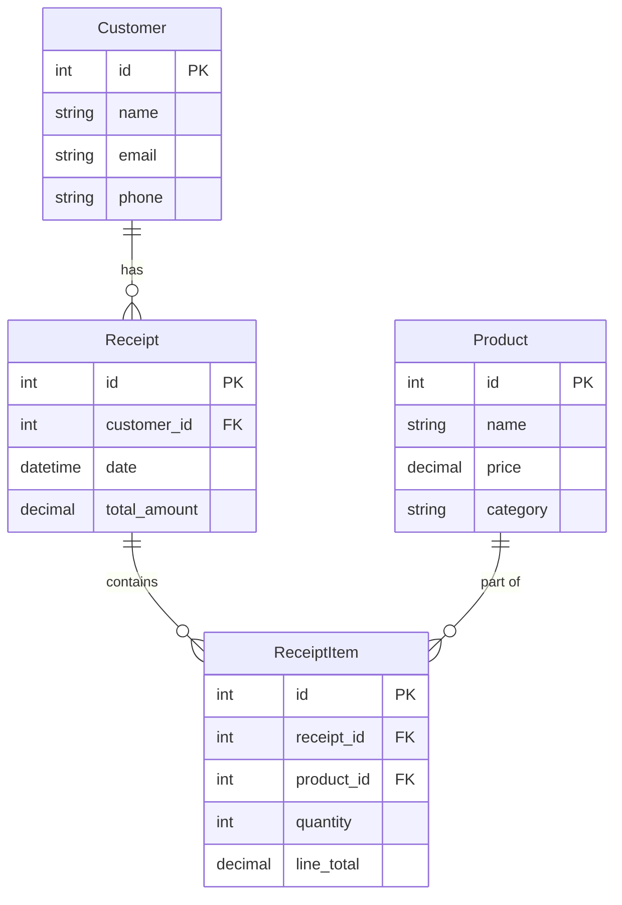

# Python and SQL Reflections

This is truly a self-assessment, as you will need to reflect on what you learned in this project and collect your thoughts on the following questions. Part of becoming a high-value software developer is understanding key concepts... not just the ability pattern match and write code.

When you are done reflecting on these topics and feel that you have a solid understanding of each one, reach out to an instructor for a vocabulary review to ensure you are prepared for technical interviews.

## What You Should Know

We will not be discussing these questions during the interview, because we expect you to have this knowledge. It is your job to ensure that you have the understanding and vocabulary for them.

### `if` Statements

2. Do I understand how to use `elif` and `else` in conjunction with `if`?
3. What is the difference between using `==` and `is` / `is not` with an `if` statement?
4. How would I check to see if a dictionary had a key with an `if` statement?

### `for` Loops

1. Write a `for` loop to iterate over elements in a list or tuple?

### Functions

1. Write the code that defines and calls a simple function in Python?
2. Explain the concepts of function arguments and return values?
3. Describe the technical difference between a method and a function?
4. What do I need to do to invoke a function that is defined in a different module?

## Concepts and Vocabulary We Will Discuss

These questions will be discussed during our interview, but we will not review the actual code.

### Classes

- What is the purpose of a class in object-oriented programming (OOP)?
- How does defining a class differ from instantiating an object of that class?

### Modules

1. Can I explain what a Python module is and why it is useful?
2. Do I know how to import and use functions from a module?
3. What are the benefits of packages when developing Python projects?

### HTTP Response Codes

1. When a server throws an unexpected exception, which status code should I send to the client in the response?
2. If the client requested a supported resource that doesn't exist, what status code should be part of the response meta-data?
3. If the client did not send all of the required data in the payload of the request, what status code should be part of the response meta-data?
4. If the client tries to perform an action _(GET, POST, PUT, or DELETE)_ that isn't supported by the API, what status code should be part of the response meta-data?

## Code Review

### Data Structures

1. Where do I create, modify, and access elements in a Python list?
2. If I was asked in an interview to describe a dictionary, what would I say?
3. Explain how to access and modify values based on keys in a dictionary.
4. Explain the difference between an object and a dictionary in Python.
5. What can an object do that a dictionary can't?

### Try/Except

1. Explain the purpose of a `try/except` block in Python?

### SQL

Review the following database diagram.

1. Explain what SQL is and why it is used in software development.
2. Write a basic SQL query to select a single record from the **ReceiptItem** database table.
3. Construct a SQL query that returns all receipt items, but includes the product name and the receipt total amount?
4. Demonstrate using the `WHERE` clause to filter records in a SQL query that returns all receipts with a total that is greater than 100.00.
5. Update your previous query to exclude receipts that were generated before 2024.
