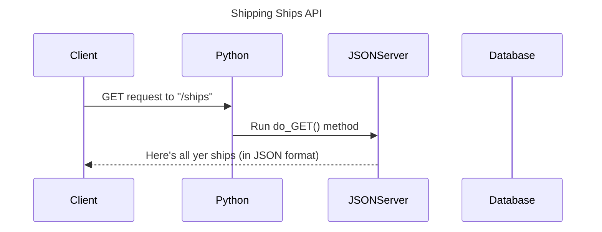
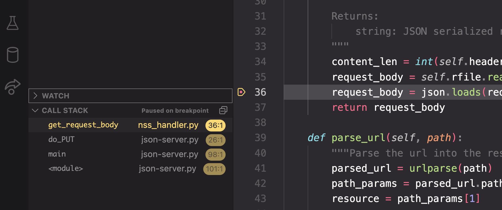

# Sequence Diagram

It's likely been a while since you built a sequence diagram, so this chapter will help you get started. The markdown provided is missing _many_ steps. You must identify all of the other participants and note all steps in the algorithm.



## Tools

We strongly recommend that you **do not** use a tool like Draw.io to build a sequence diagram. There are better tools that will generate the visual diagram from markdown text.

### Option 1: SequenceDiagram.org

Visit [sequencediagram.org](https://sequencediagram.org/) and start with the following starter directives.

```txt
title Shipping Ships API

participant Client
participant Python
participant JSONServer
participant Database
Client->>Python:GET request to "/ships"
Python->>JSONServer:Run do_GET() method
JSONServer-->>Client: Here's all yer ships (in JSON format)
```

### Option 2: VSCode Mermaid Plugin

1. Go to VS Code's extensions panel and search for _Markdown Preview Mermaid_.
2. Then install the top selection. The creator is Matt Bierner.
3. Create a new file in your project named `DIAGRAM.md`.
4. Put the code block below in the document.
5. Open the VS Code command palette with **Shift+Cmd+P**/**Shift+Ctrl+P** and searching for _preview_.
6. Choose **Markdown: Open Preview to the Side...** from the options that appear.


````sh

````

### Option 3: Mermaid Preview Extension

1. Search for the **Mermaid Preview** extension by Vlad Stirbu and install it.
2. Create a file in your project with a `.mmd` extension.
3. Open the VS Code command palette and run the **_Preview Mermaid_** command.
4. The diagram will be rendered in a new panel to the right.

## Build your diagram

Once your team has chosen which tools will be used, use your debugging skills to build a sequence diagram that correctly visualizes the process for a GET request from a client.

Time to get back into practicing your debugger skills. Using the debugger, trace the logical path of the code when a PUT request is sent from the client _(i.e. Postman, Insomnia, etc.)_. There is a feature of a debugger that will be extrmemely helpful, because it shows you the exact signal flow when you use your breakpoints - the call stack.

## Call Stack

In the image below, you will notice that there is a breakpoint on line 36 of the code. By running in debug mode, and using breakpoints, when the code is paused like this, you can see that each module, each function, and the exact line of code is displayed for you.



Watch the following **Debug Python - Call Stack** video for a short introduction to its power in helping a developer understand how to navigate declarative code and quickly jump around to each step in the process.

[](https://watch.screencastify.com/v/ofgm2w7rRRIpYaxe15kX)


## Next Steps

When your sequence diagram is complete, you must contact one of your coaches for a review. Once that review is done, and any corrections are made, you can move on to the next chapter.

[Create Resources Chapter >](./SS_API_CREATE_RESOURCES.md)
