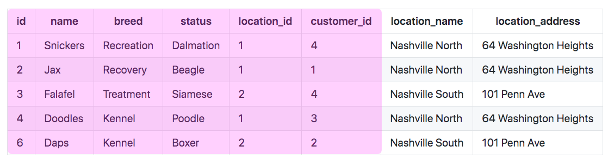
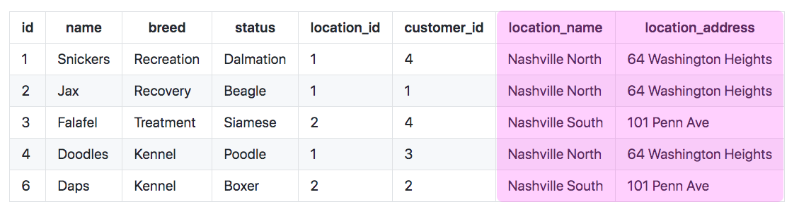

# Expanding Orders With SQL

Currently, your order JSON in a response to a client looks like this.

```json
{
    "id": 1,
    "timestamp": 1614659931693,
    "style_id": 3,
    "metal_id": 3,
    "size_id": 2
}
```

The goal is to have the related information expanded and embedded in the JSON so that the client doesn't have to perform multiple `fetch()` calls to get the metal, style, and size.

```json
{
    "id": 1,
    "timestamp": 1614659931693,
    "style_id": 3,
    "style": {
        "style": "Vintage",
        "price": 965
    },
    "metal_id": 3,
    "metal": {
        "metal": "24K Gold",
        "price": 1258.9
    },
    "size_id": 2,
    "size": {
        "carets": 0.75,
        "price": 782
    }
}
```

Since the JSON is generated by serializing an instance of the **`Order`** class, that means you need to add new properties to your class. Add three new properties to **`Order`**, but with an initial value of `None`.

```py
class Order():

    def __init__(self, id, timestamp, style_id, metal_id, size_id):
        self.timestamp = timestamp
        self.style_id = style_id
        self.metal_id = metal_id
        self.size_id = size_id
        self.style = None
        self.metal = None
        self.size = None
```

## Joining the Three Related Tables

You are going to practice the `JOIN` process in SQL for this solution.

Now you can join the `Location` table into the query so that the name and address fields are in the results. Put the following SQL in your `kennel.sql` file and run it. You should see the results displayed below.

#### SQL

```sql
SELECT
    o.timestamp,
    o.size_id,****
    o.style_id,
    o.metal_id,
    st.style,
    st.price,
    m.metal,
    m.price,
    sz.carets,
    sz.price
FROM Animal a
JOIN Location l
    ON l.id = a.location_id
```

Take the SQL statement from above and replace the existing SQL in the `get_all_animals()` function.

## Columns Used to Make an Animal

### Animal Fields

Each row contains 8 fields. The information in the first 6 will be used to create an **`Animal`** instance in your Python code.




### Location Fields

The final two columns will be used to create a **`Location`** instance in your Python code.



## Creating Location Instances

Since you have two columns in each row from the locations table in your database, that means that you can create a new instance of the **`Location`** class, in addition to the instance of **`Animal`** class that you are already making, from each row in the results.

Now replace your `for` loop with the following code.

```py
for row in dataset:

    # Create an animal instance from the current row
    animal = Animal(row['id'], row['name'], row['breed'], row['status'],
                    row['location_id'], row['customer_id'])

    # Create a Location instance from the current row
    location = Location(row['id'], row['location_name'], row['location_address'])

    # Add the dictionary representation of the location to the animal
    animal.location = location.__dict__

    # Add the dictionary representation of the animal to the list
    animals.append(animal.__dict__)
```

## Requesting from Postman Client

Request all animals from the Postman client and verify that there is an embedded `location` property on each one.


## Practice: Animals with Embedded Customer

Add an embedded customer object to the JSON response.

1. Add a `customer` property to the **`Animal`** table.
1. JOIN in the Customer table in your SQL query.
1. Select all of the columns that are needed for an instance of a **`Customer`**.
1. Create an instance of a **`Customer`** for each row in the results.
1. Add that instance of a customer

## Practice: Employee Locations

Add a `location` property to the response when the user requests http://localhost:8088/employees so that the client immediately knows the details of the employee's workplace.

