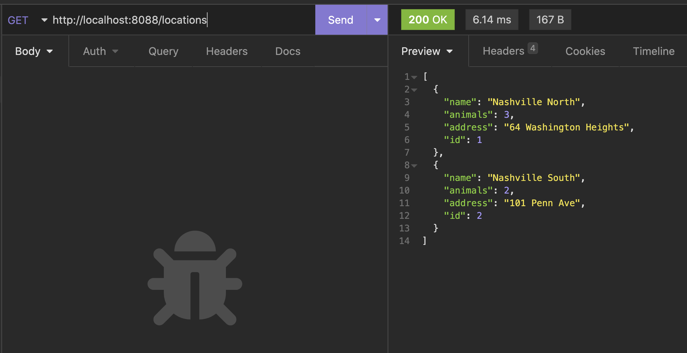

# Total Animals at Location

Use the `COUNT()` function available in SQL to add a new property `animals` to the response when requesting all locations. Its value should be an integer and represent the number of current animals assigned to the location. You need to ensure that you also include a `GROUP BY` clause in the SQL.

    
Helpful hints

1. Did you make sure to update your Location model to have an `animals` property for each object?
1. Did you add an alias for the animal count column in the SQL?
1. Did you `GROUP BY a.location_id`?

