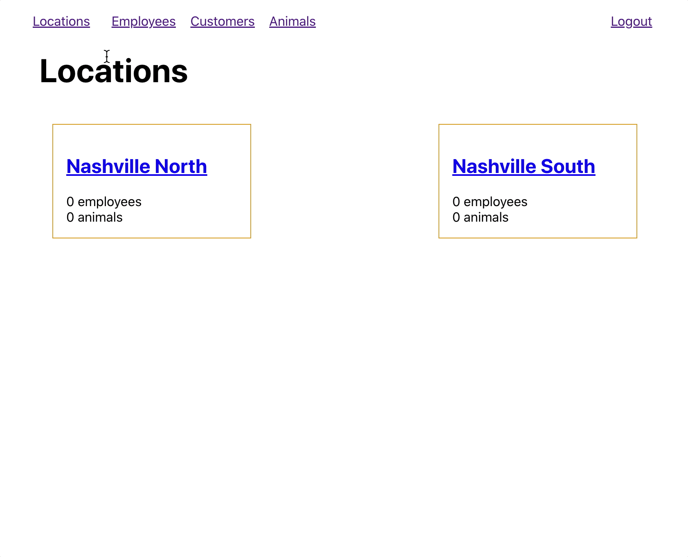

# Switching Clients

Up to this point, you've been using Postman as the client to make requests to your Python server. Well, if you have completed all of the previous chapters, and their associated practice exercises, you should now be able to fire up the <a href="https://kennels.netlify.app/" target="_blank">Nashville Kennels Client.</a>

> **Note**: Some of the client views will work, but some won't. You're not done building all the relationships in your Python server.

