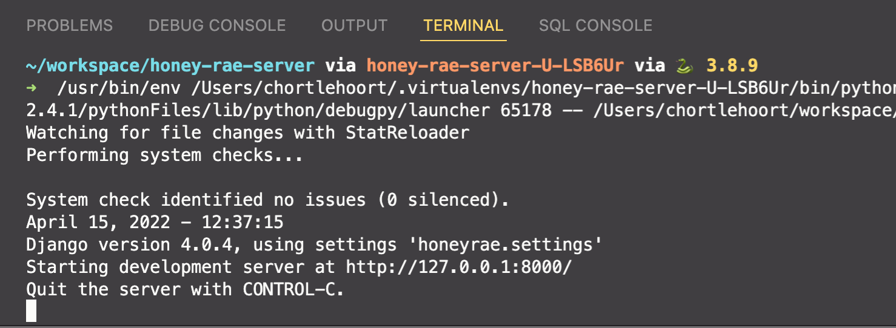

# Registering with the API

## Starting the Server in Debug Mode

Use the `Shift+Alt+D` keyboard shortcut to start your new API server in debug mode. When you do, you will see a new terminal window appear at the bottom of VS Code that looks similar to this once the API is started.



## Testing with API Client

Now you can test that the `/register` route works correctly.

1. Open your API client.
2. Create a new request.
3. Change method to POST.
4. Enter in `http://localhost:8000/register` for the URL.
5. Click the _Body_ tab under the URL.

### Register a Customer

1. Paste JSON like the following into the body. Change the values to be you, or even something silly. Doesn't really matter.
    ```json
    {
        "email": "name@domain.com",
        "first_name": "MyFirstName",
        "last_name": "MyLastName",
        "password": "django",
        "address": "404 Unknown Route",
        "account_type": "customer"
    }
    ```
7. Click the _Send_ button.
8. You should get a response that has the Django authorization token that looks like this. Yours will be different.
    ```json
    {
        "token": "382676acef1f23f321d4821c91cc4e66",
        "staff": "false
    }
    ````

### Register an Employee

1. Paste JSON like the following into the body. Change the values to be you, or even something silly. Doesn't really matter.
    ```json
    {
        "email": "mary@honeyrae.com",
        "first_name": "Mary",
        "last_name": "Floggenbottom",
        "password": "floggenbottom",
        "address": "403 Forbidden Circle",
        "account_type": "employee"
    }
    ```
7. Click the _Send_ button.
8. You should get a response that has the Django authorization token that looks like this. Note that the **staff** property's value is **true** this time.
    ```json
    {
        "token": "382676acef1f23f321d4821c91cc4e66",
        "staff": "true
    }
    ````
