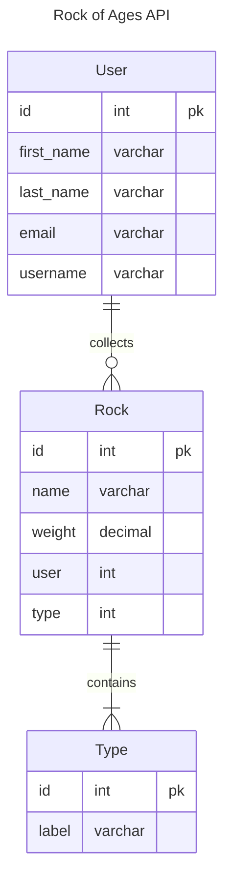

# Database Models

Time to create your ERD for the Rock of Ages API project. Create this ERD in DBDiagram. The definitions for the tables are provided below.

<details>
<summary>Expand to get DBDiagram definitions</summary>

```txt
Table User {
  id int pk
  first_name varchar
  last_name varchar
  email varchar
  username varchar
}

Table Rock {
  id int pk
  name varchar
  weight decimal
  type int [ref: > Type.id]
  user int [ref: > User.id]
}

Table Type {
  id int pk
  label varchar
}
```
</details>



## Django Models

You are going to design these tables with something called a Model. You are going to make one Model for **Rock** , one for **Type**. You don't need to define a model for **User** because Django already did that for us.

Models serve two purposes.

1. Define tables _to be_ created during a migration.
2. Represent rows in the database as objects when your API is running.

### Type Model

Make the file below and copy pasta the code into it. This is the model that you will interact with, and it has a 1-1 relationship with the user model that lives inside Django.

> #### `rockproject/rockapi/models/type.py`

```py
from django.db import models


class Type(models.Model):
    label = models.CharField(max_length=155)
```

Now that you have a model defined, it needs to be added to your project's models package.

> #### `rockproject/rockapi/models/__init__.py`

```py
from .type import Type
```

### Rock Model

Make the file below and copy pasta the code into it.

> #### `rockproject/rockapi/models/rock.py`

```py
from django.db import models
from django.contrib.auth.models import User


class Rock(models.Model):
    user = models.ForeignKey(User, on_delete=models.CASCADE, related_name='collection')
    type = models.ForeignKey("Type", on_delete=models.CASCADE, related_name='rocks')
    name = models.CharField(max_length=155)
    weight = models.DecimalField(max_digits=5, decimal_places=2)
```

Now that you have a model defined, it needs to be added to your project's models package. Add the following code.

> #### `rockproject/rockapi/models/__init__.py`

```py
from .rock import Rock
```

## Migration of Models

When your models are done, you can then create a migration to create the tables in your database.

```sh
python3 manage.py makemigrations rockapi
```

Now that migrations are created, run the following command to execute your migrations and create the tables in your database.

```sh
python3 manage.py migrate
```

Once both of those steps are done, you can view your database file _(if you already have it open, you will need to refresh)_ and you will see two new tables have been created.

- `rockapi_rock`
- `rockapi_type`

The `auth_user` table was not created now. It was created with the initial migration you did in the last chapter.

## Video Walkthrough

Here is a 4:31 minute walkthrough of implementing the code with explanations.

[](https://watch.screencastify.com/v/vyrXoRQVjaoBycysiIal)