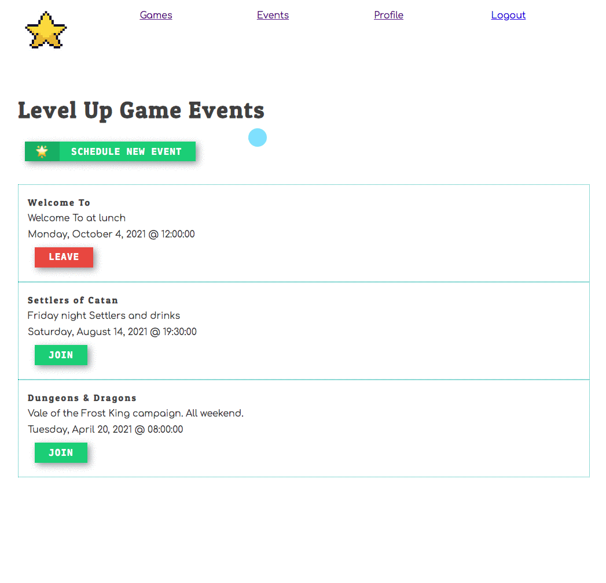

# Creating New Events

In this chapter, you are going to let a user schedule an event, and then be redirected back to the event list when done.



## Client Request Functions

Add a `createEvent()` function in your **`EventManager`** that will be responsible for performing the `fetch()` call to request that a new event be created in the server's database.

Make sure you add the `Authorization` and `Content-Type` headers to the fetch request.

```jsx
export const createEvent = () => {
    return fetch("", { })
}
```


## Event Form

Now create a **`EventForm`** component and add the code below. Invoke the `createEvent()` function when the user clicks on your form's save button.

You are only provided with a small sample of code in this chapter. You have to build out the rest of the input fields and functionality.

> #### `src/components/event/EventForm.js`

```jsx
import React, { useState, useEffect } from "react"
import { useHistory } from "react-router-dom"


export const EventForm = () => {
    const history = useHistory()

    const [currentEvent, setEvent] = useState({})

    useEffect(() => {
        // TODO: Get all existing games from API
    }, [])

    const changeEventState = (domEvent) => {
        // TODO: Complete the onChange function
    }

    return (
        <form className="gameForm">
            <h2 className="gameForm__title">Schedule New Event</h2>
            <fieldset>
                <div className="form-group">
                    <label htmlFor="gameId">Game: </label>
                    <select name="gameId" className="form-control"
                        value={ currentEvent.gameId }
                        onChange={ changeEventState }>
                        <option value="0">Select a game...</option>
                        {
                            games.map(game => (
                                <option></option>
                            ))
                        }
                    </select>
                </div>
            </fieldset>

            {/* TODO: Create the rest of the input fields */}

            <button type="submit"
                onClick={evt => {
                    evt.preventDefault()

                    // TODO: Call the createEvent function and pass it the event object


                    // TODO: Once event is created, redirect user to event list
                }}
                className="btn btn-primary">Create Event</button>
        </form>
    )
}
```

## Create Event Button

Add a button to the header of the event list component JSX. When clicked, it will redirect the browser to a `/events/new` route which should be handled by a new `<Route>` component in **`ApplicationViews`**.
