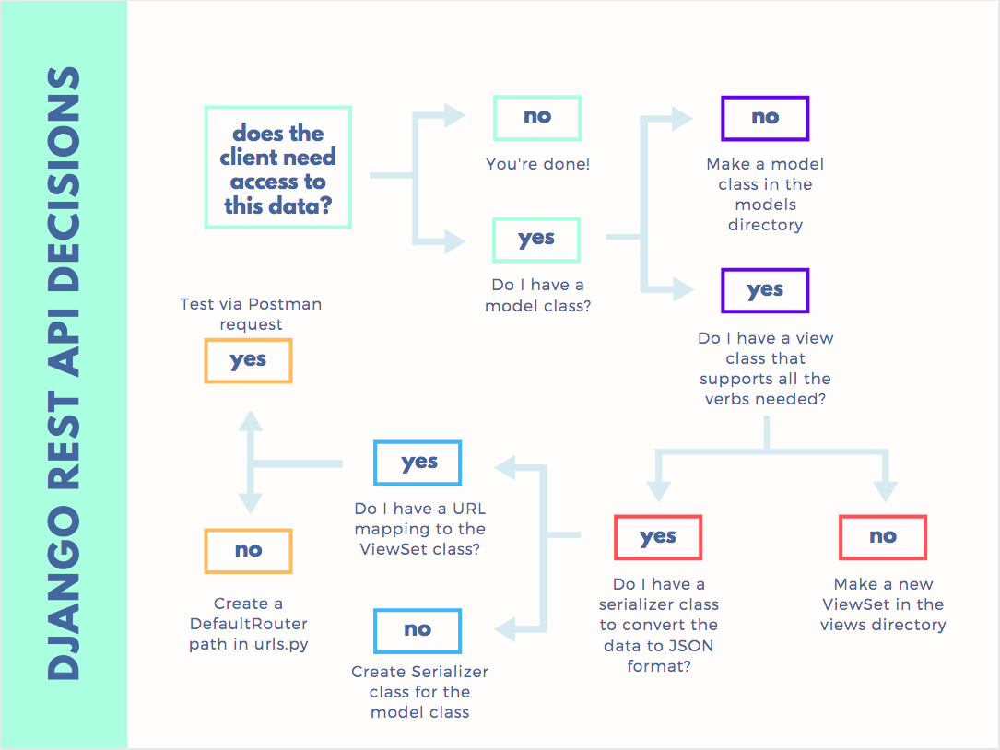

# Viewsets and Serializers

These are two key terms that you are going to be introduced to in this chapter. They are the brains of the operation.

The **ViewSet** has all of the logic for handling an incoming request from a client, determining what action is needed _(i.e. create data, get data, update data, or delete data)_, interacting with the database to do what the client asked, and then constructing a response to the client.

The **Serializer** has a much simpler job. Once the ViewSet has determined what kind of response should be sent to the client, if that response has any data, the Serializer converts the Python data into JSON format.

## Learning Objectives

* You should be able to describe the purpose of a Django View
* You should be able to explain which View methods are used to respond to a request for all of a resource, or a single resource.
* You should be able to discuss the purpose of a Serializer and how it differs from a View.
* You should be able to explain which module contains the request URLs that an API will respond to.

## Learning Resources

* The [Serializers article](https://www.django-rest-framework.org/api-guide/serializers/) in the REST framework documentation is worth a quick read. It shows examples and explanations.
* [Creating views and serializers — Django Rest Framework](https://medium.com/django-rest/django-rest-framework-creating-views-and-serializers-b76a96fb6fb7) provides a quick, high-level overview _(with example code)_ for using serializers.

## Workflow Visualization

Any time that you want to allow a client to access data in your database, there's a series of steps you have to follow in order to accomplish it with Django REST Framework.



## Step 1: The GameType Model Class

You should already have the **`GameType`** model for your application. If not, build it now after looking at the requirements in chapter 2.

## Step 2: The GameTypeView Class

Time to write the brains of the operation. The ViewSet will only handle GET requests sent from a client application over the HTTP protocol. You don't want to support POST, PUT, or DELETE because you don't want clients to have the ability to create, edit, or remove game types from the database.

> #### `levelup/levelupapi/views/game_type.py`

```py
"""View module for handling requests about game types"""
from django.http import HttpResponseServerError
from rest_framework.viewsets import ViewSet
from rest_framework.response import Response
from rest_framework import serializers
from levelupapi.models import GameType


class GameTypeView(ViewSet):
    """Level up game types"""

    def retrieve(self, request, pk=None):
        """Handle GET requests for single game type

        Returns:
            Response -- JSON serialized game type
        """
        try:
            game_type = GameType.objects.get(pk=pk)
            serializer = GameTypeSerializer(game_type, context={'request': request})
            return Response(serializer.data)
        except Exception as ex:
            return HttpResponseServerError(ex)

    def list(self, request):
        """Handle GET requests to get all game types

        Returns:
            Response -- JSON serialized list of game types
        """
        game_types = GameType.objects.all()

        # Note the additional `many=True` argument to the
        # serializer. It's needed when you are serializing
        # a list of objects instead of a single object.
        serializer = GameTypeSerializer(
            game_types, many=True, context={'request': request})
        return Response(serializer.data)
```

## Step 3: The Serializer

The serializer class determines how the Python data should be serialized as JSON to be sent back to the client. Put the following code at the bottom of the same module as above.

> #### `levelup/levelupapi/views/game_type.py`

```py
class GameTypeSerializer(serializers.ModelSerializer):
    """JSON serializer for game types

    Arguments:
        serializers
    """
    class Meta:
        model = GameType
        fields = ('id', 'label')
```

## Step 4: The URL

The last step is for the server to specify which URL it will respond to with information about game types. In this case, you want to expose a `/gametypes` resource at the end of the base API.

http://localhost:8000/gametypes

and

http://localhost:8000/gametypes/1

If any client submits a GET request to either one of those URLs, you need to clearly state that the **`GameStates`** ViewSet will handle the request. You will use a built-in class in Django called the `DefaultRouter`.


Add the following import statements at the top of the urls module.

> #### `levelup/levelup/urls.py`

```py
from rest_framework import routers
from levelupapi.views import GameTypeView
```

Then, before the URL patterns that you already set up for authentication, add these two lines of code.

> #### `levelup/levelup/urls.py`

```py
router = routers.DefaultRouter(trailing_slash=False)
router.register(r'gametypes', GameTypeView, 'gametype')

urlpatterns = [
    path('', include(router.urls)),
    path('register', register_user),
    path('login', login_user),
    path('api-auth', include('rest_framework.urls', namespace='rest_framework')),
]
```

## Client Code

There is no direct view needed in the client application to show all the game types. The information will be needed later when the user wants to add a new game, so for now, nothing needs to be added to the React client.
