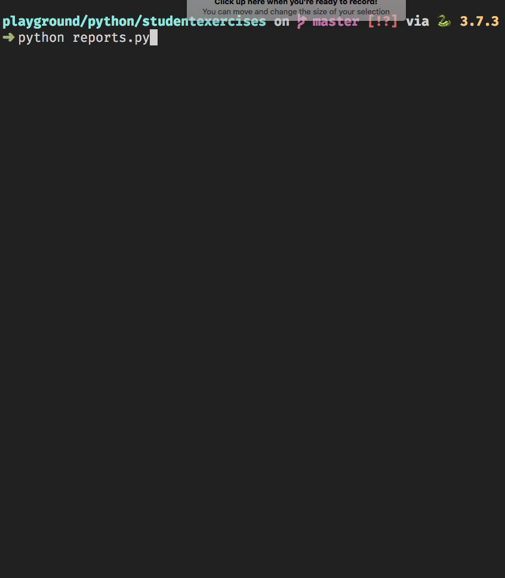

# Working with Multiple Joined Rows

Up to this point, you have seen a basic join in your SQL code and how to deal with it in Python, but now it is time to look at a more complex relationship.

Students and exercises.

Working with student and cohort is far simpler because a student can only be assigned to one cohort. However, a student can be working on multiple exercises at the same time, so the relationship is more complex. Thus, the Python code required to represent the data is complex.

Here's a sample query you can start with. Let's get each exercise in the database, and the students working on each one.

#### Students per exercise query

```sql
select
	e.Id ExerciseId,
	e.Name,
	s.Id,
	s.FirstName,
	s.LastName
from Exercise e
join StudentExercise se on se.ExerciseId = e.Id
join Student s on s.Id = se.StudentId
```

That wil produce results like this.

```
ExerciseId  Name                Id  FirstName   LastName
============================================================
2           "Overly Excited"    2   "Ryan"      "Tanay"
2           "Overly Excited"    1   "Kate"      "Williams"
1           "ChickenMonkey"     3   "Juan"      "Rodriguez"
5           "Mary Margaret"     3   "Juan"      "Rodriguez"
7           "Urban Planner"     2   "Ryan"      "Tanay"
6           "Bag o' Loot"       3   "Juan"      "Rodriguez"
```

Notice that Overly Excited is assigned to two students, so there are two rows in the results for Overly Excited. You can't use SQL to generate a single row for Overly Excited with both student names as columns. The data you get back in a one to many query will generate flat data: a row for every relationship.

The output you want to produce for this data set is nested - not flat.

```
Overly Excited
    * Ryan Tanay
    * Kate Williams

ChickenMonkey
    * Juan Rodriguez

Stock Report
    * Juan Rodriguez

Urban Planner
    * Ryan Tanay
    * Natasha Cox

Bag o' Loot
    * Juan Rodriguez
```

To turn flat data into grouped data, then consider which data structure in Python that you need to accomplish it. Perhaps each exercise could be a dictionary. The keys of the dictionary could be the name of the exercise, and the values would be lists of students.

```json
{
    "Overly Excited": ["Ryan Tanay", "Kate Williams"],
    "ChickenMonkey": ["Juan Rodriguez"],
    "Stock Report": ["Juan Rodriguez", "Natasha Cox"],
    "Urban Planner": ["Ryan Tanay"],
    "Bag o' Loot": ["Juan Rodriguez"]
}
```

## Converting Data Sets to Dictionaries

Time to look at the code to accomplish this.

Start with a blank dictionary.

```py
exercises = dict()
```

Then query for the data.

```py
exercises = dict()

with sqlite3.connect(self.db_path) as conn:
    db_cursor = conn.cursor()

    db_cursor.execute("""
        select
            e.Id ExerciseId,
            e.Name,
            s.Id,
            s.FirstName,
            s.LastName
        from Exercise e
        join StudentExercise se on se.ExerciseId = e.Id
        join Student s on s.Id = se.StudentId
    """)

    dataset = db_cursor.fetchall()
```

Then start iterating over the rows in the data set, and assign all rows to a variable.

```py
for row in dataset:
    exercise_id = row[0]
    exercise_name = row[1]
    student_id = row[2]
    student_name = f'{row[3]} {row[4]}'
```

Then you start using the dictionary. For each row, you are going to determine if the dictionary has the current exercise's name as a key. If it doesn't have the key yet, you will create it and put the student's name in a list. If it already has the key, you will append to the list of students.

```py
for row in dataset:
    exercise_id = row[0]
    exercise_name = row[1]
    student_id = row[2]
    student_name = f'{row[3]} {row[4]}'

    if exercise_name not in exercises:
        exercises[exercise_name] = [student_name]
    else:
        exercises[exercise_name].append(student_name)
```


With the first iteration of the `for` loop, the `exercises` dictionary has nothing in it

```py
print(exercises)

>>> {}
```

Therefore, since there is no 'Overly Excited' key in the dictionary, the `if` condition evaluates to true. In that case, the first exercise name is added as a key to the dictionary and it's value is the current student.

```py
{
    'Overly Excited': ['Ryan Tanay']
}
```

Now it moves on to the second row in the dataset. Does the key of 'Overly Excited' exist in the dictionary? Sure does, so the `if` condition evaluates to false, and the current student is added to the existing library.

```py
{
    'Overly Excited': ['Ryan Tanay', 'Kate Wiliams']
}
```

The third row is for the 'ChickenMonkey' exercise, so a new key is added and the matching student is in the list value

```py
{
    'Overly Excited': ['Ryan Tanay', 'Kate Wiliams'],
    'ChickenMonkey': ['Juan Rodriguez']
}
```

The fourth row is for another new exercise, so it is added and the student is in the list value.

```py
{
    'Overly Excited': ['Ryan Tanay', 'Kate Wiliams'],
    'ChickenMonkey': ['Juan Rodriguez']
    'Stock Report': ['Juan Rodriguez']
}
```

This process continues until each row in dataset has been evaluated. If you `print(exercises)` after that loop is complete, you will see a data structure like the example one below.

> **_Note:_** It won't be this pretty. It will all be squashed together in the terminal.

```py
{
    'Overly Excited': ['Ryan Tanay', 'Kate Williams'],
    'ChickenMonkey': ['Juan Rodriguez'],
    'Stock Report': ['Juan Rodriguez', 'Natasha Cox'],
    'Urban Planner': ['Ryan Tanay'],
    "Bag o' Loot": ['Juan Rodriguez', 'Jessawynne Parker'],
    'Zoolandia': ['Rainu Ittycheriah', 'Meg Ducharme', 'Jessawynne Parker'],
    'Kandy Korner': ['Hannah Hall'],
    'Kill Nickelback': ['Steven Holmes', 'Tanner Terry'],
    'Kneel Diamonds': ['Steven Holmes', 'Hannah Hall'],
    'Probes': ['Tanner Terry'],
    'Boy Bands & Vegetables': ['Jessawynne Parker']
}
```

## Iterating your Exercise Dictionary

Once the dictionary is built, then you can iterate all of the items in it. When you access the `items()` in a dictionary, you have to define a variable to hold the key, and one to hold the value in the `for` loop.

```py
for exercise_name, students in exercises.items():
    print(exercise_name)
    for student in students:
        print(f'\t* {student}')
```

