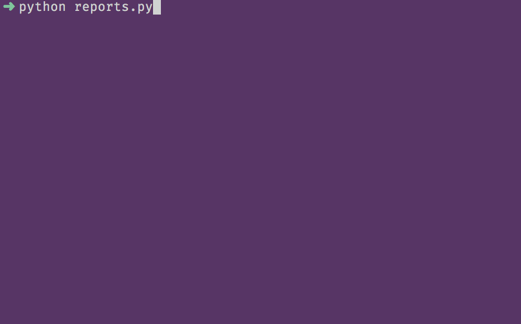
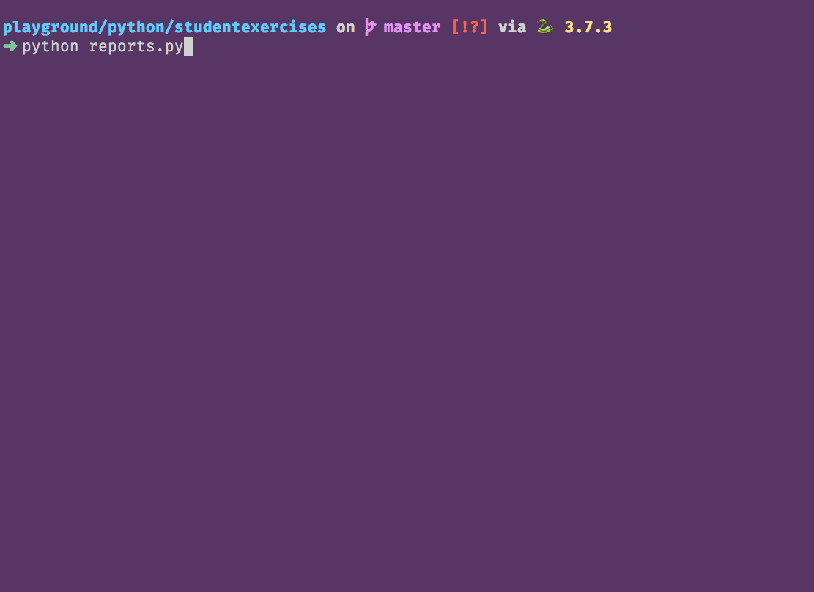

# Writing Python Code to Use SQL Statements

## Setup

```sh
cd ~/workspace/python/exercises/studentexercises
touch reports.py
```

## Using the Translator

Python can not naturually talk to a database. It needs a translator that converts Python code to code that the database understands. In your Python module, you can import that translator.

```py
import sqlite3
```

Please take a few minutes to read the documentation on the [sqlite3](https://docs.python.org/3/library/sqlite3.html) package in Python. It is strongly suggested that you bookmark that page as well, as you will be using that syntax for the next few chapters.

## Getting Data into Python

You can now use the `sqlite3` package to interact with your database. Here's a sample function that gets all students from your Student Exercises database. You can copy this directly into `reports.py`.

> **IMPORTANT:**
>
> Make sure you replace the placeholder `/absolute/path/to/home/directory/` in the db path below with your real home directory. It is important to use the full, absolute path to your database file so that debugging will work. Use the `pwd` command in your terminal to get your absolute path.
>
> In the code below, the example uses OSX absolute path syntax. If you are on a Windows machine and run `pwd` in Git Bash, the you will see a path like the following.
>
> ```sh
> /c/Users/username/workspace
> ```
>
> You need to remove the /c at the beginning
>
> ```sh
> /Users/username/workspace
> ```

```py
import sqlite3


class StudentExerciseReports():

    """Methods for reports on the Student Exercises database"""

    def __init__(self):
        self.db_path = "/absolute/path/to/home/directory/workspace/python/exercises/studentexercises/studentexercises.db"

    def all_students(self):

        """Retrieve all students with the cohort name"""

        with sqlite3.connect(self.db_path) as conn:
            db_cursor = conn.cursor()

            db_cursor.execute("""
            select s.Id,
                s.FirstName,
                s.LastName,
                s.SlackHandle,
                s.CohortId,
                c.Name
            from Student s
            join Cohort c on s.CohortId = c.Id
            order by s.CohortId
            """)

            all_students = db_cursor.fetchall()

            for student in all_students:
                print(f'{student[1]} {student[2]} is in {student[5]}')

reports = StudentExerciseReports()
reports.all_students()
```

Run your `student_exercises.py` module in your terminal and see what gets printed out.

### Fetching Data

When you instruct the `sqlite3` package to `fetchall()` in the code above, it takes your SQL string and walks over to the database and executes it. It then takes all of the rows that the database generates, and creates a tuple out of each one. It then puts all of those tuples into a list.



### Extracting Individual Columns

Since a tuple is simply an immutable list, you can use square-bracket notation to extract individual items out of it. Displaying a tuple to the terminal as output is not good UX. Use the following code to just display the first name _(second column)_, last name _(third column)_, and cohort name _(sixth column)_.

```py
for student in all_students:
    print(f'{student[1]} {student[2]} is in {student[5]}')
```



## Turning Data into Students

Since the data you are retrieving from the database represents students, the next step in the process is to create a Python class named `Student` so that there is context for the data in your code. For example, with the code you have now, every time you wanted to access the last name of the student, you would have to use the `student[5]` syntax.

There is no context there. It would be more readable code if you could use `student.cohort`. Then, future teammates looking at your code do not need to put in the time and cognitive effort to look up what's in the 6th column of the query. Put the following class in your module, above the report class.

```py
import sqlite3


class Student():

    def __init__(self, first, last, handle, cohort):
        self.first_name = first
        self.last_name = last
        self.slack_handle = handle
        self.cohort = cohort


class StudentExerciseReports():
    ...
```

Now you have a simple class that you can use to generate a new object, with contextual properties, for interacting with student data. You would create a new instance like so.

```py
student = Student('Bart', 'Simpson', '@bart', 'Cohort 8')
print(f'{student.first_name} {student.last_name} is in {student.cohort}')

# Output
> "Bart Simpson is in Cohort 8"
```

### Convert Data to Students with Row Factories

Now that you have a class to represent the data with more context, it's time to create your Student instances. The `sqlite3` package has a [row_factory property](https://docs.python.org/3/library/sqlite3.html#sqlite3.Connection.row_factory) on the connection object where you can specify the instructions for the conversion of `row of data -> Student instance` with your own function.

The function assigned to the `row_factory` property must take two arguments - the cursor, and the current row of data. It must return something. In your case, it will return a new instance of student. Add the `create_student()` method below to your report class.

```py
class StudentExerciseReports():

    """Methods for reports on the Student Exercises database"""

    def create_student(self, cursor, row):
        return Student(row[1], row[2], row[3], row[5])
```

Then assign that function to the `row_factory` method of the database connection.

```py
with sqlite3.connect(self.db_path) as conn:
    conn.row_factory = self.create_student
```

Now when you run the `fetchall()` method, you will end up with a list of Student objects instead of a list of tuples. This means that you can access those properties when displaying them.

```py
for student in all_students:
    print(f'{student.first_name} {student.last_name} is in {student.cohort}')
```

After you have made all these changes, run your code to ensure that you still get the output you expect. If you are getting error, debug them first, and if you are still stuck, come see a member of your instruction team.

## Using Python Lambdas

After you are done with the exercises for this chapter, you will be displaying students, instructors, cohorts, and exercises to the terminal. You could surmise that you will then need the `create_student()`, `create_instructor()`, `create_cohort()`, and `create_exercise()` methods on your class to convert the row data into instances of objects.

Since each of those methods will only be used once - each inside the corresponding method to query the data - then we can write a lambda. It sounds fancy, but it just means "anonymous function".

You got plenty of practice with those in the client side course. Here's some JavaScript code to create an array from another array.

```js
const childrenNames = children.map(child => child.full_name)
```

In the code above, the `child => child.full_name` is a lambda, or anonymous function. In Python, there is a keyword of `lambda` to create these.

You are currently assigning the row factory method with a named function.

```py
conn.row_factory = self.create_student
```

You can delete the `create_student()` function and define it as a lambda instead.

```py
conn.row_factory = lambda cursor, row: Student(
    row[1], row[2], row[3], row[5]
)
```

Run your code to make sure it still works.

## Represent Student as a String

Now you can use the `__repr__` dunder method to provide a default string representation of a student.

```py
class Student():

    def __init__(self, id, first, last, handle, cohort):
        self.id = id
        self.first_name = first
        self.last_name = last
        self.slack_handle = handle
        self.cohort = cohort

    def __repr__(self):
        return f'{self.first_name} {self.last_name} is in {self.cohort}'
```

Since that is how you were printing out the student information when looping over the database results, you can replace the following code...

```py
for student in all_students:
    print(f'{student.first_name} {student.last_name} is in {student.cohort}')
```

With this straightforward loop...

```py
for student in all_students:
    print(student)
```

Or this concise [list comprehension](https://www.digitalocean.com/community/tutorials/understanding-list-comprehensions-in-python-3)...

```py
[print(s) for s in all_students]
```
