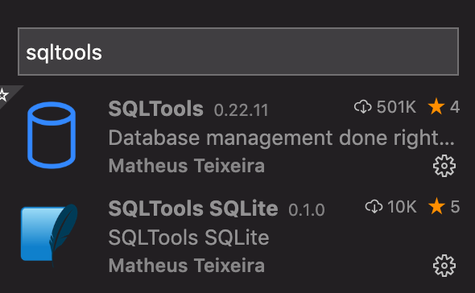
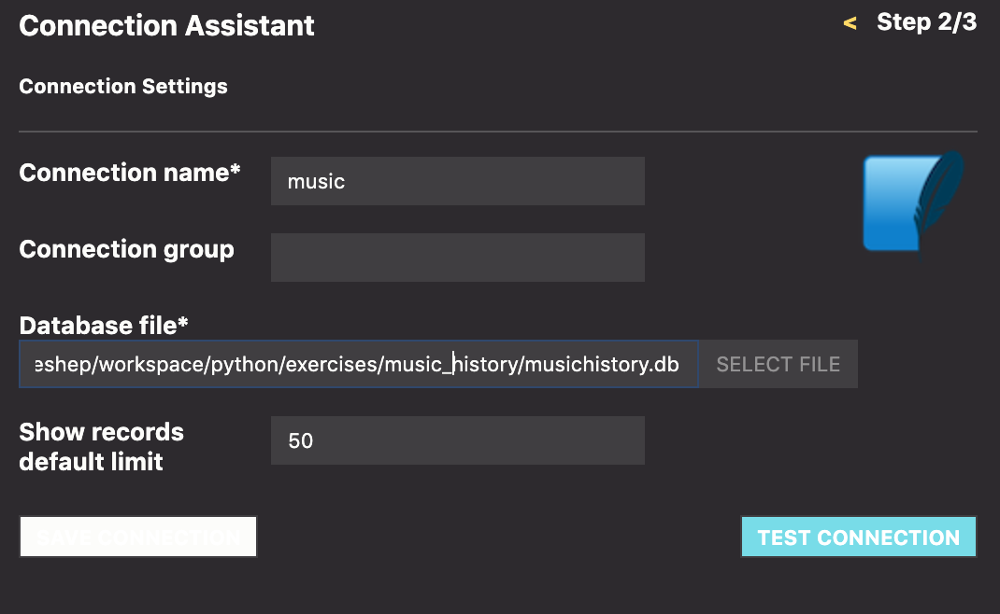
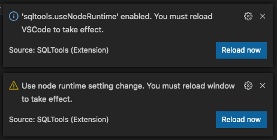
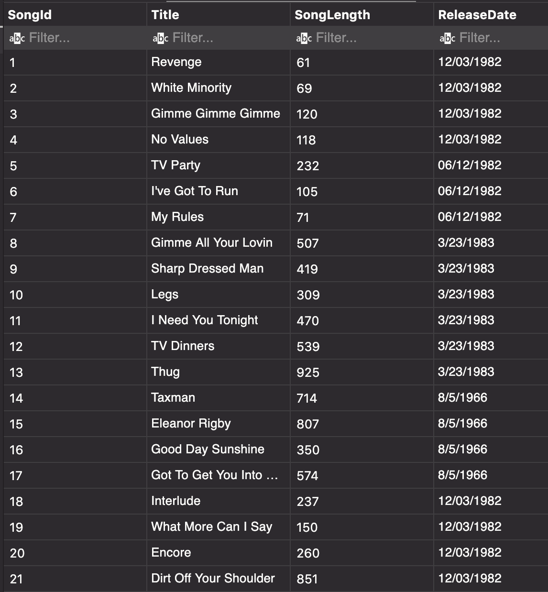

# Structured Query Language: Your Database Interface!

In the front-end course you tip-toed into the world of persisted data with the help of json-server, a command-line app that provided a way for you to make HTTP requests to a database file. What you didn't see was the work that json-server did to communicate with your database to carry out your requests to create, retrieve, update or delete the data from your db. 

It's now time to open that Pandaora's box and find out how to write code that communicates directly with a database. 

One crucial difference between your front-end and back-end databases is the format. With json-server you could throw togther a JSON file and call it a db. It was easy to edit manually, and any time you wanted to check the state of your data you just had to open the file and take a peek. Here in server-side land you will be working with a relational database management system (RDBMS), which changes things in a couple of crucial ways:

1. Your data will now be organized in tables, with columns and rows, rather than as collections of objects and arrays. Most importantly, you won't be able to look directly at your db file to see your data. Try to open a `.db` file and VS Code will say "Nope".  
2. You can't change your db file directly. Goes without saying that if you can't open the file to read it, you can't type anything into it! 

So, what's a dev to do? Learn Stuctured Query Language -- SQL -- so you can create, talk to, and explore your databases. And install some helpers for viewing the results in human-readable tables and rows.

## SQLTools for Database Management

Before you begin learning SQL, you'll need to install a VS Code extension called SQLTools to help you execute SQL queries. Think of it kind of like Postman, in that you can use SQLTools to play around with your db outside the confines of an application.  

Practice being a keyboard ninja by typing `shift + ctrl (or cmd) + X` to open the VS Code extensions view. Then search for SQLTools and install it, as well as the SQLTools SQLite driver. 



Once you're done, you can navigate back to the file view with `shift + ctrl (or cmd) + E`.

### Configuring 
To configure the extension the way we want, you will first need to tell SQLTools to connect to a database. Lucky for you we just happen to have one lying around. So, go ahead and create a directory in your workspace python folder called `music_history`. 

Then download the [musichistory.db](./assets/musichistory.db) file into the directory you just created.  

>WSL ( Linux ) users You might have found out by now that it's quite difficult to find your WSL directories in file explorer. Make sure that you have your WSL home directory pinned to your Quick Access section in file explorer:
>1. In your terminal, go to your home directory ( ~ ) and execute explorer.exe . (Must include the . !)
>1. This opened up your home directory in file explorer! Now right click Quick Access
>1. Select Pin current folder to Quick Access and done! Your linux home directory is now easily accessible from file explorer!  
>
>Now when you go to download musichistory.db you can get to your WSL directories to put the .db file in. Or something like that :shrug:

`music_history.db` **is** the database. It contains all of the tables and data. SQL comes in a variety of 'dialects'. We will be using SQLite, which, like your json files in the front-end, will allow us to simply use a file to represent our entire db. This makes it easy to get up and running with SQL without having to run a separate server to host the db.

### Time to connect!
1. Type `shift + ctrl (or cmd) + P` to open your VS Code Command Palette. 
1. Type in `SQLTools` to see all the commands for SQLTools. 
1. Look for `SQLTools Management: Add New Connection` and select it.
1. You'll be asked to select your database driver. Click on SQLite.<br>  


1. Fill out the Connection Settings by giving the connection a name ( can be anything. But let's call it music ) and by selecting `music_history.db` for the Database File.<br>  


1. Click "Test Connection". You will likely be prompted to `enable sqltools.useNodeRuntime`.  If so, click `Enable Now`, which will prompt you to reload the window.<br>  

 
1. Whew! Almost there. 
1. `shift + ctrl (or cmd) + P` again to search and select `SQLTools:Connect`  
1. Choose `music` 
1. You should now be in a new blank file called `music.session.sql`. Here is where at last you can write your SQL code to query the database. It was all worth it, we promise.

> **Note:** The `.sql` extension is common practice for files storing SQL queries

### Your first SQL query
Before you start querying the database, it might be nice to see what kind of data is in there. Start with another SQLTools command: Show Table Records. Selecting that in the command Palette will give you the choice to peek at any table in the db -- Album, Artist, Genre, or Song. Selecting `Song` will open a new tab with a table representation of every column and row in the Song table.<br>  



That's pretty cool, but it's not what we came here to do! We want to use SQL to query the db and get the data back that way. After all, our eventual goal is to write web apps that talk to databases, and to do that we need to use SQL.

Here's how to get that `Song` table and all of its data with a SQL query:

```sql
SELECT SongId, Title, SongLength, ReleaseDate
FROM Song;
```
Type that into `music.session.sql` and ask SQLTools to run it for you with, sigh, another `shift + ctrl (or cmd) + P` and a search for SQLTools Connection: Run Current Query (Make sure your cursor is still on the line you wrote.)

Hooray! You just ran your first SQL query.  
Boo! Selecting that command is a pain in the butt.  

Let's make a keyboard shortcut. You're going to `Run Current Query` a _lot_.

### Add a keyboard shortcut
* Hit shift + ctrl (or cmd) + P` (yeah, again)
* Type in "shortcuts"
* Select "Preferences: Open Keyboard Shortcuts"
* Type in "sqltool"
* Double click "SQLTools Connection: Run Current Query"
* Hold down ctrl (or cmd) and tap "R" twice to bind it to "Cmd R + Cmd R" or "Ctrl R + Ctrl R"
* type `ctrl (or cmd) + W` to close shortcuts

Now, when you're ready to run a query, you can use that key binding instead. That will save you roughly 68 hours of your life over the span of your career. You're welcome.


Your instructors will take it from here with a guide to the most common types of SQL queries for retrieving, saving, updating and removing data from a relational databse.

## References

* [SQLBolt Learn SQL with simple, interactive exercises.](https://sqlbolt.com/)
* [Introductory SQL tutorial](http://www.sqlcourse.com/)
* [W3schools interactive SQL tutorial](https://www.w3schools.com/sql/sql_intro.asp)
* [Online SQLite tutorial](http://www.sqlitetutorial.net/)

## Instructions

For each of the following exercises, provide the appropriate query. Yes, even the ones that are expressed in the form of questions. Everything from class and the [Sqlite](http://www.sqlite.org/) documentation for SQL [keywords](https://www.sqlite.org/lang.html) and [functions](https://www.sqlite.org/lang_corefunc.html) is fair game.

1. Query all of the entries in the `Genre` table
1. Using the `INSERT` statement, add one of your favorite artists to the `Artist` table.
1. Using the `INSERT` statement, add one, or more, albums by your artist to the `Album` table.
1. Using the `INSERT` statement, add some songs that are on that album to the `Song` table.
1. Write a `SELECT` query that provides the song titles, album title, and artist name for all of the data you just entered in. Use the [`LEFT JOIN`](https://www.tutorialspoint.com/sql/sql-using-joins.htm) keyword sequence to connect the tables, and the `WHERE` keyword to filter the results to the album and artist you added.
    > **Reminder:** Direction of join matters. Try the following statements and see the difference in results.

    ```
    SELECT a.Title, s.Title FROM Album a LEFT JOIN Song s ON s.AlbumId = a.AlbumId;
    SELECT a.Title, s.Title FROM Song s LEFT JOIN Album a ON s.AlbumId = a.AlbumId;
    ```
1. Write a `SELECT` statement to display how many songs exist for each album. You'll need to use the `COUNT()` function and the `GROUP BY` keyword sequence.
1. Write a `SELECT` statement to display how many songs exist for each artist. You'll need to use the `COUNT()` function and the `GROUP BY` keyword sequence.
1. Write a `SELECT` statement to display how many songs exist for each genre. You'll need to use the `COUNT()` function and the `GROUP BY` keyword sequence.
1. Using `MAX()` function, write a select statement to find the album with the longest duration. The result should display the album title and the duration.
1. Using `MAX()` function, write a select statement to find the song with the longest duration. The result should display the song title and the duration.
1. Modify the previous query to also display the title of the album.
