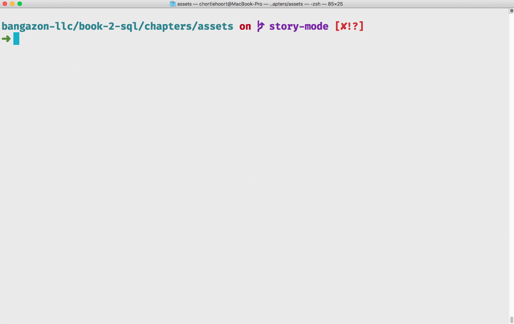

# TablePlus for Database Management

Since you are using SQLite for the Python course, you will be using the cross-platform tool called [TablePlus](https://tableplus.io/). It will work on both Mac and Windows. If you haven't installed it yet, visit their site, download it, and run the installer.

## Bash Alias

To open a database file with TablePlus, add the following alias to your initialization file.

```sh
alias tableplus="open -a """TablePlus""" "
```

This will allow you to launch TablePlus from the terminal by typing in `tableplus {database filename}`.

## Writing SQL

Once TablePlus has opened your database, you can use the keyboard shortcut of `Cmd+Enter` on OSX or `Ctrl+Enter` on Windows to open a new editor for your SQL statements.

