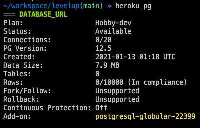

# Deploying with Heroku
Heroku is a cloud platform that lets companies and users build, deliver, monitor and scale apps. It's pretty simple to use for deploying your django application. Best of all, there's a free tier that will work well enough for what you'll need.

### Before Starting
1. Make sure you have the `db.sqlite3` in the gitignore and check that it is not in the github repo. If it is on github, fix that first before continuing.
2. Follow the steps in Book 2 Chapter 1 to hide the django `SECRET_KEY` variable.

### Steps
1. In the terminal, cd to your project folder and create a new branch named `deploy`. Push that branch to github
1. Install heroku cli: https://devcenter.heroku.com/articles/getting-started-with-python#set-up
1. Create heroku account. You will want to use two factor authentication (TFA) when creating your account: https://signup.heroku.com/
2. Create application in heroku: https://dashboard.heroku.com/new-app
3. After you create the application, click on the Github deployment method and log into Github in the pop up window
4. Scroll down a little and click the connect to github button that has appeared.
5. Type in the name of the repo you want to deployand click search.
6. Your repo should appear below the search field. Click the 'Connect' button to connect to the repo.
6. In the Automatic Deployment section, switch the branch from `main` to `deploy` and click "Enable Automatic Deploys"
7. Scroll back to the top of the page and click on "Settings" to the right of "Deploy"
8. In the "Config Vars" section, click on "Reveal Config Vars"
9. For every key and value pair in the `.env` file add those pairs to the config variables
10. Back in the terminal on the `deploy` branch, there's a few extra packages you'll need to install `pipenv install gunicorn django_on_heroku`. If you're a mac user and that fails, run `brew install postgresql` then rerun the pipenv install
11. Add `import django_on_heroku` to the imports in `settings.py`
12. Add these lines to the end of the `settings.py`
    ```py
    STATIC_ROOT = os.path.join(BASE_DIR, 'staticfiles')
    STATIC_URL = "/static/"
    STATICFILES_STORAGE = 'django.contrib.staticfiles.storage.StaticFilesStorage'

    django_on_heroku.settings(locals())
    ```
4. Add a file called `Procfile` to the root directory of your project and paste in this line (change out `levelup` for your project module name) `web: gunicorn levelup.wsgi --log-file -`
1. Add and commit all the changes
1. To add code to the heroku server run: `git push origin deploy`. With automatic deploy enabled any changes to the `deploy` branch will trigger a new deployment
1. Run `heroku open --app YOUR-APP-NAME` and you should see the base rest framework unauthorized page
1. The next step is checking that a database was created. Run `heroku pg` and you should see something like this:

1. Can't have a django project without tables so run `heroku run python3 manage.py migrate --app YOUR-APP-NAME` The output should look similar to running it locally
1. You'll need to create your django superuser next `heroku run python3 manage.py createsuperuser --app YOUR-APP-NAME` This is a live site so make sure to use a strong password
1. You should notice that all the normal `python3 manage.py .....` commands work as long as `heroku run` is at the beginning of the command.
1. Now to load the fixture data onto your database. **DO NOT LOAD the users.json OR tokens.json!!!!!!!** There is the superuser with an id of 1 so the rest of your fixtures will still work. If you need more users for your fixtures create them in the django admin with the next step.
1. To create a token for the superuser log into `<your-url>.com/admin` with the superuser and click on `Tokens` on the left and add a token for the superuser.
1. Once you are done with development, in the `settings.py` file set `DEBUG` to `False` and push up that change.
### Using Postman

At this point you should be able to use Postman to get data from the database.

Copy the token key you just created and add it to the Postman headers:


Copy the URL heroku gave you into the URL bar and try it out!


### Front end Deployment
Good news! Whatever you used to deploy during the front end will still work. You'll just need to update your API calls in react to use the deployed URL. Once your front end is deployed you'll need to add the new url to the `CORS_ORIGIN_WHITELIST` tuple in the `settings.py`.
