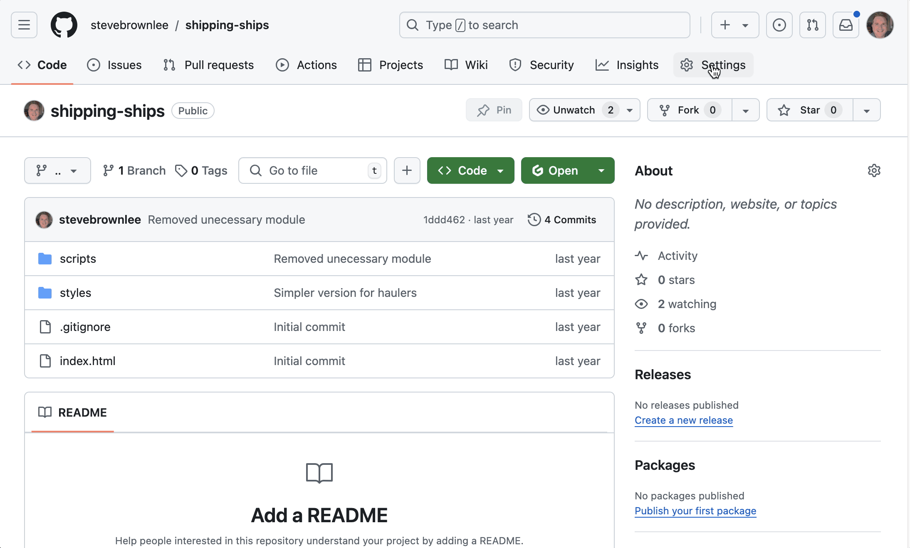

# Github Actions

Github Actions is a powerful automation tool built into GitHub that can help streamline your development workflow. For a bootcamp learner working on simple, static projects, it can be particularly useful for automating the deployment process. Here's a beginner-friendly overview.

## What is GitHub Actions?

GitHub Actions is a continuous integration and continuous delivery (CI/CD) platform that allows you to automate various tasks in your software development workflow. These automated processes are called "workflows" and are defined in YAML files in your repository.
How can a bootcamp learner use it?
For deploying simple, static projects, GitHub Actions can be used to automatically build and deploy your site whenever you push changes to your repository. Here's a basic process:

## Early, Static Project Deploys

For projects that you did early in the course before you started using `json-server` to perform HTTP requests to a local API, Github makes it very easy to deploy these.

Examples include Shipping Ships, Martin's Aquarium, and Brewed Awakenings.

### Set Up Github Pages

1. Go to your Github repository
2. Click on **Settings**
3. Click on **Pages**
4. Click on **Source** and choose _Github Actions_ option
5. Github will show you two beginner options.
6. Choose the **Static HTML** option
7. Github will show you the Github Action YAML file that you need to add to your repository.
8. You can immediately commit those changes.

### Your first automated build and deploy

1. Locally, make a simple change on your `develop` branch for the chosen project.
2. Add, commit and push the changes.
3. Go to Github and create a pull request from `develop` to `main`
4. Merge the pull request
5. Go to the **Actions** tab of your repository.
6. You will notice an automated build task running. Click on it.
7. When the build is done, click on the URL that is displayed in the task.

This workflow will run whenever you push to the main branch. It uses a pre-made action to deploy your files to GitHub Pages.
Benefits for a bootcamp learner:

Automation: You don't need to manually upload files every time you make changes.
Learning DevOps: It introduces you to important concepts in modern software development.
Portfolio boost: Having automated deployments looks impressive to potential employers.
Consistency: It ensures your deployed site is always in sync with your latest code.

As you progress, you can explore more complex workflows, like running tests before deployment or deploying to other platforms.
Remember, while GitHub Actions is powerful, start simple and gradually add complexity as you become more comfortable with the concept.