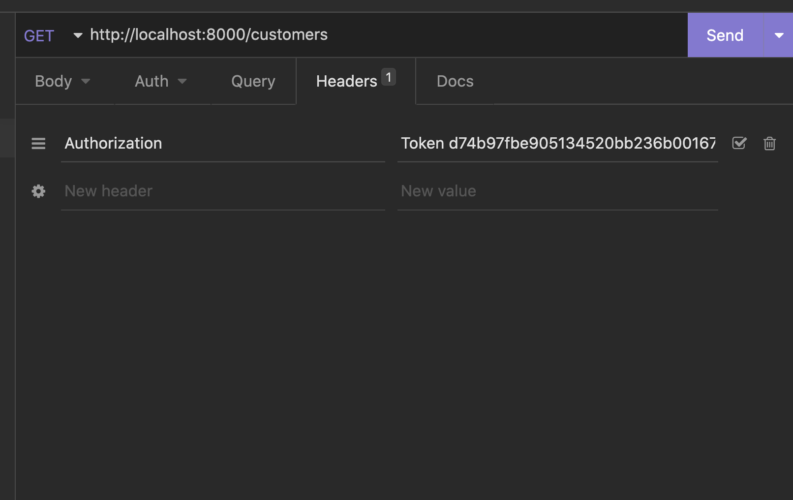

# Getting All Customers from the API

1. Create a **CustomerView** that implements **list** and **retrieve**. No special conditions need to be accounted for.
2. Create a **CustomerSerializer** that includes all three fields from the customer model.
3. Add the view class to the **views** package.

## Adding the URL

In the `urls.py` module, you have already setup the login and register routes, but from there on out you will be using the **DefaultRouter** to establish the remaining routes.

Add the following import statements at the top of the `urls.py` module.

```py
from django.conf.urls import include
from rest_framework import routers
from repairsapi.views import CustomerView
```

In the same file, above the current `urlpatterns` variable, add the following:

```py
router = routers.DefaultRouter(trailing_slash=False)
router.register(r'customers', CustomerView, 'customer')
```

Lastly, we need to add all routes registered with the default router it to the `urlpatterns`. Anywhere inside the `urlpatterns` list add the following line.

```py
path('', include(router.urls)),
```

## Test it out

Try it out in your API client!

1. Open the `tokens.json` file in your project and examine the `pk` key on each object. These are unique tokens assigned to every user in the system.
2. Copy any one of them to use in your API client.
3. Start a new request.
4. Add a new header to the request named `Authorization`
5. The value will be the word Token, followed by a space, and then the unique token you copied previously (e.g. `Token 0be249c88238743e5b4a7ac370b5145730c28e20`)
6. Then grab one of the following two URLs and generate a request.

`http://localhost:8000/customers` should return a list of all the customers.

`http://localhost:8000/customers/1` should return the customer with an id of 1.

## Examples

Here's how a request in Postman should look.


Here's how a request in Insomnia should look.


