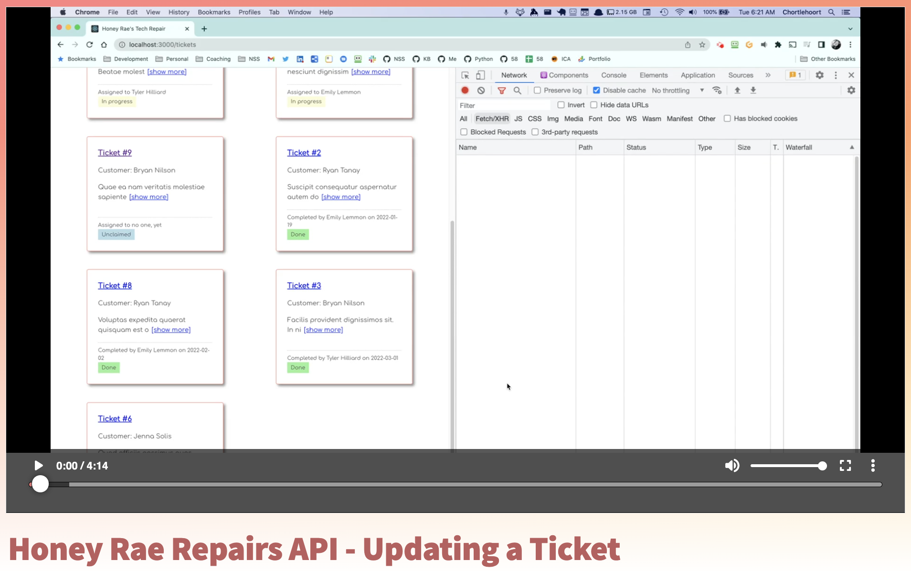

# Assign Ticket to Exployee

In this chapter, you are going to enhance your API to allow tickets to be assigned an employee. This is a PUT operation because you are editing a single ticket.

Watch the following video and then implement the code yourself.

