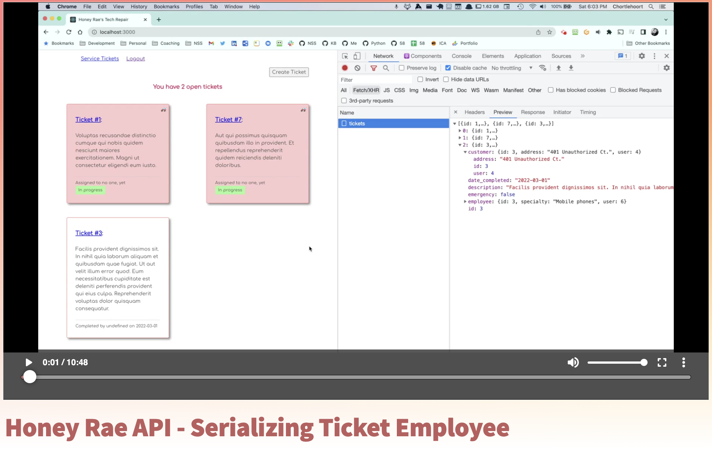
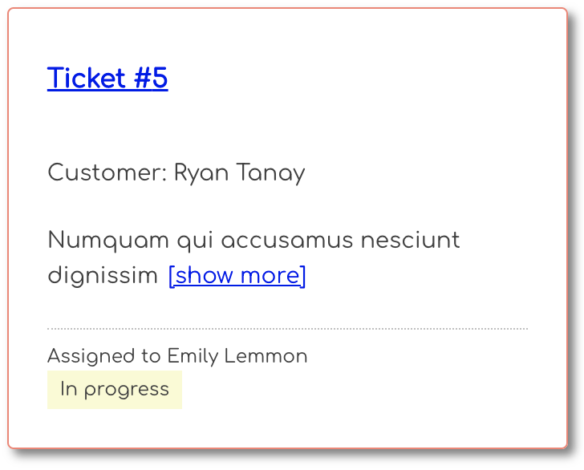

# Override User Serialization

The login form for the client you installed automatically enters in the credentials for Bryan Nilson, a customer who has submitted four service tickets to Honey Rae's Repairs. Go ahead and log in as him.

You will immediately be taken to the list of Bryan's tickets. The last one has been completed already, but it doesn't list the name of the employee who fixed it.


This is because your API does not send back all of the information that the client needs to display that information. Watch the following video, and then implement the code yourself.

When you're done, you should see the name of the employee that is assigned to each of the three tickets.

[](https://watch.screencastify.com/v/CJPF5fiVlqsZH8nxo892)

## Serializing Expanded Customer

Next, authenticate with the following credentials.

| Email | Password |
|--|--|
| meg@ducharme.com | ducharme |

Meg is an employee, so her view shows **all** tickets. An employee gets to see the customer name on each ticket. If you look in the **`TicketBody`** component in the client, you will see the following condition.

```js
{
    isStaff()
        ? <p>Customer: {ticket?.customer?.full_name}</p>
        : ""
}
```

So the client is also expecting to see a `full_name` property on the customer assigned to the ticket. Your job is to make that happen. Follow the same process that was done for the employee.

1. Modify the class to add the custom property.
2. Add a new serializer for the customer property on a ticket.
3. Override the default serialization for the customer property with your new serializer.

When done, Meg should see the customer name on each ticket.



