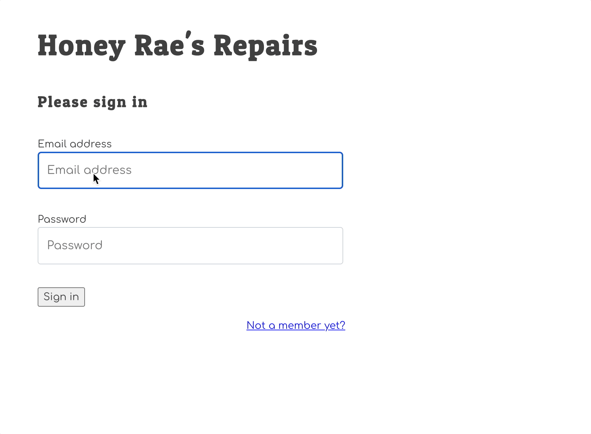

# Honey Rae Client Application

Visit the [Honey Rae Repairs Client - Django Version](https://github.com/nashville-software-school/honey-rae-django-version) template repository. Click on the "Use this template" button to get your own version of the client in your Github account.

For the remaining chapters, you will be testing your API with this React client instead of your API client _(Insomnia, Postman, etc...)_.

## Logging In

1. Remember that you have to run `npm install` first.
1. Start up the Honey Rae's React application
1. Try to log in with the account that was created when you registered.
    1. Enter the same email you used when you registered the account.
    1. Use the same password that you used when you registered the account.

Verify that you can log in and that the logout link takes you back to the log in screen.

Some things to investigate in the client and discuss with peers and your coaches.

| Tool | Explanation |
| -- | -- |
| `fetchIt()` | This abstraction was written to make fetch calls less verbose, and automatically handle token authentication. |
| `useCondensed()` | This React custom hook was written to make the descriptions of tickets condensed by default since some ticket description has be very long. |
| `ticketStatus()` | This function exists twice in the application. Duplicate code is bad. Can you eliminate the duplication? |
| `.catch()` | You will notice that some of the fetch calls have a `.catch()` method chained to the end of them. To see their value, stop your API from running and see what happens when the fetch calls are made. Then comment out the `catch()` methods and see the difference. |
