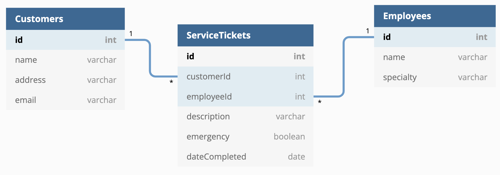
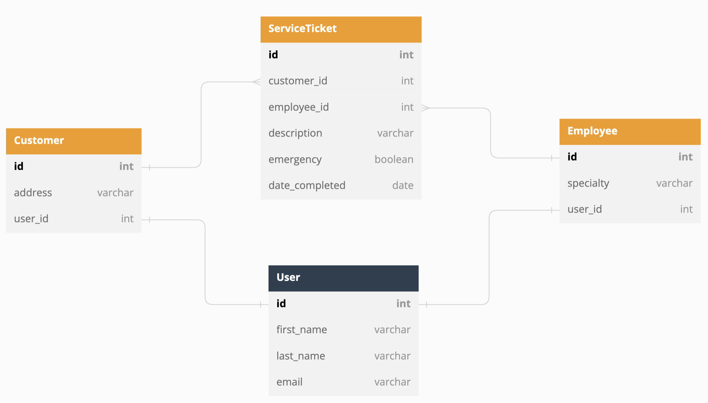
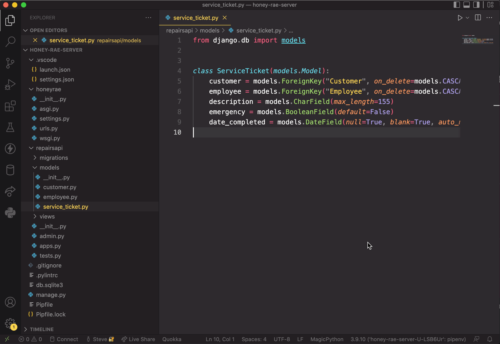

# A Database Model

Bring up your Honey Rae's Repair ERD that you created during the client side course. You are going to be making subtle changes to it to reflect how to think about designing the data in this project.

## Current ERD



## New ERD for Django

1. Make all of the table names singluar
1. Change `customerId` to `customer_id`
1. Change `employeeId` to `employee_id`
1. Change `dateCompleted` to `date_completed`
1. Remove `name` and `email` from the **Customer** table _(explanation for this below)_.
1. Add a **User** table with the following fields
    * `id int pk`
    * `first_name varchar`
    * `last_name varchar`
    * `email varchar`

The **User** table is colored differently because you won't be creating it for your application. More on this below.




## Django Models

You are going to design these tables with something called a Model. You are going to make one Model for **Employee** , one for **Customer** and one for **ServiceTicket**.

The reason you removed `name` and `email` from the **Customer** table is because one of the great things about Django is that we automatically get a **User** model created for us that has `name`, and `email` fields on it.

Unfortunately, the **User** model doesn't have `address`, so you have to create a **Customer** model with _just_ `address` to you can capture that information.

### Customer Model

Make the file below and copy pasta the code into it.

> #### `honeyrae-server/repairapi/models/customer.py`

```py
from django.db import models
from django.contrib.auth.models import User


class Customer(models.Model):

    # Relationship to the built-in User model which has name and email
    user = models.OneToOneField(User, on_delete=models.CASCADE)
    # Additional address field to capture from the client
    address = models.CharField(max_length=155)
```

Now that you have a model defined, it needs to be added to your project's models package.

> #### `honeyrae-server/repairapi/models/__init__.py`

```py
from .customer import Customer
```

### Employee Model

Make the file below and copy pasta the code into it.

> #### `honeyrae-server/repairapi/models/employee.py`

```py
from django.db import models


class Employee(models.Model):
    name = models.CharField(max_length=55)
    specialty = models.CharField(max_length=155)
```

Now that you have a model defined, it needs to be added to your project's models package. Add the following code.

> #### `honeyrae-server/repairapi/models/__init__.py`

```py
from .employee import Employee
```

### ServiceTicket Model

Make the file below and copy pasta the code into it. Remember, Python conventions don't use camel casing - for variable names or file names. The only exception is class names _(as you see below)_.

> #### `honeyrae-server/repairapi/models/service_ticket.py`

```py
from django.db import models


class ServiceTicket(models.Model):
    customer = models.ForeignKey("Customer", on_delete=models.CASCADE, related_name='tickets')
    employee = models.ForeignKey("Employee", on_delete=models.CASCADE, related_name='assigned_tickets')
    description = models.CharField(max_length=155)
    emergency = models.BooleanField(default=False)
    date_completed = models.DateField(null=True, blank=True, auto_now=False, auto_now_add=False)
```

Now that you have a model defined, it needs to be added to your project's models package. Add the following code.

> #### `honeyrae-server/repairapi/models/__init__.py`

```py
from .service_ticket import ServiceTicket
```

## Migration of Models

When your models are done, you can then create a migration to create the tables in your database.

```sh
python3 manage.py makemigrations repairsapi
```

Now that migrations are created, run the following command to execute your migrations and create the tables in your database.

```sh
python3 manage.py migrate
```


## Database Connection

You should now have a `db.sqlite3` file in the project folder. Make a connection to the database with SQLite Explorer to see the tables in the database.




## Resources

* [Django Models](https://docs.djangoproject.com/en/3.2/topics/db/models/) - Overview of Django Models
* [Extending the User Model](https://docs.djangoproject.com/en/dev/topics/auth/customizing/#extending-the-existing-user-model) - Explanation for how to add fields to the Django user
* [Model Field Types](https://docs.djangoproject.com/en/3.2/ref/models/fields/#field-types) - All the options for data types in a model
* [One to Many Relationships](https://docs.djangoproject.com/en/3.2/topics/db/models/#many-to-one-relationships) - How to add a foreign key to a model
* [Many to Many Relationships](https://docs.djangoproject.com/en/3.2/topics/db/models/#many-to-many-relationships) - How to set up a Many-Many Relationship
