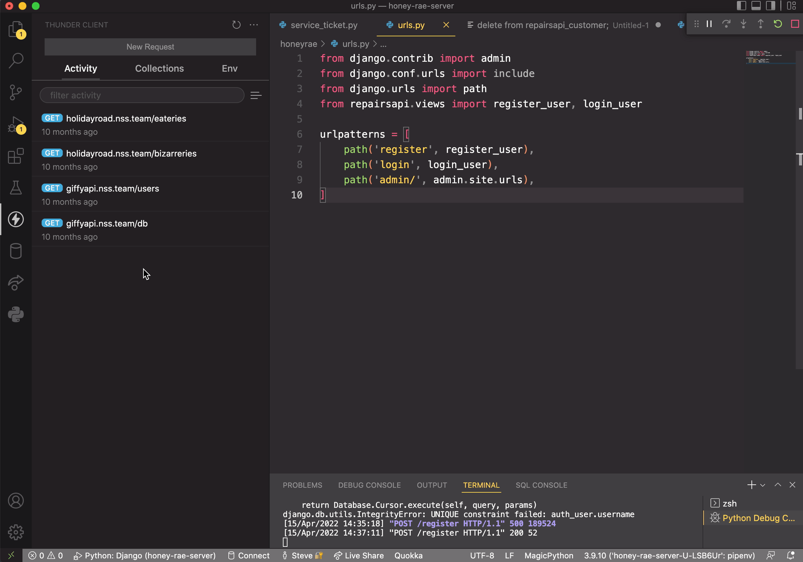

# Registering with the API

## Starting the Server in Debug Mode

Use the `Shift+Alt+D` keyboard shortcut to start your new API server in debug mode. When you do, you will see a new terminal window appear at the bottom of VS Code that looks like this once the API is started.


## Testing with API Client

Now you can test that the `/register` route works correctly.

1. Open your API client.
2. Create a new request.
3. Change method to POST.
4. Enter in `http://localhost:8000/register` for the URL.
5. Click the _Body_ tab under the URL.
6. Paste JSON like the following into the body. Change the values to be you, or even something silly. Doesn't really matter.
    ```json
    {
        "email": "name@domain.com",
        "first_name": "MyFirstName",
        "last_name": "MyLastName",
        "password": "django",
        "address": "404 Unknown Route",
        "account_type": "customer"
    }
    ```
7. Click the _Send_ button.
8. You should get a response that has the Django authorization token that looks like this. Yours will be different.
    ```json
    {
        "token": "382676acef1f23f321d4821c91cc4e66"
    }
    ````

> This token is unique for every user, and is used by Django to determine who the user is.



## Authenticating a User

Now you can test this out as an actual Honey Rae's customer who would be using the application.

### Update Login Component

First though, you need to update the code for the **Login** component in your React client. Expand the code below and replace the entire contents of the **`Login`** module.

The following changes are needed to work with your API.

1. The URL of the fetch has changed to `http://localhost:8000/login`.
2. The response is no longer a user object, but an object that contains a `valid` key and a `token` key. Those properties are used to determine if the credentials are correct.
3. The unique token generated by the login() method is stored in localStorage instead of the the primary key of the user.
4. A password field has been added since that is required for Django authentication, but wasn't for `json-server`.

<details>
    <summary>Expand to get the code</summary>

```js
import React, { useRef, useState } from "react"
import { Link } from "react-router-dom";
import { useNavigate } from "react-router-dom"
import "./Login.css"

export const Login = () => {
    const [email, setEmail] = useState("")
    const [password, setPassword] = useState("")
    const existDialog = useRef()
    const navigate = useNavigate()

    const handleLogin = (e) => {
        e.preventDefault()
        fetch(`http://localhost:8000/login`, {
            method: "POST",
            body: JSON.stringify({ email, password }),
            headers: {
                "Content-Type": "application/json"
            }
        })
            .then(res => res.json())
            .then(authInfo => {
                if (authInfo.valid) {
                    localStorage.setItem("honey_customer", authInfo)
                    navigate("/")
                } else {
                    existDialog.current.showModal()
                }
            })
    }

    return (
        <main className="container--login">
            <dialog className="dialog dialog--auth" ref={existDialog}>
                <div>User does not exist</div>
                <button className="button--close" onClick={e => existDialog.current.close()}>Close</button>
            </dialog>

            <section>
                <form className="form--login" onSubmit={handleLogin}>
                    <h1>Honey Rae's Repairs</h1>
                    <h2>Please sign in</h2>
                    <fieldset>
                        <label htmlFor="inputEmail"> Email address </label>
                        <input type="email" id="inputEmail"
                            onChange={evt => setEmail(evt.target.value)}
                            className="form-control"
                            placeholder="Email address"
                            required autoFocus />
                    </fieldset>
                    <fieldset>
                        <label htmlFor="inputPassword"> Password </label>
                        <input type="password" id="inputPassword"
                            onChange={evt => setPassword(evt.target.value)}
                            className="form-control"
                            placeholder="Password"
                            required />
                    </fieldset>
                    <fieldset>
                        <button type="submit">
                            Sign in
                        </button>
                    </fieldset>
                </form>
            </section>
            <section className="link--register">
                <Link to="/register">Not a member yet?</Link>
            </section>
        </main>
    )
}
```
</details>


