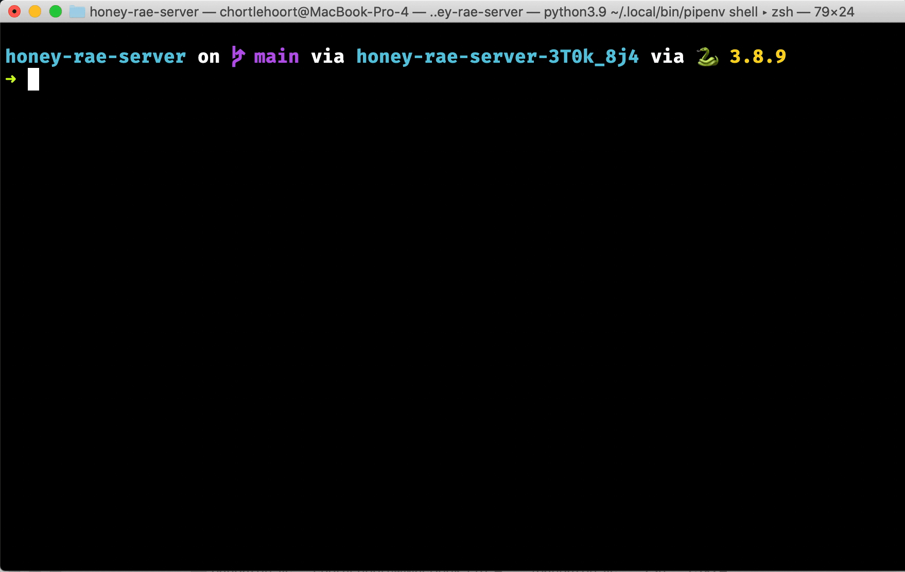

# Fixtures

> 🧨 Fair warning, in this chapter, you are going to be doing a lot of copy pasta operations.

| Term | Definition |
|--|--|
| Fixture | JSON files that contain some data for your database. Useful for initial creation of a development database, or for testing. |

In this chapter, you are going to set up your project with some fixtures so that you can provide some [initial, or seed, data](https://docs.djangoproject.com/en/4.1/howto/initial-data/) for your database, without the need to write any `INSERT INTO` statements in a SQL file.

## Setup

Be in the `repairsapi` directory and run the following commands to create the fixtures directory and the JSON files you will need.

```sh
mkdir fixtures
touch customers.json
touch employees.json
touch tickets.json
touch tokens.json
touch users.json
```

### Customer Data

Copy the following JSON into the `customers.json` file.

<details>
<summary>Expand to get the JSON data</summary>

```json
[
    {
        "model": "repairsapi.customer",
        "pk": 1,
        "fields": {
            "user": 1,
            "address": "404 Unknown Way"
        }
    },
    {
        "model": "repairsapi.customer",
        "pk": 2,
        "fields": {
            "user": 3,
            "address": "400 Bad Request Ave"
        }
    },
    {
        "model": "repairsapi.customer",
        "pk": 3,
        "fields": {
            "user": 4,
            "address": "401 Unauthorized Ct."
        }
    }
]
```
</details>

### Employee Data

Copy the following JSON into the `employees.json` file.

<details>
<summary>Expand to get the JSON data</summary>

```json
[
    {
        "model": "repairsapi.employee",
        "pk": 1,
        "fields": {
            "user": 2,
            "specialty": "Routers"
        }
    },
    {
        "model": "repairsapi.employee",
        "pk": 2,
        "fields": {
            "user": 5,
            "specialty": "Laptops"
        }
    },
    {
        "model": "repairsapi.employee",
        "pk": 3,
        "fields": {
            "user": 6,
            "specialty": "Mobile phones"
        }
    }
]
```
</details>

### Ticket Data

Copy the following JSON into the `tickets.json` file.

<details>
<summary>Expand to get the JSON data</summary>

```json
[
    {
        "model": "repairsapi.serviceticket",
        "pk": 1,
        "fields": {
            "customer": 3,
            "employee": 1,
            "description": "Voluptas recusandae distinctio cumque qui nobis quidem nesciunt maiores exercitationem. Magni ut consectetur eligendi eum iusto.",
            "emergency": true,
            "date_completed": null
        }
    },
    {
        "model": "repairsapi.serviceticket",
        "pk": 2,
        "fields": {
            "customer": 1,
            "employee": 2,
            "description": "Suscipit consequatur aspernatur autem dolorum voluptatum omnis vel veniam. Ex fuga quod iusto autem repellat. Aliquid ut iste fugit id ea. Quae aperiam deleniti animi.",
            "emergency": false,
            "date_completed": "2022-01-19"
        }
    },
    {
        "model": "repairsapi.serviceticket",
        "pk": 3,
        "fields": {
            "customer": 3,
            "employee": 3,
            "description": "Facilis provident dignissimos sit. In nihil quia laborum aliquam et quibusdam quae fugiat. Ut aut velit illum error quod. Eum necessitatibus cupiditate est deleniti perferendis provident qui eius culpa. Reprehenderit voluptas dolor quisquam consequatur.",
            "emergency": false,
            "date_completed": "2022-03-01"
        }
    },
    {
        "model": "repairsapi.serviceticket",
        "pk": 4,
        "fields": {
            "customer": 2,
            "employee": 3,
            "description": "Ea ut aliquam praesentium. Beatae molestiae maiores accusantium et.",
            "emergency": false,
            "date_completed": null
        }
    },
    {
        "model": "repairsapi.serviceticket",
        "pk": 5,
        "fields": {
            "customer": 1,
            "employee": 2,
            "description": "Numquam qui accusamus nesciunt dignissimos dicta quos. In quidem esse omnis quasi qui. Dicta officia minus laudantium alias omnis autem laboriosam nobis.",
            "emergency": false,
            "date_completed": null
        }
    },
    {
        "model": "repairsapi.serviceticket",
        "pk": 6,
        "fields": {
            "customer": 2,
            "employee": 2,
            "description": "Quod officiis possimus quos similique commodi vel facere. Eaque corporis doloremque possimus facilis iste deserunt. Est fuga saepe natus corrupti vel dolorum. Nostrum dolorem et reprehenderit et ex.",
            "emergency": false,
            "date_completed": "2022-03-19"
        }
    },
    {
        "model": "repairsapi.serviceticket",
        "pk": 7,
        "fields": {
            "customer": 3,
            "employee": 2,
            "description": "Aut qui possimus quisquam quibusdam illo in provident. Et repellendus reprehenderit quidem reiciendis deleniti doloribus.",
            "emergency": true,
            "date_completed": null
        }
    },
    {
        "model": "repairsapi.serviceticket",
        "pk": 8,
        "fields": {
            "customer": 1,
            "employee": 2,
            "description": "Voluptas expedita quaerat quisquam est officia assumenda aut ut. Maxime aut quaerat labore iure.",
            "emergency": false,
            "date_completed": "2022-02-02"
        }
    },
    {
        "model": "repairsapi.serviceticket",
        "pk": 9,
        "fields": {
            "customer": 3,
            "employee": null,
            "description": "Quae ea nam veritatis molestiae sapiente dolore omnis eaque ipsum. Et et architecto quod. Ea qui ipsa et. Quisquam quidem et qui nulla asperiores a. Porro illum tempore. Quaerat magni quo.",
            "emergency": false,
            "date_completed": null
        }
    }
]
```
</details>

### Token Data

Copy the following JSON into the `tokens.json` file.

<details>
<summary>Expand to get the JSON data</summary>

```json
[
    {
        "model": "authtoken.token",
        "pk": "06787add96eb3264080015997720cb0877b40f90",
        "fields": {
            "user": 6,
            "created": "2022-10-21T21:19:25.057Z"
        }
    },
    {
        "model": "authtoken.token",
        "pk": "0be249c88238743e5b4a7ac370b5145730c28e20",
        "fields": {
            "user": 1,
            "created": "2022-10-21T21:15:55.928Z"
        }
    },
    {
        "model": "authtoken.token",
        "pk": "8b44b69d17de6e7e81bede339e8fd997369f8819",
        "fields": {
            "user": 5,
            "created": "2022-10-21T21:18:55.902Z"
        }
    },
    {
        "model": "authtoken.token",
        "pk": "a165c6136019e8c4246c1a31856234d33ce476da",
        "fields": {
            "user": 4,
            "created": "2022-10-21T21:18:13.109Z"
        }
    },
    {
        "model": "authtoken.token",
        "pk": "d74b97fbe905134520bb236b0016703f50380dcf",
        "fields": {
            "user": 2,
            "created": "2022-10-21T21:16:33.976Z"
        }
    },
    {
        "model": "authtoken.token",
        "pk": "ec7ddcc665035a3adeaa80ed8f812bfe3ef5b5f4",
        "fields": {
            "user": 3,
            "created": "2022-10-21T21:17:24.482Z"
        }
    }
]
```
</details>

### User Data

Copy the following JSON into the `users.json` file.

<details>
<summary>Expand to get the JSON data</summary>

```json
[
    {
        "model": "auth.user",
        "pk": 1,
        "fields": {
            "password": "pbkdf2_sha256$320000$skKMaZQjJwGMIJO1MmeaoP$68b2U4VFPL1ZQYgYmM7sIJUWPDhKCrAJOrdz4MWnLq4=",
            "last_login": null,
            "is_superuser": false,
            "username": "ryan@ryantanay.com",
            "first_name": "Ryan",
            "last_name": "Tanay",
            "email": "ryan@ryantanay.com",
            "is_staff": false,
            "is_active": true,
            "date_joined": "2022-10-21T21:15:55.764Z",
            "groups": [],
            "user_permissions": []
        }
    },
    {
        "model": "auth.user",
        "pk": 2,
        "fields": {
            "password": "pbkdf2_sha256$320000$6caQGznxTT5xOWckvjT6QO$YZTdqhVzw5XIXUcA2TrQsZuC4SJGBeFc2OYOIz6j8Lk=",
            "last_login": null,
            "is_superuser": false,
            "username": "meg@ducharme.com",
            "first_name": "Meg",
            "last_name": "Ducharme",
            "email": "meg@ducharme.com",
            "is_staff": true,
            "is_active": true,
            "date_joined": "2022-10-21T21:16:33.812Z",
            "groups": [],
            "user_permissions": []
        }
    },
    {
        "model": "auth.user",
        "pk": 3,
        "fields": {
            "password": "pbkdf2_sha256$320000$NKseENHvY06F1AIu2RdtPX$mEuwkQRhvscNYW9ORA68BddrY96oVevnyLz6szhmrO4=",
            "last_login": null,
            "is_superuser": false,
            "username": "jenna@solis.com",
            "first_name": "Jenna",
            "last_name": "Solis",
            "email": "jenna@solis.com",
            "is_staff": false,
            "is_active": true,
            "date_joined": "2022-10-21T21:17:24.322Z",
            "groups": [],
            "user_permissions": []
        }
    },
    {
        "model": "auth.user",
        "pk": 4,
        "fields": {
            "password": "pbkdf2_sha256$320000$d3OTZFUe5DZje6Kb6rm7zv$5oKmFOAQ2WtJQJ+FCT4tXnkbsL60zQN0OTM4nPQQ69A=",
            "last_login": null,
            "is_superuser": false,
            "username": "bryan@nilson.com",
            "first_name": "Bryan",
            "last_name": "Nilson",
            "email": "bryan@nilson.com",
            "is_staff": false,
            "is_active": true,
            "date_joined": "2022-10-21T21:18:12.946Z",
            "groups": [],
            "user_permissions": []
        }
    },
    {
        "model": "auth.user",
        "pk": 5,
        "fields": {
            "password": "pbkdf2_sha256$320000$L9WyeeE95squbRZelePsZf$XayBzPujv5CeAnmIzcLL0orBqE3qDpJLuQsy9zOM5rc=",
            "last_login": null,
            "is_superuser": false,
            "username": "emily@lemmon.com",
            "first_name": "Emily",
            "last_name": "Lemmon",
            "email": "emily@lemmon.com",
            "is_staff": true,
            "is_active": true,
            "date_joined": "2022-10-21T21:18:55.741Z",
            "groups": [],
            "user_permissions": []
        }
    },
    {
        "model": "auth.user",
        "pk": 6,
        "fields": {
            "password": "pbkdf2_sha256$320000$iU8LQX1Y1DxUjhddsV7FR7$AAvT4VAaY7v7hiOGX8/rnuoAkZnj1joW5WOt6kbGC9Q=",
            "last_login": null,
            "is_superuser": false,
            "username": "tyler@hilliard.com",
            "first_name": "Tyler",
            "last_name": "Hilliard",
            "email": "tyler@hilliard.com",
            "is_staff": true,
            "is_active": true,
            "date_joined": "2022-10-21T21:19:24.892Z",
            "groups": [],
            "user_permissions": []
        }
    }
]
```
</details>


## Database Seeding Bash Script

Make sure you back in the main project directory of `honey-rae-server`.

1. Open the file named `seed_database.sh`.
2. Copy pasta the following content into it.
   ```sh
   #!/bin/bash

   rm db.sqlite3
   rm -rf ./repairsapi/migrations
   python3 manage.py migrate
   python3 manage.py makemigrations repairsapi
   python3 manage.py migrate repairsapi
   python3 manage.py loaddata users
   python3 manage.py loaddata tokens
   python3 manage.py loaddata customers
   python3 manage.py loaddata employees
   python3 manage.py loaddata tickets
   ```
3. Run the following command in your terminal. It makes the file an [executable script](https://linuxhandbook.com/make-file-executable/).
    ```sh
    chmod u+x ./seed_database.sh
    ```

## Seed Your Database

Now you can run that script any time you want to start from scratch with the initial data in your database.

Type `./seed_database.sh` into your terminal and you will see all of those commands run.




