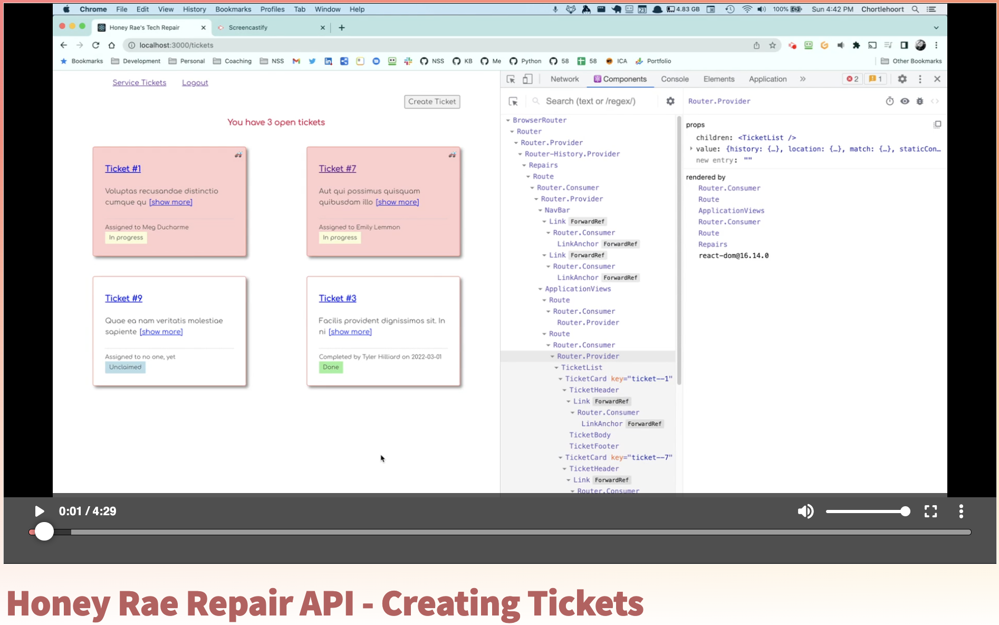

# Creation of Service Tickets

The client application already has a form component for you. What you need to implement in the API is to capture the request from the client and insert the data into the database using the Django ORM magic.

Watch the following video for an explanation of the process.

[](https://watch.screencastify.com/v/rxH1ZRZnCJ627PMLHVZz)

After you are done watching the video, grab the code below to implement the feature.

<details>
<summary>Expand to get your API create code</summary>

```py
    def create(self, request):
        """Handle POST requests for service tickets

        Returns:
            Response: JSON serialized representation of newly created service ticket
        """
        new_ticket = ServiceTicket()
        new_ticket.customer = Customer.objects.get(user=request.auth.user)
        new_ticket.description = request.data['description']
        new_ticket.emergency = request.data['emergency']
        new_ticket.save()

        serialized = ServiceTicketSerializer(new_ticket, many=False)

        return Response(serialized.data, status=status.HTTP_201_CREATED)
```
</details>

