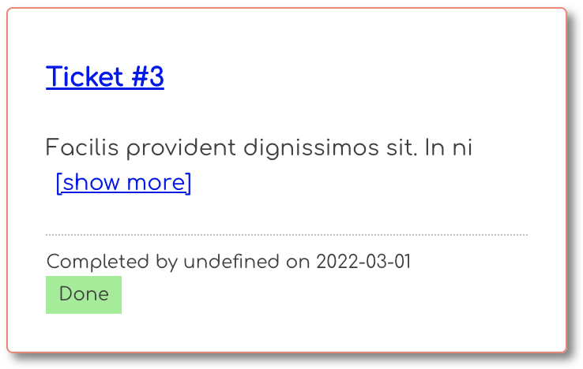
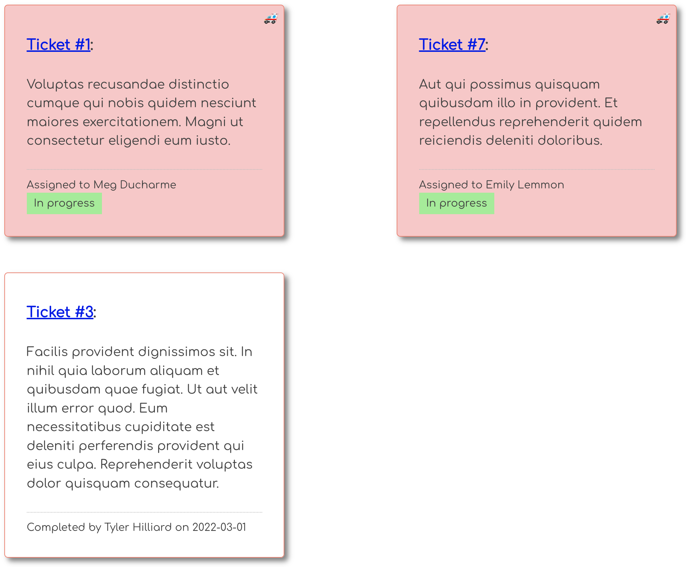

# Override User Serialization

The login form for the client you installed automatically enters in the credentials for Bryan Nilson, a customer who has submitted three service tickets to Honey Rae's Repairs. Go ahead and log in as him.

You will immediately be taken to the list of Bryan's tickets. The last one has been completed already, but it doesn't list the name of the employee who fixed it.

This is because your API does not send back all of the information that the client needs to display that information. Watch the following video, and then implement the code yourself.

When you're done, you should see the name of the employee that is assigned to each of the three tickets.

