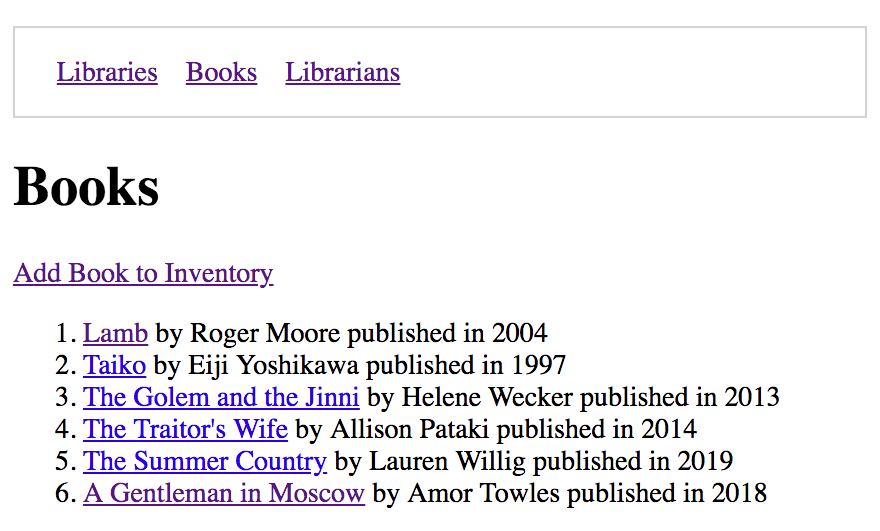

# Extending and Sharing Templates

Up to this point, each of your templates has contained all of the HTML needed to render the page. However, that is not a road to an easily maintained project, as each time you want to modify something like the `<title>` of your site, you would have to make sure that you changed all your templates individually - which could grow into dozens of files.

> Reference: [The Django Book: Django’s Templates](https://djangobook.com/mdj2-django-templates/)

To make the application's templates more scalable and easy to maintain, you are going to build some shared templates. The first one you will build is the one that contains the main, outer HTML that every page will have in common.

> #### libraryproject/libraryapp/templates/shared/base.html

```jinja

<!DOCTYPE html>
<html>

<head>
    <meta charset="utf-8">
    <title>Library</title>
</head>

<body>

    
    

</body>

</html>
```

You want every page of HTML delivered to the client to have this exact, same structure, and every other template will place its code inside the ``.

## Book Form Refactor

The first template you will refactor is your book HTML form. Open that file, and use the following code to wrap the HTML from the `<h1>` to the ending `</form>` tag.

```py




# The <h1> and <form> elements go in here


```

Now visit http://localhost:8000/book/form and verify that the `<html>`, `<head>`, and `<body>` tags are still in the DOM.

## Practice: Extending the Base

Go through your application and have every template extend the base template, and verify that all pages contain all the necessary HTML tags.

## Navigation Bar

Now to add navigation links for your application. Open `base.html` replace its contents with the following code.

```jinja

<!DOCTYPE html>
<html>

<head>
    <meta charset="utf-8">
    <title>Library</title>

    <style>
        .navList {
            list-style-type: none;
            display: flex;
            border: 1px solid lightgray;
            padding: 1em;
        }

        .navList__route {
            margin: 0 0.5em;
        }
    </style>
</head>

<body>

    <nav id="site-nav">
        <ol class="navList">
            <li class="navList__route"><a href="">Libraries</a></li>
            <li class="navList__route"><a href="">Books</a></li>
            <li class="navList__route"><a href="">Librarians</a></li>
        </ol>
    </nav>

    
    

</body>

</html>
```

## Add Book Link

After the main heading in your book list, add a link to the book creation form.

```jinja
<h1>Books</h1>

<a href="">Add Book to Inventory</a>
```


