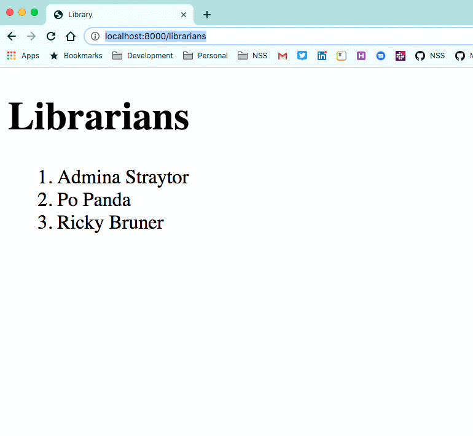

# Adding Authentication to your Django Application

## Setting up the Routes

Open `libraryapp/urls.py` and update your import statement to import the include method from the `django.urls` package.

```py
from django.urls import include, path
```


Then add the URLs to your existing patterns. This lets your application use the built-in login and logout views that Django provides.

> #### libraryproject/libraryapp/urls.py

```py
path('accounts/', include('django.contrib.auth.urls')),
```

You never need to touch these views, and they live in Django and have all the logic you need.

### Login Screen Template

By default, the login view looks for a template path of  `registration/login.html`, so you need to create that file. Then place the following code in it.

> #### libraryproject/libraryapp/templates/registration/login.html

```py
<h2>Login</h2>
<form method="post">
    
    {{ form.as_p }}
    <button type="submit">Login</button>
</form>
```

## Customize Logout

By default, the Django logout function takes the user to the admin site, which you don't want to happen. It's confusing to the user since the UI branding will be different from your site. Therefore, you set up your own view and URL pattern.

> #### libraryproject/libraryapp/urls.py

```py
path('logout/', logout_user, name='logout'),
```

### Redirect on Logout

> #### libraryproject/libraryapp/views/auth/logout.py

```py
from django.urls import reverse
from django.shortcuts import redirect
from django.contrib.auth import logout

def logout_user(request):
    logout(request)
    return redirect(reverse('libraryapp:home'))
```

Then import the `logout_user` view into `libraryapp/views/__init__.py`.

## Where to Go When User Authenticates

Open your `settings.py` file and place the following configuration variable at the bottom of the file. This tells Django which URL it should redirect the browser to when the user authenticates. For now, you will redirect the user to the list of books.

```py
LOGIN_REDIRECT_URL = '/books'
```

## Logging In

Now go to the http://localhost:8000/accounts/login URL and you should see the simple login form. Go ahead and authenticate with the superuser account that you created.


## Requiring Authentication for Views

As you app stands right now, you can login, view books, view libraries, and view librarians. However, login doesn't really do anything since a user can still view all information even if s/he doesn't authenticate. Time to change that.

You are going to modify your application so that books, libraries, and librarians can only be viewed if the user is authenticated.

Django provide a useful decorator named `@login_required`. First, import the decorator.

```py
from django.contrib.auth.decorators import login_required
```

Then put that decorator above your book list view.

```py
@login_required
def book_list(request):
```

Make sure you visit http://localhost:8000/accounts/logout to ensure that you are unauthenticated. Then go to the book list, and you will be immediately redirected to the login view.



> **Lightning Exercise:** Add the decorator to the appropriate modules so that the user has to be authenticated to view libraries, and librarians.
