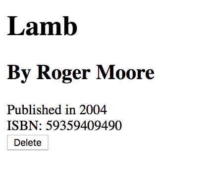

# Deleting Resources

Making requests from a web browser, without the aid of JavaScript, will only support two of the HTTP verbs.

1. **GET** - When you type something into the URL bar of the browser, or click on a hyperlink, you are performing an HTTP request with the verb of GET.
1. **POST** - When you fill out a form on a web page and click the submit button, you are performing an HTTP request with the verb of POST.

That's it. Nothing else is supported.

If you want to use any other verb, then you need to deliver JavaScript to the browser and use tools like `fetch()` or `XMLHttpRequest` and manually specify which verb to use on the request.

## Delete Without Delete

If you can't make an HTTP request with the DELETE verb without JavaScript, then how can you delete something in a web application that can only utilize hyperlinks _(GET)_ and forms _(POST)_ to make requests to the server?

You will put a button element inside a form and make a POST request to the same route as if you were viewing the details of a book, but you will utilize a hidden form field to provide additional information to the server to process the request correctly.

Open `templates/books/detail.html` and place this code before the closing `</body>` tag.

```jinja
<form action="" method="POST">
    
    <input type="hidden" name="actual_method" value="DELETE">
    <button>Delete</button>
</form>
```

Then view the details of one of your books, and inspect the DOM in your browser. You will now see a form like this.

```html
<form action="/books/9/" method="POST">
    <input type="hidden" name="csrfmiddlewaretoken" value="...">
    <input type="hidden" name="actual_method" value="DELETE">
    <button>Delete</button>
</form>
```

You should also now see a delete button in your book detail.



## Handling DELETE in the Detail View

Open `views/books/details.py` and place this code at the bottom of the `book_details` view.

```py
if request.method == 'POST':
    form_data = request.POST

    # Check if this POST is for deleting a book
    #
    # Note: You can use parenthesis to break up complex
    #       `if` statements for higher readability
    if (
        "actual_method" in form_data
        and form_data["actual_method"] == "DELETE"
    ):
        with sqlite3.connect(Connection.db_path) as conn:
            db_cursor = conn.cursor()

            db_cursor.execute("""
            DELETE FROM libraryapp_book
            WHERE id = ?
            """, (book_id,))

        return redirect(reverse('libraryapp:books'))
```

This code will execute a DELETE statement in your database to get rid of the book data, and then redirect the user to the list of books so that s/he will immediately see that the book is no longer in the inventory.

Click your Delete button and watch it happen. If your code doesn't work, go through the chapter again and make sure you placed all of the code exactly where the instructions say to. If that doesn't fix it, then please see your instruction team.

## Demo

Once all your code is in place, you should be able to go to the detail view of any book and delete it.

