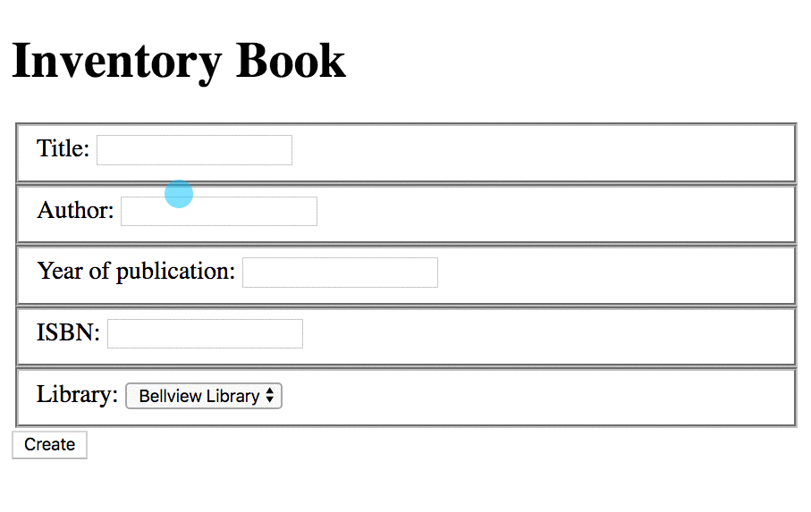

# Getting and Posting Forms

> **Instructor Note:** Review HTTP verbs and CRUD operations with students before this lesson. Also review using the Chrome Dev Tools network tab to inspect requests.

## Librarians Adding Books in Libraries

Time for you to implement your first form so that users can enter in a new book and assign it to a library. For now, you can start with building the template. Create the `books/form.html` template, and put the following code in it.

> #### libraryproject/libraryapp/templates/books/form.html

```jinja

<!DOCTYPE html>
<html>
  <head>
    <meta charset="utf-8">
    <title>Bangazon</title>
  </head>
  <body>
    <h1>Inventory Book</h1>


    <form action="" method="post">
      
      <fieldset>
          <label for="title">Title: </label>
          <input id="title" type="text" name="title">
      </fieldset>
      <fieldset>
          <label for="author">Author: </label>
          <input id="author" type="text" name="author">
      </fieldset>
      <fieldset>
          <label for="year_published">Year of publication: </label>
          <input id="year_published" type="number" name="year_published">
      </fieldset>
      <fieldset>
          <label for="isbn">ISBN: </label>
          <input id="isbn" type="text" name="isbn">
      </fieldset>
      <fieldset>
          <label for="location">Library: </label>
          <select id="location" type="text" name="location">
                
                    <option value="{{ library.id }}">{{ library.title }}</option>
                
          </select>
      </fieldset>

      <input type="submit" value="Add It" />
    </form>
  </body>
</html>
```

Create the following entry in your URL patterns so that clients can request the book creation form.

```py
path('book/form', book_form, name='book_form'),
```

## Handling GET and POST Requests

When the user visits the URL http://localhost:8000/book/form the browser performs a GET request to that URL. In that specific case, your Django app will send the book HTML form to the user to fill out.

Create the `views/books/form.py` module and place the following code in it.

```py
import sqlite3
from django.shortcuts import render
from django.contrib.auth.decorators import login_required
from libraryapp.models import Book
from libraryapp.models import Library
from libraryapp.models import model_factory
from ..connection import Connection


def get_libraries():
    with sqlite3.connect(Connection.db_path) as conn:
        conn.row_factory = model_factory(Library)
        db_cursor = conn.cursor()

        db_cursor.execute("""
        select
            l.id,
            l.title,
            l.address
        from libraryapp_library l
        """)

        return db_cursor.fetchall()

@login_required
def book_form(request):
    if request.method == 'GET':
        libraries = get_libraries()
        template = 'books/form.html'
        context = {
            'all_libraries': libraries
        }

        return render(request, template, context)
```

## Updating the Views Package

Import this new view into the package file.

> #### libraryproject/libraryapp/views/\_\_init__.py

```py
from .books.form import book_form
```

## Handling the POST Request

When the user fills out the form and clicks the submit button, the browser will collect all the values of the form and submit a POST request to a URL. You must then handle that request and create a book.

Where should the request be sent. Thinking back to chapter 1 where you reviewed HTTP requests and verbs, what operation are you performing? You are making a change to the collection of books by creating a new one. Therefore, you will submit the request to `/books`.

You already have a pattern defined in `urls.py` for that URL.

```py
path('books', book_list, name='books'),
```

That means that you have to refactor the `book_list()` method to handle a POST. That method already handles a GET request, so place the following code in your file at the bottom to handle the case of the request method being POST.

```py
elif request.method == 'POST':
    form_data = request.POST

    with sqlite3.connect(Connection.db_path) as conn:
        db_cursor = conn.cursor()

        db_cursor.execute("""
        INSERT INTO libraryapp_book
        (
            title, author, isbn,
            year_published, location_id, librarian_id
        )
        VALUES (?, ?, ?, ?, ?, ?)
        """,
        (form_data['title'], form_data['author'],
            form_data['isbn'], form_data['year_published'],
            request.user.librarian.id, form_data["location"]))

    return redirect(reverse('libraryapp:books'))
```

Once the book is created, your view now redirects the client to the list of books so that s/he can see that the book is now in the collection.

## Demo

Once all of this code is into place, you should be able to add a new book to your collection.



## Practice: Creating Libraries

Now it is your turn to follow this pattern to create a form for creating a new entry in the database for libraries. You need to create the following items to make it work.

1. A Django template in `templates/libraries/form.html` that displays a form for entering in all the values for a library.
1. A Django template in `templates/libraries/list.html` that displays all libraries.
1. A new URL pattern in `libraryapp/urls.py` for getting the form.
1. A new URL pattern in `libraryapp/urls.py` for the collection of libraries.
1. A new view in `views/libraries/form.py` to handle the GET request for the library HTML form.
1. A new view in `views/libraries/list.py` that will handle GET requests _(list of libraries)_, and POST requests _(for creating new libraries)_.
1. Two new `import` statements in `views/__init__.py` to add the views into the package.
