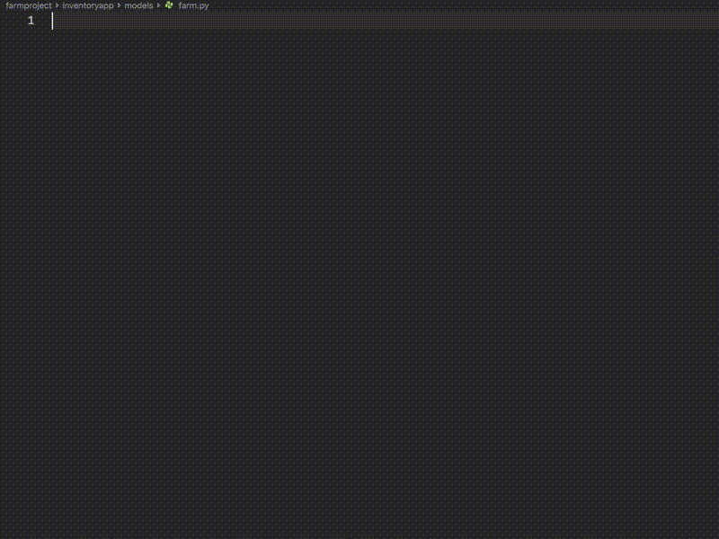

# First Django Project: Trestlebridge Farms

## Goals

The purpose of this application is to do basic management of farms. We're going to define some different areas of each farm - called facilities - that will contain animals that we will purchase. Certain facilities will only be able to hold certain animals. You need to record when an animal was purchased, when the farm was established, who created the farm, and when a new facility is constructed on a farm.

We will be purchasing the following animals.

* Pigs
* Cows
* Chickens
* Llamas

Pigs will be put in pig pens.

Cows and llamas will be put in grazing fields.

Chickens will be put in chicken coops.

### Design Data Relationships

Time to deconstruct this problem into what you need to build in our application. First, you need to define the tables and relationships you will need in your database.

* Farm (id, name, date_created, user)
* Facilities (id, date_constructed, facility_type_id, farm_id)
* Facility types (id, description)
* Animals (id, date_purchased, facility_id)
* Animal types (id, description)

Now take some time to create an ERD of this database structure on [dbdiagram.io](https://dbdiagram.io).

## Virtual Environment Setup

```sh
mkdir -p ~/workspace/python/trestlebridge && cd $_
python -m venv env
source ./env/bin/activate
pip install django
pip freeze > requirements.txt
```

## Create Django Project

Django creates a project directory. A project can have 1 -> _n_ applications contained within in. For example, you could have a project for managing a coffee shop. The project could contain an application that is for the people who work at the coffee shop to maintain inventory, payroll and financials. The main project could also contain an application for the public website that customers can use to buy products.

```sh
django-admin startproject farmproject
cd farmproject
```

When you tell Django to create a project, it automatically generates an application that you can use, as the administrator, to manage data in the database, set up users, etc. Every Django project starts with this administrative application. You then have to create another application for what you want to build.

## Create Trestlebridge Application

Your application's purpose is to manage the facilities and animals on the farm, so create a Django application with an appropriate name. Make the name of the app one word and all lower case. Do not use spaces. Do not use dashes. Do not use underscores.

```sh
python manage.py startapp inventoryapp
cd inventoryapp
```

## Create Models

First, create a `models` sub-directory in your `inventoryapp` directory. Then create all the files needed for this package. Having the `__init__.py` import all of the classes from the other modules is necessary.

```sh
md models && cd $_
touch animal.py animaltype.py facility.py facilitytype.py farm.py __init__.py
echo 'from .animal import Animal
from .animaltype import AnimalType
from .facility import Facility
from .facilitytype import FacilityType
from .farm import Farm' >> __init__.py
```

Now that all of the files are created, it's time to define all of the models. Each model must define a property for each column you want in the corresponding database table that it will create.

Open `animaltype.py` and use the power of your Python extensions to add the `from django.db import models` at the top of the files. This import is needed for Python classes that are modeling a database table.


Then create a new class with another code generator. Type in `Model` and select that item from the suggested list.

The code generator will erroneously put underscores before the verbose meta fields. Delete those.


Then create the properties for the class. There are also code generators for those. The code generator produces an initial argument with an underscore at the beginning. You can delete that and just leave the `max_length` argument.


Now you can define the models for animal, facility type, and facility. Save farms for last and when you're ready, read the next section.

## Assigning Data to Users

Django has a namespace `django.contrib.auth.models` that you can use to utilize its built-in user authentication and authorization system. In your application, people will register new accounts and be able to manage their own farms. Each user should only be able to access data that they created, and not other people's data. Since each user will be creating a farm, and then assigning animals and facilities to it, we need to assign farms to users.

1. Open `farm.py`.
1. Import models like all the other classes.
1. Then include `from django.contrib.auth.models import User` as the next import.
1. Use the Model code generator to create the `Farm` class.
1. Define a `name` property of type `CharField` and a `date_create` property of type `DateField`.
1. Then define a `user` property that is a `ForeignKey` to the `User` class that you imported from Django.



## Related Type Attribute

When any model has a foreign key to another model, you can specify a `related_name` attribute on that property. For example, the **`Animal`** model has a foreign key to both the **`Facility`** and **`AnimalType`** model. This allows you to use the Django ORM to easily select sets of data.

Change your **`Animal`** class foreign key properties to the following.

```py

```