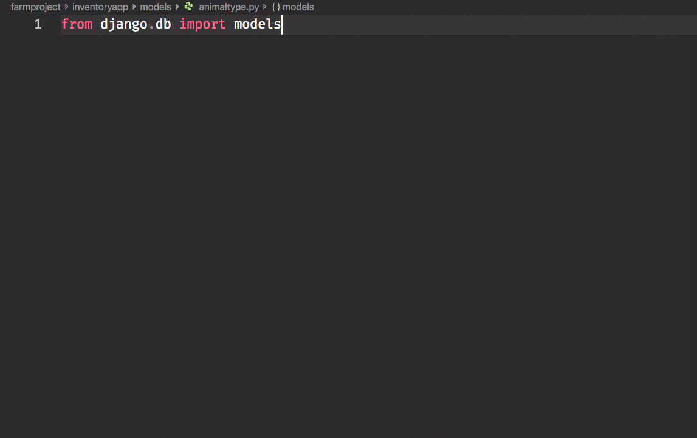
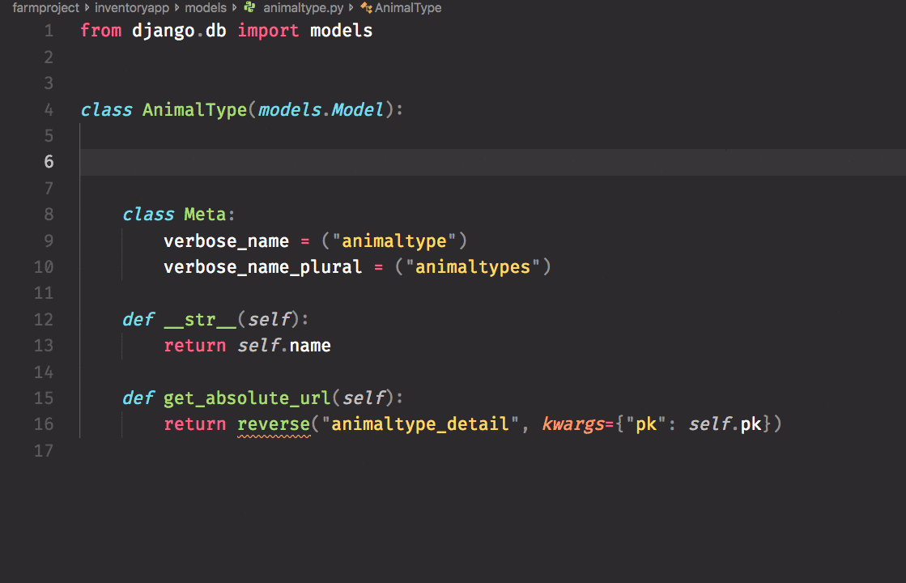

# First Django Project: Nashville Public Library

## Goals

The purpose of this application is to allow librarians to manage the books in their library's inventory. The user will be able to add new books, remove obsolete books, and mark when a book has been checked out by a patron or checked back in.

### Design Data Relationships

Time to deconstruct this problem into what you need to build in our application. First, you need to define the tables and relationships you will need in your database.

#### Resources

1. Libraries
1. Books
1. Librarians _(the users)_

#### Relationships

* Books are assigned to a library
* Track which librarian adds a book
* Librarians are assigned to a library

Now take some time to create an ERD of this database structure on [dbdiagram.io](https://dbdiagram.io).

## Virtual Environment Setup

```sh
mkdir -p ~/workspace/python/library-management && cd $_
python -m venv libraryenv
source ./libraryenv/bin/activate
pip install django
pip freeze > requirements.txt
```

## Create Django Project

Django creates a project directory. A project can have 1 -> _n_ applications contained within in. For example, you could have a project for managing a coffee shop. The project could contain an application that is for the people who work at the coffee shop to maintain inventory, payroll and financials. The project could also contain an application for the public website that customers can use to buy products.

This project is going to start with only one application.

```sh
django-admin startproject libraryproject
cd libraryproject
```

When you tell Django to create a project, it automatically generates an administrative application that you can use to manage data in the database, set up users, etc. Every Django project starts with this administrative application. You then have to create another application for what you want to build.

Right now, you should see `library-management/libraryproject/libraryproject` directory. That nested `libraryproject` directory is the administrative application.

## Create Super User

Be in the `library-management/libraryproject` directory, and run the following command. Enter in whatever credentials you want to use for your super user account.

```sh
python manage.py createsuperuser
```

This account will allow you to use the web-based administration site that Django provides. You'll learn more about this later.

## Create Nashville Library Application

Your application's purpose is to manage the libraries, librarians and books, so you will create a Django application with an appropriate name. Make the name of the app one word and all lower case. Do not use spaces. Do not use dashes. Do not use underscores.

Then you will run what's called a database migration. The `migrate` command you see below will create the database for your application, and create a set of tables that Django uses for user management.

```sh
python manage.py startapp libraryapp
python manage.py migrate
cd libraryapp
```

## Add the Library Application to INSTALLED_APPS

Open your `settings.py` file and make sure your `libraryapp` application is in the list of apps.

```py
INSTALLED_APPS = [
    'django.contrib.admin',
    'django.contrib.auth',
    'django.contrib.contenttypes',
    'django.contrib.sessions',
    'django.contrib.messages',
    'django.contrib.staticfiles',
    'libraryapp'
]
```

## Create Models

First, create a `models` sub-directory in your `libraryapp` directory. Then create all the files needed for this package. Having the `__init__.py` import all of the classes from the other modules is necessary.

> **Note:** You will notice a `libraryapp/models.py` file that gets automatically generated for your application. You will not be using that file, and can delete it.

```sh
md models && cd $_
touch library.py book.py librarian __init__.py
echo 'from .library import Library
from .book import Book
from .librarian import Librarian
' >> __init__.py
```

> **Tip:** The `__init__.py` file turns the models directory into a Python package instead of just a directory containing files.

Now that all of the files are created, it's time to define all of the models. Each model must define a property for each column you want in the corresponding database table that it will create.

### Library Model

Open `library.py` and use the power of your Python extensions to add the `from django.db import models` at the top of the files. This import is needed for Python classes that are modeling a database table.


Then create a new class with another code generator. Type in `Model` and select that item from the suggested list.

The code generator will erroneously put underscores before the verbose meta fields. Delete those.



Then create the properties for the class. There are also code generators for those. The code generator produces an initial argument with an underscore at the beginning with two quotes inside parenthesis. You can delete that entire first argument.



### Book Model

> **Lightning Exercise:** It's your job to create a Book model in the `book.py` module. A book should have the following properties.
>    * Title (CharField)
>    * ISBN number (CharField)
>    * Author (CharField)
>    * Year published (IntegerField)

## Creating Relationships Between Models

Now that you have a **`Library`** model and a **`Book`** model, it's time to define the relationship between them. If two models are related, you open the model that represents the table with the foreign key and add a `ForeignKey` field. Since the book table has a foreign key to the library table, then open up your `book.py` module and add the following foreign key to it.

In order to reference another model, you need to import it. Put the following statement at the top of the file.

```py
from .library import Library
```

Then establish the relationship in the class with the following property.

```py
location = models.ForeignKey(Library, on_delete=models.CASCADE)
```

Now each book will have a `location` property on it, and it stores the primary key of one of the libraries.

You also want to track which librarian added

## Librarian Model

Since the librarian is the main user of the system, you are going to leverage the built-in user management packages that Django provides out of the box.

Open `librarian.py` and place the following code in it. Your instructor will walk you through this code and explain the concepts in it.

> **Important:** Never define your own User in a Django app. Seriously. Never. Always extend it. In this application, we are creating a seperate model and making a one-to-one relationship between it and the built-in User.

```py
from django.db import models
from django.contrib.auth.models import User
from django.db.models.signals import post_save
from django.dispatch import receiver
from .library import Library


class Librarian(models.Model):
    user = models.OneToOneField(User, on_delete=models.CASCADE)
    location = models.ForeignKey(
        Library, related_name="librarians", on_delete=models.CASCADE)


# These receiver hooks allow you to continue to
# work with the `User` class in your Python code.


# Every time a `User` is created, a matching `Librarian`
# object will be created and attached as a one-to-one
# property
@receiver(post_save, sender=User)
def create_librarian(sender, instance, created, **kwargs):
    if created:
        Librarian.objects.create(user=instance)

# Every time a `User` is saved, its matching `Librarian`
# object will be saved.
@receiver(post_save, sender=User)
def save_librarian(sender, instance, **kwargs):
    instance.librarian.save()
```

## Tracking the Librarian

Now that we have a librarian model, remember that the book model also has a foreign key to the librarian since you want to track which librarian adds each book to the inventory. First import the model in `book.py`.

```py
from .librarian import Librarian
```

Then establish the relationship

```py
librarian = models.ForeignKey(Librarian, on_delete=models.CASCADE)
```


## New Migration for Your Models

In the `library-management/libraryproject/libraryproject` directory, open the `urls.py` file and add the following import statement. This is needed so that Django knows abotu the location of your models.

```py
from libraryapp.models import *
```

Now it's time to generate instructions for how to update the database and create tables/relationships for libraries, librarians and books. Right now, those tables don't exist.

Run the following command from `library-management/libraryproject`.

```sh
python manage.py makemigration
```

You should see the following output. If you don't, see an instructor.

```sh
Migrations for 'libraryapp':
  libraryapp/migrations/0001_initial.py
    - Create model Library
    - Create model Librarian
    - Create model Book
```

That simply creates the instructions for how your database will change. You can look at the instructions by opening the `libraryproject/libraryapp/migrations/0001_initial.py` file. To apply the instructions, and officially update your database, you have to execute the migration with the following command.

```sh
python manage.py migrate
```

Now if you go back to Tableplus, and reload the workspace, you will see three new tables in your database.


