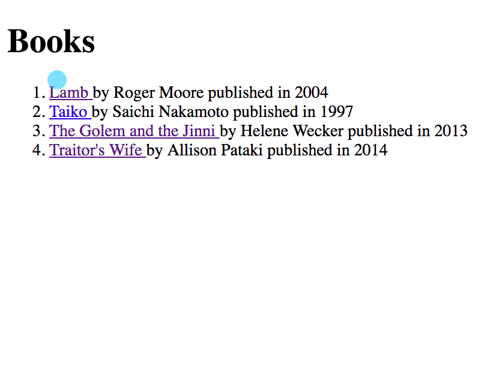

# Hyperlinks to Individual Resources

In this chapter, you are going to make hyperlinks out of the items in your list templates, write views to query a single resource from the database, and have new patterns for URLs with a route parameter at the end. For example...

http://localhost:8000/books/1

The `1` is the route parameter.

## A New Way to Define URL Patterns

Import the following method into your application `urls.py`.

```py
from django.urls import path
```

Then define the following URL pattern.

```py
path('books/<int:book_id>/', book_details, name='book'),
```

The `<int:book_id>` part of that URL pattern is used to capture any integer that is the route parameter, and stores that number in the `book_id` variable.

## Detail View

In the view, query for a single book in the database and use the `fetchone()` method instead of the `fetchall()` that you use in the list view. Also note that the `book_id` variable that you specified in the URLs pattern above gets automatically sent as an argument to the `book_details` view.

That's pretty cool.

Create the `views/books/details.py` file and use the following code.

```py
import sqlite3
from django.urls import reverse
from django.shortcuts import render, redirect
from django.contrib.auth.decorators import login_required
from libraryapp.models import Book, Library
from libraryapp.models import model_factory
from ..connection import Connection


def get_book(book_id):
    with sqlite3.connect(Connection.db_path) as conn:
        conn.row_factory = model_factory(Book)
        db_cursor = conn.cursor()

        db_cursor.execute("""
        SELECT
            b.id,
            b.title,
            b.isbn,
            b.author,
            b.year_published,
            b.librarian_id,
            b.location_id
        FROM libraryapp_book b
        WHERE b.id = ?
        """, (book_id,))

        return db_cursor.fetchone()

@login_required
def book_details(request, book_id):
    if request.method == 'GET':
        book = get_book(book_id)

        template = 'books/detail.html'
        context = {
            'book': book
        }

        return render(request, template, context)
```


## Add View to Package

Add the new view to `__init__.py`

```py
from .books.details import book_details
```

## Detail Template

Create `templates/books/detail.html` and use the following code.

```jinja

<!DOCTYPE html>
<html>
  <head>
    <meta charset="utf-8">
    <title>Library</title>
  </head>
  <body>
    <h1>{{ book.title }}</h1>
    <h2>By {{ book.author }}</h2>

    <div>Published in {{ book.year_published }}</div>
    <div>ISBN: {{ book.isbn }}</div>
  </body>
</html>
```

## Refactor List Template

Open `templates/books/list.html` and change each line item to the following code.

```jinja
<li>
    <a href=""> {{ book.title }} </a>
    by {{book.author}} published in {{book.year_published}}
</li>
```

The `url` keyword in the interpolation is a shortcut for Django to look up a named route in your `urls.py`. Then you specify the name of the route you want to look up. In this case, it's the pattern named `book` in the library application.

```py
path('books/<int:book_id>/', book_details, name='book'),
```

The third item in there - `book.id` - is the route parameter you want to send to that URL.

This code will generate `http://localhost:8080/books/{id}` for each book.

Refresh your page and click on the title of each book. You should be taken to the detail page of each one.



## Practice: Library Details

Follow these steps so that the user can see a detail view of each library in your system.

## Practice: Librarian Details

Follow these steps so that the user can see a detail view of each library in your system.
