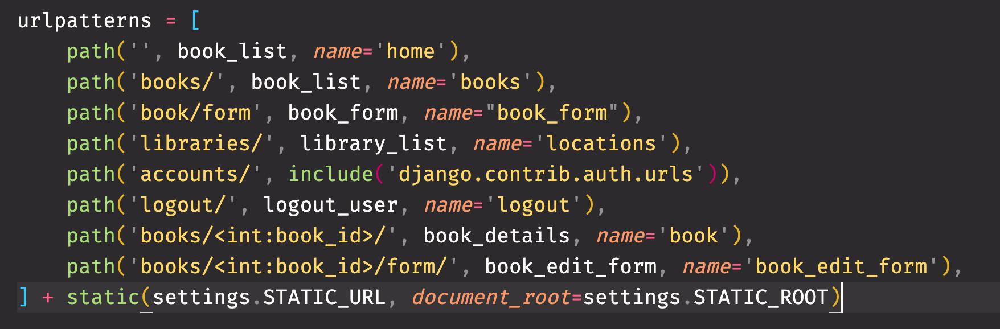

# Static Files in Django

In the previous chapter about extending base templates, you put a `<style>` tag in the `base.html` template. This is certainly not best practice. You want to have all of your styles in `.css` files contained in a `styles` subdirectory.

Any resources like CSS files, JS files, or images are considered 'static' assets, meaning Django just needs to serve them up when a browser asks for them. Your `settings.py` file has a default setting, `STATIC_URL = '/static/'`, that tells Django to look in a directory called `static` for those files.

In your `libraryapp` directory create a sub-directory called `static` and then add a `styles` directory to `static`. Then create a `styles/base.css` file. Remove the styles from the base HTML file.

> #### `libraryapp/static/styles/base.css`  

Then place the following CSS in the new `base.css` file.

```css
body {
    margin: 0;
    padding: 0;
    font-size: 1.5em;
    font-family: 'Gill Sans', 'Gill Sans MT', Calibri, 'Trebuchet MS', sans-serif;
}

.main-content {
    padding: 1em 2em;
}

.navList {
    list-style-type: none;
    display: flex;
    border: 1px solid lightgray;
    padding: 1em;
    margin: 0;
}

.navList__route {
    margin: 0 0.5em;
}
```

To make the final connection between your `static` directory and your templates that will be asking for those files, add the following after the closing square bracket of your libraryapp's `urls.py`.

```py
+ static(settings.STATIC_URL, document_root=settings.STATIC_ROOT)
```

It should look like this



## CSS Content Block

Update your base template to include the base CSS and add a content block so that dervied templates can specify their own CSS files. Note the keyword of `static` in the interpolated value of the `href` attribute of the `<link>` tag. This new code also adds a `<main>` element around your content block so we can add a class and style it.

> #### `libraryapp/templates/shared/base.html`

```jinja

<!DOCTYPE html>
<html>

<head>
    <meta charset="utf-8">
    <title>Library</title>

    <link rel="stylesheet" href="" />

    
    
</head>

<body>

    <nav id="site-nav">
        <ol class="navList">
            <li class="navList__route"><a href="">Home</a></li>
            <li class="navList__route"><a href="">Libraries</a></li>
            <li class="navList__route"><a href="">Books</a></li>
            <li class="navList__route"><a href="">Librarians</a></li>
            <li class="navList__route"><a href="">Logout</a></li>
        </ol>
    </nav>

    <main class="main-content">
        
        
    </main>

    
    
</body>

</html>
```

## Book List Styles

Next step is to create a CSS file to style the book list. Create a `styles/books.css` and place the following code in it.

> #### `libraryapp/static/styles/books.css`

```css
.books {
    list-style: none;
    display: flex;
    flex-wrap: wrap;
    justify-content: space-evenly;
}

.book {
    flex-basis: 20%;
    padding: 0 2em 0.5em 2em;
    border: 1px solid gray;
    margin: 1em;
    padding: 1.5em;
}

.book__title {
    font-size: 1.1em;
}

.book__description {
    font-size: 0.75em;
}
```

Also update the book list template to request the `books.css` file, and include all those classes. In a derived template, you also need to `` to use static files in your application, even though the base template also had that instruction in it.

> #### `libraryapp/templates/books/list.html`

```jinja




    <link rel="stylesheet" href="" />



    <h1>Books</h1>

    <a href="">Add Book to Inventory</a>

    <ol class="books">
    
        <li class="book">
            <a class="book__title" href=""> {{ book.title }}</a>
            <div class="book__description">
                by {{book.author}} published in {{book.year_published}}
            </div>
        </li>
    
    </ol>

```

The end result should be a slightly better looking book list view that uses Flexbox to create a grid layout for the books.


## You Got Your JavaScript in my HTML!

Now you can add some basic JavaScript to be requested to add some interactivity to the page. Create a `static/scripts/books.js` file and put in the following code.

> #### `libraryapp/static/scripts/books.js`

```js
const infoDialog = document.querySelector(".infoDialog")
const message = document.querySelector(".infoDialog__message")
const closeDialog = document.querySelector(".closeDialog")

document.querySelector(".books").addEventListener("click", (evt) => {
    if (evt.target.id.startsWith("detail")) {
        const id = evt.target.id.split("--")[1]
        message.innerText = `You have selected book ${id}`
        infoDialog.show()
    }
})

// Close the dialog when the close button is clicked
closeDialog.addEventListener("click", e => infoDialog.close())

// Close the dialog when the escape key is pressed
window.addEventListener("keyup", e => {
    if (e.keyCode === 27) {
        infoDialog.close()
    }
})
```

Now go back to the books list template, and you are going to add a new HTML element, and you are going to include a script. The HTML element is a dialog element so you can show a message to the user.

```html
<dialog class="infoDialog">
    <div class="infoDialog__message"></div>
    <button class="closeDialog">Close</button>
</dialog>
```

Then you will add the `<script>` element to your HTML so that it can be requested, downloaded, and used.

```jinja

    <script src=""></script>

```

Lastly, you will add a button to each of the book elements in the list.

```jinja
<button id="detail--{{ book.id }}">Details</button>
```

Here's the entire file that you can use to replace what you have.

> #### `libraryapp/templates/books/list.html`

```jinja




    <link rel="stylesheet" href="" />



    <h1>Books</h1>

    <dialog class="infoDialog">
        <div class="infoDialog__message"></div>
        <button class="closeDialog">Close</button>
    </dialog>

    <a href="">Add Book to Inventory</a>

    <ol class="books">
    
        <li class="book">
            <a class="book__title" href=""> {{ book.title }}</a>
            <div class="book__description">
                by {{book.author}} published in {{book.year_published}}
            </div>
            <button id="detail--{{ book.id }}">Details</button>
        </li>
    
    </ol>



    <script src=""></script>

```


