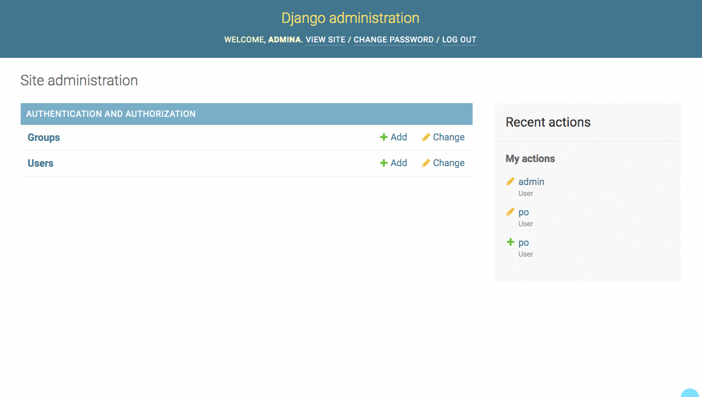

# Views and Templates to Display Data

In Django, views and templates work together to take complex data structures that you build in Python, and convert them into HTML representations for your customers to view and understand.

| Views | Templates |
| ---|---|
| The brains of the operation. Queries data from the database and provides it as context for a template | Defines HTML structure and specifies where the contextual data should be rendered _(interpolated)_  |

## Creating Sample Data

Before you start creating views so that your can render HTML in the browser, you need some data first. Open up your database and execute the following SQL.

```sql
INSERT INTO libraryapp_library
(title, address)
VALUES
('Bellview Library', '500 Main Street');

INSERT INTO libraryapp_book
(title, isbn, year_published, location_id, author, librarian_id)
VALUES
('Lamb', '59359409490', 2004, 1, 'Christopher Moore', 1);

INSERT INTO libraryapp_book
(title, isbn, year_published, location_id, author, librarian_id)
VALUES
('Taiko', '04275747474873', 2001, 1, 'Eiji Yoshikawa', 1);
```

## Django Views

The main responsiblity of a Django view is to respond to a HTTP request on a certain URL. The view will hold all of the logic required to get the appropriate data from the database, and then attach that data to a template for representing it in HTML.

Time to write your first view. Be in your `libraryapp` directory and run the following commands to start setting it up.

```sh
mkdir views && cd $_
touch __init__.py connection.py
mkdir books && cd $_
touch list.py
```

Open `connection.py` and place the following code in it. This allows any view to import the path to the database so each can connect to it and query data.

> #### libraryproject/libraryapp/views/connection.py

```py
class Connection:
    db_path = "/absolute/path/to/library-management/libraryproject/db.sqlite3"
```

Next, open `views/books/list.py` and paste in the following code. Note that the row factory being used for this connection to the database uses the built-in `sqlite3.Row` method. This allows developers to access columns in each row in the dataset by the column name instead of by index in the tuple.

> #### libraryproject/libraryapp/views/books/list.py

```py
import sqlite3
from django.shortcuts import render
from libraryapp.models import Book
from ..connection import Connection


def book_list(request):
    if request.method == 'GET':
        with sqlite3.connect(Connection.db_path) as conn:
            conn.row_factory = sqlite3.Row
            db_cursor = conn.cursor()

            db_cursor.execute("""
            select
                b.id,
                b.title,
                b.isbn,
                b.author,
                b.year_published,
                b.librarian_id,
                b.location_id
            from libraryapp_book b
            """)

            all_books = []
            dataset = db_cursor.fetchall()

            for row in dataset:
                book = Book()
                book.id = row['id']
                book.title = row['title']
                book.isbn = row['isbn']
                book.author = row['author']
                book.year_published = row['year_published']
                book.librarian_id = row['librarian_id']
                book.location_id = row['location_id']

                all_books.append(book)

        template = 'books/list.html'
        context = {
            'all_books': all_books
        }

        return render(request, template, context)
```

Import the function into the package init file.

> #### libraryproject/libraryapp/views/\_\_init__.py

```py
from .books.list import book_list
```

This function is now called a view since it will handle HTTP requests. Which HTTP request, you might ask? Well, you define that in `urls.py`.

Create a `urls.py` file in the `libraryapp` directory. This file will define all of the URLs that your library application will respond to. Place the following code in it.

> #### libraryproject/libraryapp/urls.py

```py
from django.urls import path
from .views import *

app_name = "libraryapp"

urlpatterns = [
    path('', book_list, name='home'),
    path('books/', book_list, name='books'),
]
```

These two patterns ensures that HTTP requests to

* `http://localhost:8000`
* `http://localhost:8000/books`

Are handled by the `book_list()` function in the `views/books/list.py` module.

Then in the `libraryproject/urls.py` file, include the URL mappings from your `libraryapp`. This pattern is followed because Django projects usually grow and start containing more than one application. By having each application define its own URLs, and then importing each set of those into the project, it prevents the project `urls.py` from becoming bloated and hard to read/maintain.

> #### libraryproject/libraryproject/urls.py

```py
from django.contrib import admin
from django.urls import include, path
from django.urls import path
from libraryapp.models import *

urlpatterns = [
    path('admin/', admin.site.urls),
    path('', include('libraryapp.urls')),
]
```

## Django HTML Templates

Now that you have a view that reads all books from the database, and you configured your application to invoke that view when the `/books` URL is requested, it's time to define your HTML representation with a template.

In the `libraryapp/templates` directory, run the following commands.

```sh
mkdir books
touch books/list.html
```

Then open that file in Visual Studio code, and place the following code into it.

> #### libraryproject/libraryapp/templates/books/list.html

```jinja

<!DOCTYPE html>
<html>
  <head>
    <meta charset="utf-8">
    <title>Library</title>
  </head>
  <body>
    <h1>Books</h1>

    <ol>
    
        <li>
            {{ book.title }}
            by {{book.author}}
            published in {{book.year_published}}
        </li>
    
    </ol>
  </body>
</html>
```

Look back in your `views/books/list.py` file and review the following two lines at the bottom.

```py
template = 'books/list.html'
context = {
    'all_books': all_books
}

return render(request, template, context)
```

When a view wants to generate some HTML representations of data, it needs to specify a template to use. Above, the `template` variable is holding the path and filename of the template you just created.

Then the `render()` method is invoked. That method takes the HTTP request as the first argument, the template to be used as the second argument, and then a dictionary containing the data to be used in the template.

In this case, the dictionary has a single property labeled `all_books` and its value is the list of book objects that the view generates.

The key name is able to be used in the template, which is why the template has the following loop.

```py

    ...

```

If you changed your view to the following code.

```py
template = 'books/list.html'
context = {
    'the_list_of_books': all_books
}

return render(request, template, context)
```

Then your template loop would also change to the following.

```py

    ...

```

Yep, this is Python code written inside an HTML file. Weird, I know. It's like that [cheesy, old Reese's Peanut Butter Cup commercial](https://www.youtube.com/watch?v=O7oD_oX-Gio).

"Hey! You got Python in my HTML"

"Hey! You got HTML on my Python"

**Template language rule #1:** When you want to write logical code in a Django template like for loops, or if statements, you need to wrap the code in ``.

**Template language rule #2:** When you want to display the value of variables, you wrap the variable name in `{{  }}`.

Here's another example that shows both the for loop, but with an nested if statement to show you the use of the interpolation punctuation.

```jinja

    
        <li>{{ book.title }} by {{book.author}} published in {{book.year_published}}</li>
    

```

## Create a User with the Administration Site

Visit http://localhost:8000/admin and add another user to your system. You pick the username and password.



Once you have a new user, add a book to your database, and assign your new user as the librarian that added it to the inventory.

```sql
INSERT INTO libraryapp_book
(title, isbn, year_published, location_id, author, librarian_id)
VALUES
('The Golem and the Jinni', '8592475822', 2013, 1, 'Helene Wecker', 2);
```

> **Lightning Exercise:** Create two more users with the admin site, and then use SQL to create a book that each librarian added to the inventory.

## Listing Librarians (i.e. Users)

Since the `libraryapp_librarian` table is one you created that extends the `auth_user`, when you build the `views/librarians/list.py` view, your SQL needs to join in the `auth_user` table.

```py
import sqlite3
from django.shortcuts import render
from libraryapp.models import Librarian
from ..connection import Connection


def list_librarians(request):
    with sqlite3.connect(Connection.db_path) as conn:
        conn.row_factory = sqlite3.Row
        db_cursor = conn.cursor()

        db_cursor.execute("""
        select
            l.id,
            l.location_id,
            l.user_id,
            u.first_name,
            u.last_name,
            u.email
        from libraryapp_librarian l
        join auth_user u on l.user_id = u.id
        """)

        all_librarians = []
        dataset = db_cursor.fetchall()

        for row in dataset:
            lib = Librarian()
            lib.id = row["id"]
            lib.location_id = row["location_id"]
            lib.user_id = row["user_id"]
            lib.first_name = row["first_name"]
            lib.last_name = row["last_name"]
            lib.email = row["email"]

            all_librarians.append(lib)

    template_name = 'librarians/list.html'

    context = {
        'all_librarians': all_librarians
    }

    return render(request, template_name, context)
```

Then your `templates/librarians/list.html` template will iterate the `all_librarians` key on the context dictionary.

> #### libraryproject/libraryapp/templates/librarians/list.html

```jinja

<!DOCTYPE html>
<html>
  <head>
    <meta charset="utf-8">
    <title>Library</title>
  </head>
  <body>
    <h1>Librarians</h1>

    <ol>
    
        <li>{{ librarian.first_name }} {{ librarian.last_name }}</li>
    
    </ol>
  </body>
</html>
```

Also make sure you add your URL pattern.

```py
path('librarians/', librarian_list, name='librarians'),
```

## Library View

Now it's your turn to create a view, and a corresponding template to list libraries.

1. Create `libraryapp/views/libraries/list.py`
1. Create `libraryapp/templates/libraries/list.html`
1. Define the URL that you want to expose to list libraries in `libraryapp/urls.py`

## Advanced Creation of Simple Model Instances

> **Warning:** The following code requires a solid understanding of the concept of higher order functions. If the code you have written so far makes sense to you, and the code below does not after reading it and reflecting upon it, then it is in your best interest to move on to the next concept.

Create a `models/modelfactory.py` file and place the following code in it.

> #### libraryproject/libraryapp/models/modelfactory.py

```py
import sqlite3

# Higher order function to create instances of models
# when performing single table queries
def model_factory(model_type):
    def create(cursor, row):
        instance = model_type()
        smart_row = sqlite3.Row(cursor, row)
        for col in smart_row.keys():
            setattr(instance, col, smart_row[col])
        return instance
    return create
```

Import the function into the pckage.

> #### libraryproject/libraryapp/models/\_\_init__.py

```py
from .library import Library
from .book import Book
from .librarian import Librarian
from .modelfactory import model_factory
```

Import the factory function into the book list module, and invoke the function with the Book model as an argument. Then when you invoke `fetchall()`, then end result will be a list of **`Book`** instances.

> **Rule for using model_factory:** Your SQL statement must query a single table, and each column in the table must be specified in the SQL.

> #### libraryproject/libraryapp/views/books/list.py

```py
import sqlite3
from django.shortcuts import render
from libraryapp.models import Book
from libraryapp.models import model_factory
from ..connection import Connection


def book_list(request):
    if request.method == 'GET':
        with sqlite3.connect(Connection.db_path) as conn:

            conn.row_factory = model_factory(Book)

            db_cursor = conn.cursor()
            db_cursor.execute("""
            select
                b.id,
                b.title,
                b.isbn,
                b.author,
                b.year_published,
                b.librarian_id,
                b.location_id
            from libraryapp_book b
            """)

            all_books = db_cursor.fetchall()

        template = 'books/list.html'
        context = {
            'all_books': all_books
        }

        return render(request, template, context)
```

## The Home Template

Before you move on, you should create a home page. Right now, the root route `/` and `/books` both show the listing of books, so you are going to change that. For now, it will be a dumb template - meaning it won't have any data in its context. It is just a welcome message for your users when they first visit your site.

### The Template

> #### libraryproject/libraryapp/templates/home.html

```html
<!DOCTYPE html>
<html>

<head>
    <meta charset="utf-8">
    <title>Nashville Library Management System</title>
</head>

<body>

    <h1>Welcome to the Nashville Library Management System</h1>

</body>

</html>
```

### The View

> #### libraryproject/libraryapp/views/home.py

```py
from django.shortcuts import render

def home(request):
    if request.method == 'GET':
        template = 'home.html'
        context = {}

        return render(request, template, context)
```

### Adding View to Package

Add the following import to your package init.

> #### libraryproject/libraryapp/views/\_\_init__.py

```py
from .home import home
```

### Home Page URL

Update the `'home'` pattern in your application URLs.

> #### libraryproject/libraryapp/urls.py

```py
urlpatterns = [
    path('', home, name='home'),
    path('books/', book_list, name='books'),
]
```
