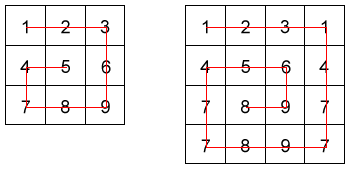

# Snail's Path

Write a function that takes one parameter. The parameter will be a list of lists. Return the elements of the array arranged from outermost elements to the middle element, traveling clockwise. Take a look at the example images for a visual.

## Examples

```py
list_example = [[1,2,3],
         [4,5,6],
         [7,8,9]]
snail(list_example) # returns [1,2,3,6,9,8,7,4,5]
```



## Starter Code

```py
def snail(matrix):
    # Add your code here
    pass

def test_snail_solution():
    arr = [
        [1, 2, 3],
        [4, 5, 6],
        [7, 8, 9]
    ]
    expected = [1, 2, 3, 6, 9, 8, 7, 4, 5]
    assert solution(arr) == expected

    arr = [
        [1, 2, 3, 4, 5],
        [6, 7, 8, 9, 10],
        [11, 12, 13, 14, 15],
        [16, 17, 18, 19, 20],
        [21, 22, 23, 24, 25]
    ]
    expected = [1, 2, 3, 4, 5, 10, 15, 20, 25, 24, 23, 22, 21, 16, 11, 6, 7, 8, 9, 14, 19, 18, 17, 12, 13]
    assert solution(arr) == expected

    arr = [
        [1, 2, 3, 4, 5, 6],
        [20, 21, 22, 23, 24, 7],
        [19, 32, 33, 34, 25, 8],
        [18, 31, 36, 35, 26, 9],
        [17, 30, 29, 28, 27, 10],
        [16, 15, 14, 13, 12, 11]
    ]
    expected = [1, 2, 3, 4, 5, 6, 7, 8, 9, 10, 11, 12, 13, 14, 15, 16, 17, 18, 19, 20, 21, 22, 23, 24, 25, 26, 27, 28, 29, 30, 31, 32, 33, 34, 35, 36]
    assert solution(arr) == expected
```

## Need a hint?

The length of each inner list will always match the length of the outer list

## Finished?

Run `pytest` in the terminal to see if your solution passes
Can you find another solution?
