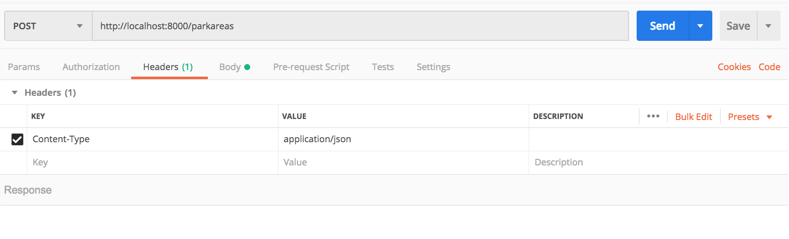
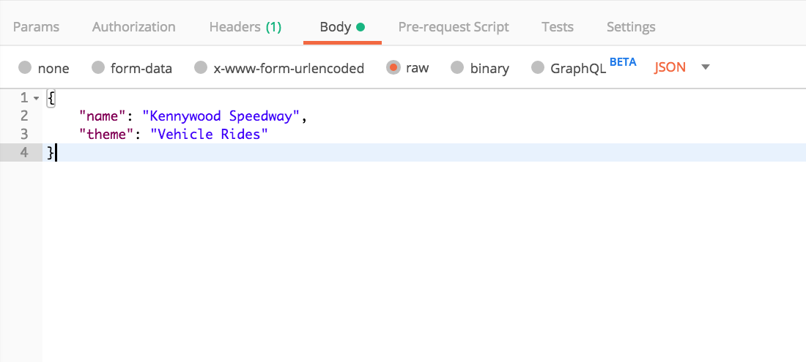
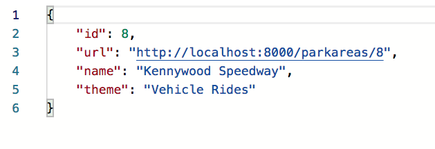

# Completing Your ViewSet for CRUD

Now it's time to fill out your `parkarea.py` module with all of the CRUD actions that it needs to perform. You can copy pasta this entire block of code into your module.

```py
"""Park Areas for Kennywood Amusement Park"""
from django.http import HttpResponseServerError
from rest_framework.viewsets import ViewSet
from rest_framework.response import Response
from rest_framework import serializers
from rest_framework import status
from kennywoodapi.models import ParkArea


class ParkAreaSerializer(serializers.HyperlinkedModelSerializer):
    """JSON serializer for park areas

    Arguments:
        serializers
    """
    class Meta:
        model = ParkArea
        url = serializers.HyperlinkedIdentityField(
            view_name='parkarea',
            lookup_field='id'
        )
        fields = ('id', 'url', 'name', 'theme')


class ParkAreas(ViewSet):
    """Park Areas for Kennywood Amusement Park"""

    def create(self, request):
        """Handle POST operations

        Returns:
            Response -- JSON serialized ParkArea instance
        """
        newarea = ParkArea()
        newarea.name = request.data["name"]
        newarea.theme = request.data["theme"]
        newarea.save()

        serializer = ParkAreaSerializer(newarea, context={'request': request})

        return Response(serializer.data)

    def retrieve(self, request, pk=None):
        """Handle GET requests for single park area

        Returns:
            Response -- JSON serialized park area instance
        """
        try:
            area = ParkArea.objects.get(pk=pk)
            serializer = ParkAreaSerializer(area, context={'request': request})
            return Response(serializer.data)
        except Exception as ex:
            return HttpResponseServerError(ex)

    def update(self, request, pk=None):
        """Handle PUT requests for a park area

        Returns:
            Response -- Empty body with 204 status code
        """
        area = ParkArea.objects.get(pk=pk)
        area.name = request.data["name"]
        area.theme = request.data["theme"]
        area.save()

        return Response({}, status=status.HTTP_204_NO_CONTENT)

    def destroy(self, request, pk=None):
        """Handle DELETE requests for a single park area

        Returns:
            Response -- 200, 404, or 500 status code
        """
        try:
            area = ParkArea.objects.get(pk=pk)
            area.delete()

            return Response({}, status=status.HTTP_204_NO_CONTENT)

        except ParkArea.DoesNotExist as ex:
            return Response({'message': ex.args[0]}, status=status.HTTP_404_NOT_FOUND)

        except Exception as ex:
            return Response({'message': ex.args[0]}, status=status.HTTP_500_INTERNAL_SERVER_ERROR)

    def list(self, request):
        """Handle GET requests to park areas resource

        Returns:
            Response -- JSON serialized list of park areas
        """
        areas = ParkArea.objects.all()
        serializer = ParkAreaSerializer(
            areas, many=True, context={'request': request})
        return Response(serializer.data)
```

## Using Your New API

Time to bring back our old friend Postman! Fire it up and make some requests.

### Create a Park Area

Create a POST request and set the `Content-Type` header.



Click the Body tab and create a JSON object representing a new park.



When you submit that request, you should get a response very similar to what's below. Your `id` property will likely be different.



Now visit your browsable API in the browser and look at your list of park areas. Your new area should be in the list.


## Modify a Park Area

Perform a PUT request in Postman to change the `name` property of the park area you just created to "Kennywood Motor Speedway". Verify the change by viewing it in the browsable API.

## Delete a Park Area

Perform a DELETE request to remove the park area you just created. Verify the change by viewing it in the browsable API.

