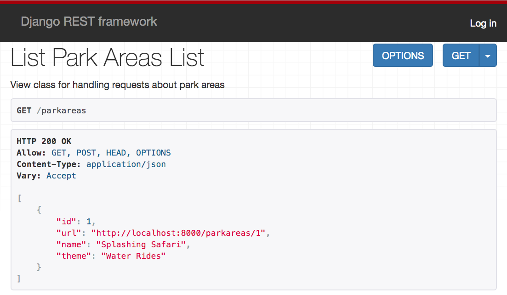

# Installations and Configuration for a DRF Project

1. Clone the [Kennywood API](https://github.com/nashville-software-school/kennywood-api) repository to your machine
1. `cd kennywood-api`
1. `python -m venv KennywoodEnv`
1. Activate the enviroment. Use the `source ./KennywoodEnv/bin/activate` command on OSX, or run `activate.bat` for Windows.
1. `pip install -r requirements.txt`

## Allowing Common Variables Names

The pylint package is very good at ensuring that you follow the community standards for variable naming, but there are certain times that you want to use variable names that are short and don't use snake case. You can put those variable names in a `.pylintrc` file in your project.

Without this configuration, your editor will put orange squiggles under those variable names to alert you that you violated community standards. It becomes annoying, so you override the default rules.

```sh
echo '[FORMAT]
good-names=i,j,ex,pk
' > .pylintrc
```

In Visual Studio Code, `cmd+shift+p` and open "Preferences: Open Settings (JSON)". Add the following configuration item to the object.

```json
"python.linting.pylintArgs": [
    "--load-plugins=pylint_django"
],
```

## Create Base Django Tables

You may remember that Django gives you user and role management tables out of the box, and there is a built-in migration file that makes the tables for you. Go ahead and run that migration to set up the initial Django tables.

```sh
python manage.py makemigrations
python manage.py migrate
python manage.py runserver
```

## Create your First Park Area

To see how this all works, you are going to insert a park area into the database manually first. Connect to your Kennywood database and execute the following SQL statement.


```sql
INSERT INTO
    kennywoodapi_parkarea
    ([name], theme)
VALUES
    ('Splashing Safari', 'Water Rides')
;
```

## Browsable API

That's the last piece to see something in the browsable API in the browser.  Open http://localhost:8000 in your browser and you should see a URL for park areas.


Go ahead and click on the URL for the `"parkareas"` key and you should then see the list of park areas in your database. There's only the one for now.



## Using a Client to Manipulate Resources

Time to bring back our old friend Postman! Fire it up and make some requests.

### Create a Park Area

Create a POST request and set the `Content-Type` header.


Click the Body tab and create a JSON object representing a new park.


When you submit that request, you should get a response very similar to what's below. Your `id` property will likely be different.


Now visit your browsable API in the browser and look at your list of park areas. Your new area should be in the list.


## Modify a Park Area

Perform a PUT request in Postman to change the `name` property of the park area you just created to "Kennywood Motor Speedway". Verify the change by viewing it in the browsable API.

## Delete a Park Area

Perform a DELETE request to remove the park area you just created. Verify the change by viewing it in the browsable API.

