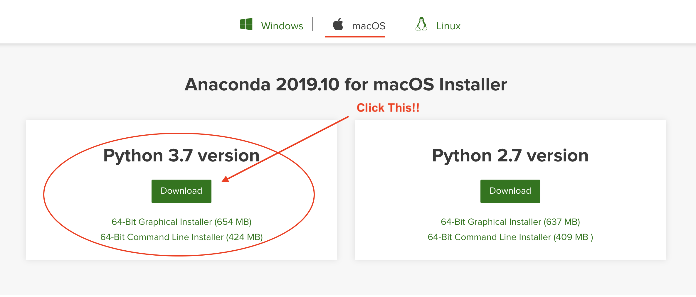
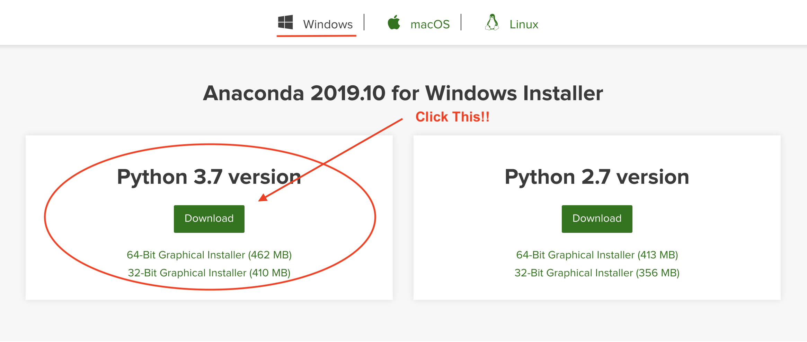
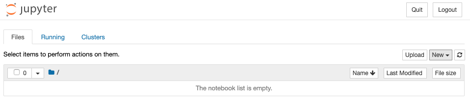

# Installations

## Anaconda Distribution

Follow [this link](https://www.anaconda.com/distribution/) to the Anaconda Distribution downloads page.

### Mac Users
Click the download button, and follow the directions on your installer prompt.
Choose the defaults for everything.
 

### Windows Users
Click the download button, and follow the directions on your installer prompt.
Choose the defaults for everything.


### Verifying Your Installation

Check out [this webpage](https://docs.anaconda.com/anaconda/install/verify-install/) for ways to verify your installation worked correctly.

An easy way to test this is through your terminal/command prompt.
1. Make sure you quit your terminal / command prompt application
2. (Re)open it
3. Run `conda --version`

You should see a version number!

Additionally, you should now have an application called Anaconda Navigator.
If that application exists, you installed successfully.

## Next Steps: The Plan

1. Get an [IDE](https://en.wikipedia.org/wiki/Integrated_development_environment) up and running!
For this course, we will be using a browser-based IDE called `jupyter`.
When running, `jupyter` will allow use to write python code and see the results in real-time.
2. Open a `notebook`. 
You can think of a _notebook_ as a text document that you will write your code in. 
Every time we want to write some code, we will either open an existing notebook, or create a new one.
3. Start writing some python code!
Yay!

# Step 1: Get `jupyter` Running

First, open up your Terminal or Command Prompt.
Then, paste in this command: 

```sh
cd ~/Documents/python-orientation
jupyter notebook
```

This worked _if_..
* A browser on your computer opened up
* The browser is displaying something like this



# Step 2: Open a `Notebook`

In your browser, click the link to the `chapters` page.
This should show you a bunch of files (Chapters 1-10).

When you are working through a chapter, you will navigate to this screen and choose the chapter to focus on.

# Step 3: Code Something!

Now we can start coding!
Follow the instructions in each chapter to get going.
