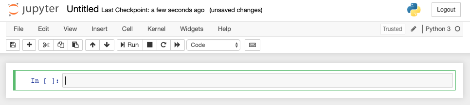

# The Plan

1. Get an [IDE](https://en.wikipedia.org/wiki/Integrated_development_environment) up and running!
For this course, we will be using a browser-based IDE called `jupyter`.
When running, `jupyter` will allow use to write python code and see the results in real-time.
2. Create a `notebook`. 
You can think of a _notebook_ as a text document that you will write your code in. 
Every time we want to write some code, we will either open an existing notebook, or create a new one.
3. Start writing some python code!
Yay!

# Step 1: Get `jupyter` Running

First, open up your Terminal or Command Prompt.
Then, paste in this command: 

```sh
mkdir -p ~/Documents/python/orientation && cd $_
jupyter notebook
```

This worked _if_..
* A browser on your computer opened up
* The browser is displaying something like this


# Step 2: Create a `Notebook`

See that `New` button with the dropdown?
Go ahead and click that. 
Then click `Python3`.

You should now have a _second_ tab open, looking something like this: 


Go ahead and click the `Untitled` part in the top left, and rename it to `Chapter 1`.

# Step 3: Code Something!

Now we can start coding!
For each of the next code snippets, copy them and paste them into separate `cells` within your notebook.

## Basic Types

```python
number = 12345
float_number = 12.345
some_text = 'This is text (a string)!'
a_boolean = True
```

Everything to the _left_ of the equal sign is a _variable_ name, while everything to the right of the equal sign is a value that gets assigned to the variable name. 
This comes in handy when you want to reference a value later in your code. 

Try running this code in a new cell below: 
```python
print(number)
print(float_number)
print(some_text)
print(a_boolean)
```

Notice how the _names_ don't show up, but the values the names represent do.
Also, printing is cool!

Just like SQL or Excel, python has _types_.
We've already covered a few of the basic and most common types. 

* Integer - `int()`
* Float - `float()`
* String - `str()`
* Bool - `bool()`

## Integer / Float

Wanna do some math? 
These characters should be your go-to.
They can do everything you think numbers should be able to do.

Take it away `int`s!
```python
print(1 + 1)
print(10 - 5)
print(2 * 3)
print(6 / 2)
print(5 / 2)
```

Now the `float`
```python
print(1.0 + 1.0)
print(10.3 - 5.75)
print(0.12345 * 0.6789)
print(2_000_000.123 / 150.23)
```

## String

_Text_.
Nothing too special here!
 
```python
print('I am text.. With single quotes!')
print("I am text.. With DOUBLE quotes!")
print("I am text.." + ' Using both!!!!')
```

With python, you can do some pretty cool things with text.
Right out of the box!
What if we wanted to dynamically create a greeting, for example.
```python
greeting_name = 'FooBar'
greeting = 'Hello, my name is.. {name}'
```

Notice the `name` parameter there?
We can substitute that with a variable!
```python
print(greeting.format(name=greeting_name))

a_different_name = 'NotFooBar'
print(greeting.format(name=a_different_name))
```

Now try it yourself!
```python
# first declare a name variable
# then print it using the greeting from before!
```

### Thoughts on _Methods_

Remember the `SUM`, `MIN`, or `AVG` functions in Excel?
You would use them like this: 
```postgresql
SELECT SUM(column) as sum_of_column 
FROM table
```

In this scenario, `SUM` is a _function_. 
Some function attributes might be:
* Can take an argument, or arguments
* Available to you with no strings attached.. 
Use right out of the box
* Performs an _action_.
It goes out and tries to _do_ something. 
Verb!!

_Methods_ are pretty much the same thing..
Except they _are attached to another object_. 
They are actions specific to an object. 

As an example.. 
```
People can run.
Trees cannot run.

People can drive.
Trees cannot drive.

People can consume water.
Trees can consume water.
```

In this scenario, people and trees are objects.
Run, drive, and consume are all actions. 

People would have the following methods: 
* run
* drive
* consume 

Tree would only have the following method:
* consume

If this were code, it may look something like this:
```python
people.run()
people.drive()
people.consume('water')

trees.consume('water')
```

Most objects in python have _methods_ associated with them. 
They have the ability to do things!
Just like people and trees can do things.
The syntax for that looks like: `object.method()`.

## A Few of String Methods
```python
sentence = 'this is a sentence!'
```

String's have quite a few methods available for use.
* `capitalize` - Capitalize the first letter
* `upper` - Uppercase all the letters in the string
* `replace` - Replace part of the string with something else
* `strip` - Remove all whitespaces

```python
print(sentence.capitalize())
print(sentence.lower())
print(sentence.replace('sentence', 'not a sentence'))
print(sentence.strip())
```

And [many more](https://docs.python.org/2.5/lib/string-methods.html)!

## Boolean

True or False?? 
Yes or No? 

```python
this = True
that = False

print(this, that)
```

```python
print(this == True)
print(that == True)
```

```python
print(this or that)
print(this and that)
print(this and not that)
```

Ok, these have all been absolute / static. 
What else is can evaluate to True or False?

```python
print('foo' == 'foo')
print('foo' == 'bar')
print('foo' != 'foo')

print(1 < 2)
print(35 == 35.0)
print(bool(''))
```

```python
print(True if '' and 1 else False)
```
